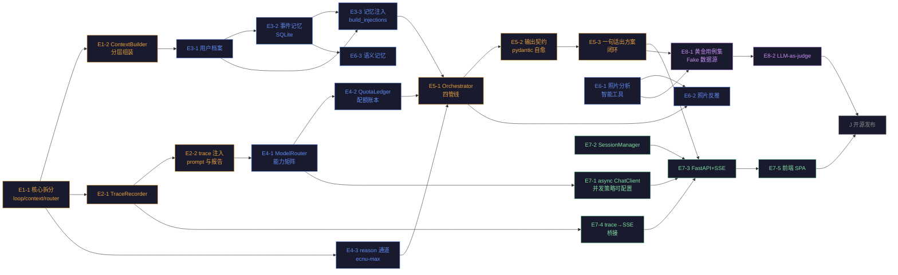

# LightTrail（光迹）· 开发进程路线图

> **版本**：v2.5
> **日期**：2026-09-09
> **作者**：架构师 高见远
> **定位**：指导后续接手的单个 agent 按步骤独立完成每个任务的原子化路线图
> **依据**：PRD v0.3、架构文档 v2.0（`docs/architecture.md`，演进路径 E1–E8）、现有源码（15 工具已注册 + api/ + frontend/）、`docs/design/FRONTEND-SPEC.md`（**前端唯一 spec**）、TODO.md、UI 设计总览
> **v2.5 变更摘要**（2026-09-09）：小北确认设计稿（`lighttrail-prototype.html`）为目标视觉形态，实际前端 `frontend/` 需对齐补齐。新增**阶段五·补（E7-6 ~ E7-10 前端旅程页对齐）**，排 E8 之前（前端 6 页旅程 SPA 是求职演示本体，成本低且不烧 LLM 配额）；新增权威 spec `docs/design/FRONTEND-SPEC.md`（6 页信息架构、设计令牌全集、组件→API 映射、可解释性三铁律、移动端规范）；设计文档 v1.1 归档至 `docs/design/archive/`，DESIGN-OVERVIEW 升 v2.0、交付说明升 v2.0 并勘误接入方向。
> **v2.4 变更摘要**（2026-09-09）：**E7 阶段交付完成**（E7-1 async ChatClient 串行闸门 / E7-2 SessionManager / E7-3 FastAPI 五端点 SSE / E7-4 trace→SSE 桥 / E7-5 SPA 三核心页 / E7-0 真实 SSE 联调通过），pytest **212 全绿**（基线 43 → +169）；§1.1 现状、§1.2 阶段五状态、PRD 覆盖矩阵 A-08/Web UI 勾选；E8 评估体系（阶段六）为当前缺口。
> **v2.0 变更摘要**：项目已从「741 行骨架 + 2 演示工具」推进到「~2300 行 + 12 个已注册工具 + 43 测试全绿」；阶段划分弃用旧的「按 PRD 功能堆」方式，改为与架构 v2.0 演进路径 **E1–E8** 一一对应，并新增 Web 服务层（E7，SSE 流式）与评估体系（E8）两个阶段。
> **v2.1 变更摘要**（2026-09-07）：同步 PRD v0.3「主动提醒服务」能力族——E3-2 事件记忆增补坐标 + 天气快照字段（复拍提醒 D2.3-07 的数据前提）；§4 待明确事项新增 4.10 主动提醒服务排期。
> **v2.3 变更摘要**（2026-09-07 深夜）：**E6 阶段交付**（E6-1 照片分析 / E6-2 照片反推 /
> E6-3 语义提炼与 favorite_spots / E6-4 复盘闭环 / E6-5 收口），工具 15、pytest 177 全绿；
> **E6-0 真实联调通过 + 29 commits push 至 origin/main（HEAD 0b502a6）**，远程基线已就绪。
> **v2.2 变更摘要**（2026-09-07）：**E1–E5 已全部交付**（20 commits，含 ADR-002 平台中立性重构）：§1.1 现状与 §1.3 PRD 覆盖矩阵同步勾选；E8-1 黄金用例集改为「各阶段增量交付」策略（每阶段新增 5–10 条，E8 本体只做框架与 LLM-as-judge）；新增**阶段八 E9 主动提醒服务**（被动提醒 MVP：D2.3-07 复拍提醒 + D3.1-04 就近推荐，开源后迭代）；新增 E6-0 / E7-0 真实联调基线验证任务（每阶段以真实 Key 跑通开场，禁止仅凭 mock 判定阶段完成）。

---

## 1. 总览

### 1.1 项目现状

LightTrail 已完成 **E1–E6 全部交付**（含 E6-0 真实联调 + push）：地基拆分（loop/context/router + ContextBuilder 五层组装）、可观测性（TraceRecorder + 置信度规则表 + TraceReport）、四层记忆（档案常驻注入 / SQLite 事件记忆含坐标与天气快照 / 语义记忆 double-confirm）、路由与配额（ModelRouter 能力矩阵 + QuotaLedger 三窗口 + reason 深推理通道）、决策编排（四管线端到端闭环 + Intent/DecisionCard pydantic 契约 + 一句话出方案 + 追问回落 ReAct）、多模态与差异化（照片分析智能工具 depth=1 红线 + 照片反推 + 复盘管线闭环 + 语义记忆提炼 + favorite_spots 沉淀）。**ADR-002 平台中立性 + ADR-003 扩展参数适配**已落地。当前规模：src+tests ~1.1w 行 + `frontend/`（Vite + React + TS），**15 个已注册工具**（含 analyze_photo / reverse_engineer_photo / search_memory），pytest **212 全绿**（基线 43 → +169）、ruff 0 告警、smoke 21 项通过、前端 `npm run build` 通过。**E6-0 真实 Key 四管线联调 + E7-0 真实 Key SSE 联调均通过**（HEAD ead1e8e）。**E7 阶段已完成**（async ChatClient + SessionManager + FastAPI 五端点 SSE + trace→SSE 桥 + SPA 三核心页），**当前缺口**：评估体系（E8）。

### 1.2 阶段划分（对齐架构 v2.0 演进路径）

| 阶段 | 对应架构 | 主题 | 目标 | 状态 |
|------|----------|------|------|------|
| 阶段一 | E1+E2 | 地基拆分与可观测性 | `agent/core.py` 拆出 loop/context/router；TraceRecorder 贯穿三层 | ✅ 已完成 |
| 阶段二 | E3+E4 | 记忆层与配额感知 | 四层记忆注入 + reason 通道 + QuotaLedger 配额账本 | ✅ 已完成 |
| 阶段三 | E5 | 决策编排与输出契约 | 四管线编排 + Intent/DecisionCard pydantic 契约 + 自愈重试 | ✅ 已完成 |
| 阶段四 | E6 | 多模态与差异化 | 照片分析（智能工具）+ 反推方案 + 事件/语义记忆 | ✅ 已完成（E6-0~E6-5，联调通过 + push） |
| 阶段五 | E7 | Web 服务层 | async ChatClient + FastAPI + SSE 流式 + SPA 前端（trace 即 UI） | ✅ 已完成（E7-0~E7-5，真实联调 + push） |
| 阶段六 | E8 | 评估体系 | 三层评估：黄金用例集 + LLM-as-judge，质量回归门禁 | 未开始 |
| 阶段七 | — | 开源发布 | 文档完善、贡献指南、版本发布 | 未开始 |
| 阶段八 | E9 | 主动提醒服务（被动 MVP） | 复拍机会提醒 + 就近快速推荐（查询时被动触发，非定时推送） | 未开始 |

### 1.3 PRD 覆盖矩阵

| PRD 方向 | 状态 | 路线图任务 |
|----------|------|-----------|
| D3.2 参数推荐（曝光换算/星空 NPF/ND） | ✅ 已完成 | 工具 `equivalent_exposure` / `star_shutter_rule` / `nd_long_exposure` |
| D2.1 天文查询（太阳时刻/方位/月相/银心） | ✅ 已完成 | 工具 `sun_times` / `sun_position` / `moon_phase` / `moon_events` / `galaxy_visibility` |
| D2.3 天气数据（云量/能见度/降水） | ✅ 已完成 | 工具 `weather_forecast` |
| D3.1 火烧云概率评估 | ✅ 已完成（工具层） | 工具 `sunset_glow_score`（编排进临场决策管线） |
| D2.1-03 机位×天象匹配 | ✅ 已完成（工具层） | 工具 `match_sites`（编排进规划管线） |
| M1 个性化记忆（档案/事件/语义） | ✅ 已完成 | E3-1 ~ E3-3（commits f0948f2 / 3045ec6 / a32a874） |
| M2 可解释性（轨迹/依据/来源/推理） | ✅ 已完成（SSE 展示待 E7-4） | E2-2（TraceRecorder + 置信度规则）+ E5-2（契约必填字段） |
| A-06 模型路由 + 配额 | ✅ 已完成 | E4-1（ModelRouter）+ E4-2（QuotaLedger），commits 490c369 / 5b5fd5f |
| D1.1 一句话出方案 / D2.3 计划生成 | ✅ 已完成 | E5-1 ~ E5-3（四管线 + 端到端闭环，commit 27035d1） |
| D1.2 照片反推 / D4 照片分析 | ✅ 已完成 | E6-1（analyze_photo）/ E6-2（reverse_engineer_photo），commits 2dc1c89 / c520186 |
| D2.2 多机位赶场调度 | ⏳ 待定 | 见 §4 待明确事项 |
| A-08 对话持久化 / Web UI | ✅ 已完成 | E7-2（SessionManager）/ E7-3、E7-5（FastAPI + SPA），commits 3a4fd15 / ee49bdc / ead1e8e |
| 非功能：可测试性 / 质量回归 | ⏳ 未开始 | E8-1 / E8-2（黄金用例已随各阶段增量交付） |
| PRD v0.3 主动提醒能力族 | 📅 已排期 E9 | D2.3-07 复拍提醒 + D3.1-04 就近推荐进 E9 被动 MVP；D2.3-06 休息日推荐 / M1.1-04 通勤画像延后；UGC 机位维持 P2 |

### 1.4 任务依赖图



---

## 2. 任务清单

### 阶段零：已完成（工具层，验收记录）

> 本阶段已交付，列出仅作基线记录。12 个工具全部通过 `@registry.tool` 注册，28 个 pytest 用例全绿。

| 工具 | 文件 | PRD 映射 |
|------|------|---------|
| `get_current_time` | `tools/basic.py` | A-01 基础 |
| `equivalent_exposure` | `tools/exposure.py` | D3.2-01 等效曝光 |
| `star_shutter_rule` | `tools/exposure.py` | D3.2-02 星空 500/NPF |
| `nd_long_exposure` | `tools/exposure.py` | D3.2-03 长曝光 ND |
| `sun_times` / `sun_position` | `tools/astronomy.py` | D2.1-01 太阳时刻/方位 |
| `moon_phase` / `moon_events` | `tools/astronomy.py` | D3.2-05 月相/月升月落 |
| `galaxy_visibility` | `tools/astronomy.py` | D2.1-01 银心窗口 |
| `weather_forecast` | `tools/weather.py` | D2.3-01 天气（分云层） |
| `sunset_glow_score` | `tools/weather.py` | D3.1 火烧云评分（复合） |
| `match_sites` | `tools/site_match.py` | D2.1-03 机位×天象匹配（复合） |

---

### 阶段一：地基拆分与可观测性（E1+E2）

> 阶段目标：把 `agent/core.py`（116 行）拆成职责单一的 loop/context/router 三模块，让「换模型路由」「改上下文策略」不再动核心循环；同步落地 TraceRecorder，为后续所有可解释性（M2）与 SSE 事件（E7-4）提供数据源。
> 原则：**`Agent.run()` 与 `@registry.tool` 签名不变**，28 个现有用例不动。

---

#### E1-1 核心拆分：loop / context / router

- **目标**：`agent/core.py` 拆为 `agent/loop.py`（ReAct 循环）、`agent/context.py`（ContextBuilder 占位）、`llm/router.py`（ModelRouter），`core.py` 收敛为对外门面。
- **前置依赖**：无
- **输入上下文**：
  - `src/lighttrail/agent/core.py`——现有 `Agent` 类：`run()` / `_run_loop()` / `_execute_tool_calls()` / `_build_messages()`，`DEFAULT_SYSTEM_PROMPT` 常量，`MAX_TOOL_ROUNDS=8`
  - `src/lighttrail/llm/client.py`——`ChatClient.chat(messages, *, model, tools, temperature)`，模块级 `_SERIAL_LOCK`
  - `src/lighttrail/config.py`——`Settings.model`（ecnu-plus）与 `Settings.model_reason`（ecnu-max）
- **输出交付物**：
  - `src/lighttrail/agent/loop.py`——`ReActLoop` 类：持有 client/registry/trace，`run(messages) -> str`，核心流程 chat→tool_calls→dispatch→回传（沿用现有 `_run_loop` 逻辑）
  - `src/lighttrail/agent/context.py`——`ContextBuilder` 类：先实现「拼接 system + history」，分层组装在 E1-2 落地
  - `src/lighttrail/llm/router.py`——`ModelRouter` 类：`resolve(needs_tools, needs_vision, needs_deep_reasoning) -> model_name`，能力矩阵硬编码（plus 有工具/视觉，max 有长上下文/深推理），单测覆盖矩阵
  - `src/lighttrail/agent/core.py`——`Agent` 门面：组合 loop/context/router，公开 API 不变
- **实现步骤**：
  1. 将 `_run_loop` / `_execute_tool_calls` 原样搬入 `loop.py`，构造参数改为注入 `client` / `registry` / `max_tool_rounds`；`core.py` 的 `Agent.run()` 委托给 `ReActLoop`
  2. 新建 `context.py`：先把 `_build_messages` 移动进来（system + history 拼接），`ContextBuilder.build(system_prompt, history)` 返回 messages
  3. 新建 `llm/router.py`：实现能力矩阵 `_CAPABILITY_MATRIX = {"ecnu-plus": {"tools": True, "vision": True}, "ecnu-max": {"deep": True}}`；`resolve()` 校验声明意图并返回模型名，非法声明抛 `RouterError`
  4. `core.py` 只留 `Agent` 门面：`__init__` 组装三件套，`run()` / `reason()`（E4-3 落地前先透传）委托
  5. 更新 `agent/__init__.py` 导出
  6. 测试：现有 43 用例全绿即通过（回归验证门面兼容）；新增 router 能力矩阵用例
- **验收标准**：
  - `pytest tests/` 43 用例全绿，无改动
  - 新增 `tests/test_router.py`：验证 `resolve(needs_tools=True) == "ecnu-plus"`、`resolve(needs_deep_reasoning=True) == "ecnu-max"`、非法组合抛错
  - `agent/core.py` 行数 < 100
- **涉及文件**：`agent/{core,loop,context}.py`、`llm/router.py`、`tests/test_router.py`
- **难度**：⭐⭐⭐

---

#### E1-2 ContextBuilder 分层组装

- **目标**：system prompt 落实架构 v2.0 §2.7 的**五层结构**，按「变化频率升序」排列（静态角色 → 行为准则 → 工具说明 → 档案+语义记忆 → 轨迹摘要），为平台 prompt 缓存命中（命中价 1/5）服务。
- **前置依赖**：E1-1（context.py 存在）
- **输入上下文**：架构 v2.0 §2.7 五层定义；现有 `DEFAULT_SYSTEM_PROMPT`
- **输出交付物**：
  - `ContextBuilder` 扩展：`set_layers(...)` 或构造参数注入各层构建器；每层独立 token 预算与版本号
  - `to_openai_messages(history)` 返回组装好的 messages
- **实现步骤**：
  1. 将现有 `DEFAULT_SYSTEM_PROMPT` 拆为「角色与使命」「行为准则」两段常量（静态层）
  2. 工具说明层：`ToolRegistry.to_openai_schema()` 的精简中文摘要缓存为半静态段（注册表变更时刷新）
  3. 动态层：档案（≤400 token）与轨迹摘要由注入器提供（E3-3 / E2-2 接入），未就绪时注入空段
  4. 每层版本号（如 `layer:profile@3`），输出 prompt 带版本注释头，供回归 diff
- **验收标准**：`pytest tests/` 全绿；构造出的 system prompt 分段顺序为 ①→⑤；静态前缀在多次 `build()` 间字节不变（可断言字符串相等）
- **涉及文件**：`agent/context.py`、`tests/test_context.py`
- **难度**：⭐⭐

---

#### E2-1 TraceRecorder 与事件订阅接口

- **目标**：实现基础设施层 `infra/trace.py`——被动记录 LLM 调用 / 工具调用 / 管线步骤三类事件，提供**事件订阅接口**（为 E7-4 SSE 桥接预留），可关闭（关闭时行为同现状）。
- **前置依赖**：E1-1（loop/registry 有稳定写入点）
- **输入上下文**：架构 v2.0 §2.6（三个写入点 + 消费形态）；现有 `registry.dispatch` 与 `loop.py`
- **输出交付物**：
  - `src/lighttrail/infra/__init__.py`、`src/lighttrail/infra/trace.py`
  - `TraceRecorder`：`record_llm()` / `record_tool()` / `record_step()`；`subscribe(callback)` 订阅事件流；`to_prompt_section()`（精简轨迹注入文本）；`to_report() -> TraceReport`（结构化，含 sources+confidence）
  - loop.py 与 registry.dispatch 挂写入点（构造时注入 recorder，默认 `NullTrace` 关闭态）
- **实现步骤**：
  1. 定义事件 dataclass：`TraceEvent(kind, name, payload, ts)`，kind ∈ {llm, tool, step}
  2. `record_tool(name, arguments, result)`：参数/结果截断（200/300 字），提取 `data_source`、关键字段，追加来源标注
  3. `subscribe(callback)`：简单监听器列表，事件同步派发（E7-4 在此挂 async 队列适配器）
  4. `to_prompt_section()`：格式化为「① 调用 sun_times → 日出 05:12 日落 18:47\n② …」式文本
  5. 接线：`ReActLoop.__init__` 与 `ToolRegistry.dispatch` 接收可选 recorder 参数（默认 None = 关闭）
- **验收标准**：FakeChatClient 触发工具调用后 `to_prompt_section()` 非空且含工具名；订阅回调收到 tool 事件；关闭态零开销断言（不产生记录）
- **涉及文件**：`infra/trace.py`、`agent/loop.py`（修改）、`agent/tools.py`（修改）、`tests/test_trace.py`
- **难度**：⭐⭐⭐

---

#### E2-2 trace 注入与 TraceReport

- **目标**：把精简轨迹注入下一轮 prompt（ContextBuilder 第⑤层），并产出 `TraceReport` 结构化报告——M2「建议依据 / 来源与置信度」的数据来源。
- **前置依赖**：E2-1、E1-2
- **输入上下文**：架构 v2.0 §2.6 置信度模型（规则化，不让模型自评）
- **输出交付物**：loop 每轮把 `recorder.to_prompt_section()` 注入 system ⑤层；`Agent.run()` 结束返回 `(text, TraceReport)`（新方法 `run_with_trace()`，旧 `run()` 返回纯文本保持兼容）
- **实现步骤**：
  1. `ContextBuilder` 第⑤层接入 recorder（见 E1-2）
  2. `TraceReport`：汇总本轮工具调用、LLM 调用（模型/耗时/token）、管线步骤，附 `sources: [{tool, field, confidence}]`
  3. 置信度规则表移入 `infra/trace.py` 或独立 `infra/confidence.py`：天气预报时效 ≤6h→high、云图外推→medium、模型主观→low
- **验收标准**：测试验证第二轮 LLM 请求的 system 含轨迹文本；`run_with_trace()` 返回的 report 含 sources 与 confidence
- **涉及文件**：`infra/trace.py`、`agent/context.py`、`agent/loop.py`、`tests/test_trace.py`
- **难度**：⭐⭐

---

### 阶段二：记忆层与配额感知（E3+E4）

> 阶段目标：交付 M1 四层记忆（档案常驻 / 事件按需 / 语义择优）与 A-06 模型路由 + 配额账本。架构 v2.0 §2.5 / §2.3 增补是设计依据。

---

#### E3-1 用户档案记忆（常驻注入）

- **目标**：`data/profile.json` 用户档案 + ≤300 token 常驻注入段。
- **前置依赖**：E1-2（第④层注入点）
- **输入上下文**：PRD M1.1-01 / M1.2-01；`Settings.data_dir`
- **输出交付物**：
  - `src/lighttrail/memory/__init__.py`、`src/lighttrail/memory/profile.py`：`UserProfile.load(data_dir)` / `save()` / `to_prompt_section()`（≤300 字）/ `update(fields)`
  - `memory/manager.py`：`MemoryManager` 门面，`build_injections(intent) -> list[MemoryBlock]`（先只有档案块）
  - `data/profile.example.json` 模板（`camera_body`/`lenses`/`preferences`/`common_locations`/`skill_level`）
  - ContextBuilder 第④层接入（E1-2 的动态层注入器）
- **实现步骤**：参考旧路线图 T2.1（实现路径保留），但注入走 E1-2 的分层机制而非「追加到 base prompt 末尾」
- **验收标准**：无 `profile.json` 时注入空段行为不变；有档案时第④层出现 ≤300 字摘要；`pytest` 全绿
- **涉及文件**：`memory/{profile,manager}.py`、`agent/context.py`、`data/profile.example.json`、`tests/test_memory.py`
- **难度**：⭐⭐⭐

---

#### E3-2 事件记忆（SQLite 按需检索）

- **目标**：`data/events.db` 事件存储 + 地点/题材/时间关键词检索注入。
- **前置依赖**：E3-1（MemoryManager 框架）
- **输入上下文**：PRD M1.2-02；架构 v2.0 §2.5（事件按需、规则检索、不常驻）
- **输出交付物**：
  - `src/lighttrail/memory/events.py`：`EventStore(db_path)`，`add_event(timestamp, location, subject_type, summary, lesson, tags)` / `search_events(query, location, subject_type, limit)`（LIKE 匹配，参数化防注入）/ `to_prompt_section(events)`
  - `MemoryManager.retrieve_events(intent)`：意图含地点/题材时自动检索 top-k 注入（管线入口调用），注册 `search_memory` 工具供 ReAct 主动检索
  - **事件字段（v0.3 增补，对应 PRD M1.1-05）**：精确坐标（楼栋/公寓级，`coordinates`）、题材（`subject_type`）、次数统计（聚合）、**当时的天气/天象快照**（`weather_snapshot`：云量 / 火烧云评分 / 月相等，复拍对比 D2.3-07 的基线）、器材参数（后可接 EXIF）
- **实现步骤**：沿用旧路线图 T2.3 的设计，注入点改为 `build_injections()` 的按需块
- **验收标准**：添加事件后可检索命中；空库返回空注入；SQLite 文件在 `data/events.db`；**事件含坐标与 weather_snapshot 字段（为 D2.3-07 复拍提醒提供数据前提）**
- **涉及文件**：`memory/events.py`、`memory/manager.py`、`tools/memory_tool.py`（search_memory 工具）、`tests/test_events.py`
- **难度**：⭐⭐⭐

---

#### E3-3 语义记忆（精选注入）

- **目标**：从事件中提炼「结论型」经验（如「该用户低云量火烧云成功率高」），命中规则时注入 1–2 条。
- **前置依赖**：E3-2（事件源）、E6-3（提炼流程可后置，本任务先做读取与注入）
- **输出交付物**：`memory/semantic.py`：`SemanticStore`（JSON 起步），`match(rules) -> list[str]`；MemoryManager 第④层档案段旁追加
- **实现步骤**：MVP 先支持手动维护的 `data/semantic.json` + 规则命中注入；自动提炼（规则聚合：同地点/题材的 success 统计）放 E6-3
- **验收标准**：semantic.json 存在时按规则命中注入；写入必须人工/规则 double-confirm（防污染）
- **涉及文件**：`memory/semantic.py`、`memory/manager.py`、`tests/test_memory.py`
- **难度**：⭐⭐

---

#### E4-1 ModelRouter 能力矩阵（完工）

- **目标**：把 E1-1 的 router 占位转为完整能力路由：`resolve(needs_tools, needs_vision, needs_deep_reasoning)`，调用方声明意图 + Router 校验。
- **前置依赖**：E1-1（router 骨架）、E2-1（TraceRecorder 记 LLM 调用含模型名）
- **输入上下文**：架构 v2.0 §2.3；PRD 附录 B 能力对照
- **输出交付物**：router 完整实现 + 路由决策点接入（loop 的对话调用 → plus；E4-3 的 reason → max）
- **实现步骤**：能力矩阵、意图声明枚举（`RouteIntent`）、冲突校验（如 needs_tools + needs_deep_reasoning 非法组合提示调用方拆分）
- **验收标准**：`pytest tests/test_router.py` 覆盖矩阵全通过；loop 对话路径实测走 plus
- **涉及文件**：`llm/router.py`、`agent/loop.py`、`tests/test_router.py`
- **难度**：⭐⭐

---

#### E4-2 QuotaLedger 配额账本

- **目标**：`infra/quota.py`——按 token 记账（5h/日/月滚动窗口）、管线入口成本预估、水位 >90% 时降级（max→plus+thinking 并在 DecisionCard 标注"降级原因"）。
- **前置依赖**：E4-1（路由知道模型计价）、E5-1（管线入口挂钩）
- **输入上下文**：架构 v2.0 §2.3 增补；ECNU 配额规则（每 5h 2000 / 日 5000 / 月 50000 credits；plus 输入 100/M 命中 20、输出 400/M；max 输入 300/M）
- **输出交付物**：
  - `infra/quota.py`：`QuotaLedger`，`record(model, in_tokens, out_tokens)` / `estimate(call_plan) -> credits` / `check(estimate) -> bool` / `degrade?(pipeline) -> str`
  - `ChatClient.chat()` 返回 token 用量（openai 响应里有 usage），由 ledger 记账
  - 降级标记随 `TraceReport` 输出
- **实现步骤**：先记后估——CLI/管线入口 `check(estimate)` 不通过则返回降级建议；配置 `LIGHTTRAIL_QUOTA_WARN_THRESHOLD`（默认 0.9）
- **验收标准**：FakeChatClient 注入固定 usage 后账本正确累加；模拟水位 >90% 时 `degrade?()` 返回 max→plus 降级；`pytest` 全绿
- **涉及文件**：`infra/quota.py`、`llm/client.py`（返回 usage）、`llm/router.py`、`tests/test_quota.py`
- **难度**：⭐⭐⭐

---

#### E4-3 reason 通道（ecnu-max 纯推理）

- **目标**：`Agent.reason(prompt, system="")`——ecnu-max 纯文本深度推理（**不携带工具**），供 E5 管线末端综合。
- **前置依赖**：E1-1（门面）、E4-1（路由）；E4-2 可选（记账）
- **输入上下文**：PRD 附录 B（max 不支持工具调用，走 JSON 模式 + thinking + reasoning_effort）
- **输出交付物**：`Agent.reason()` 方法；Router 的 `needs_deep_reasoning` 决策点；thinking 摘要入 TraceReport（M2-04 推理可见）
- **实现步骤**：构建 `[system, user]` 消息，`model=ecnu-max`，`tools=None`，`temperature=0.3`，开启 thinking（`thinking: {"type": "enabled"}`），reasoning_effort 按任务复杂度映射
- **验收标准**：FakeChatClient 断言 model 为 reason 模型、tools=None；真实调用输出 JSON 合法（含 schema 校验见 E5-2）
- **涉及文件**：`agent/core.py`、`llm/router.py`、`tests/test_agent.py`
- **难度**：⭐⭐

---

### 阶段三：决策编排与输出契约（E5）

> 阶段目标：交付 D1.1 一句话出方案 / D2.3 计划生成 / D3.1 临场决策 / D4 复盘四管线的编排层，全部 LLM 输出走 pydantic 契约 + 自愈重试。工具层已就绪（含 `sunset_glow_score`、`match_sites`），此阶段只做编排。

---

#### E5-1 Orchestrator 与四管线

- **目标**：`orchestrator/` 包——意图路由 + 四条代码化管线（灵感/规划/临场决策/复盘）+ `PipelineContext` 数据对象。
- **前置依赖**：E3-1（档案注入）、E4-2（配额预估）、E4-3（reason 通道）
- **输入上下文**：架构 v2.0 §2.1 / §2.2（双模混合、代码化管线）；PRD D1.1 / D2.3 / D3.1 / D4；已注册工具清单（见阶段零）
- **输出交付物**：
  - `orchestrator/orchestrator.py`：`Orchestrator.submit(raw_input, session_ctx) -> decide(Pipeline)`；意图理解用 plus 一次调用（输出强约束 JSON，失败降级 ReAct）
  - `orchestrator/pipelines.py`：四条管线类，每管线 = 步骤函数列表（数据采集→代码评分→组装 prompt→reason 综合→DecisionCard）
  - `orchestrator/context.py`：`PipelineContext` dataclass（intent / 数据集 / 评分 / 卡片）
  - cli.py 增加 `--pipeline` 入口
- **实现步骤**：
  1. 意图协议：`Intent{subject_type, location, time, mode}` 由 plus 解析（prompt 强约束 JSON）
  2. 灵感管线：intent → build_injections → 数据采集（`registry.dispatch` 直调，非 ReAct 轮次）→ 代码评分 → 组装综合 prompt → `reason()` → DecisionCard
  3. 临场管线：`sunset_glow_score` + 用户通勤参数 → 及时性判断（去/等/放弃）→ 卡片
  4. 规划管线：`score_shooting_conditions`（7 天天气+月相打分）→ `match_sites` → 卡片
  5. 复盘管线（骨架，照片分析见 E6-1）：EXIF + 多模态 → 处方卡片
  6. 管线失败（步骤异常或 reason 失败）→ 降级到 `Agent.run()` 自由对话，原因为「管线降级」
- **验收标准**：Fake 数据源 + FakeChatClient 走通灵感管线，各步骤输入输出落 TraceRecorder；`pytest tests/test_orchestrator.py` 全绿
- **涉及文件**：`orchestrator/{orchestrator,pipelines,context}.py`、`cli.py`、`tests/test_orchestrator.py`
- **难度**：⭐⭐⭐⭐

---

#### E5-2 结构化输出契约（pydantic + 自愈）

- **目标**：`Intent` / `DecisionCard` / 照片诊断结果定义为 pydantic 模型（JSON Schema），校验失败把错误回传模型自愈（≤2 次），仍失败降级 ReAct。
- **前置依赖**：E5-1（管线存在调用点）
- **输入上下文**：架构 v2.0 §2.10；`orchestrator/schemas.py`
- **输出交付物**：
  - `orchestrator/schemas.py`：`Intent`、`DecisionCard{conclusion, time_window, locations, params, alternatives, evidence: list[Source], confidence}`（evidence/confidence 为必填——结构性保证 M2 不落空）
  - `llm/output.py` 或 `infra/validation.py`：`parse_with_retry(model, prompt, schema, max_retries=2)`——LLM 输出 → pydantic 校验 → 失败回传错误重试 → 仍失败抛 `SchemaError`（由管线捕获降级）
  - 管线末端统一调用
- **实现步骤**：复用现有「工具错误回传自修正」的同款机制；schema 同时作为 FastAPI 请求/响应模型（E7 白拿 OpenAPI）
- **验收标准**：FakeChatClient 先返回非法 JSON 再返回合法，验证自愈重试触发且最终通过；连续失败降级路径正确
- **涉及文件**：`orchestrator/schemas.py`、`infra/validation.py`、`tests/test_validation.py`
- **难度**：⭐⭐⭐

---

#### E5-3 一句话出方案闭环

- **目标**：端到端串联「用户一句话 → 意图 → 数据采集 → 评分 → max 综合 → DecisionCard」，兜底「追问 → ReAct」。
- **前置依赖**：E5-1、E5-2、E3-1、E4-3
- **输入上下文**：PRD 场景一（「这周末想去拍银河」→ 崇明东滩 + 参数方案）
- **输出交付物**：CLI/API 可调用的 `Orchestrator.plan(user_request)`；方案卡片含依据/置信度/来源/备选
- **实现步骤**：E5-1 各管线组装完毕后的端到端联调 + 黄金场景验证（对应 E8 黄金用例集雏形）
- **验收标准**：`python -m lighttrail.cli --pipeline "这周末想去拍银河"` 输出结构化方案（Fake 或真实）；追问「参数激进一点」转入自由对话且携带 DecisionCard 上下文
- **涉及文件**：`orchestrator/orchestrator.py`、`cli.py`、`tests/test_pipeline_e2e.py`
- **难度**：⭐⭐⭐

---

### 阶段四：多模态与差异化（E6）

> 阶段目标：D4 照片分析（智能工具，深度=1 红线）、D1.2 照片反推、复盘管线闭环、语义记忆提炼。架构 v2.0 §2.4「智能工具」约束是本阶段硬红线。

---

#### E6-0 真实联调基线验证 + 远程基线建立

- **目标**：真实 Key 跑通 `--pipeline` 四管线各 ≥1 条真实 query，留存 TraceReport 证据；顺带 push 本地 20+ commits 建立远程基线（**push 需小北确认**）。
- **前置依赖**：无（E1–E5 已交付）
- **背景**：149 项测试主要基于 Fake 数据源（cassette），真实链路仅修过三处 bug（thinking extra_body / Open-Meteo 400 / 评分键对齐），尚无系统性真实验证；从此每阶段以真实 Key 验证开场，**禁止仅凭 mock 判定阶段完成**。
- **输出交付物**：四管线真实端到端记录（TraceReport 落盘 docs/ 或 devlog 引用）；发现的真实链路问题修复清单
- **验收标准**：灵感/规划/临场/复盘四管线真实 query 无人工干预跑通；trace 留档；remote 与本地一致
- **涉及文件**：视联调发现而定（预期少量修复）
- **难度**：⭐⭐

---

#### E6-1 照片分析智能工具

- **目标**：`tools/photo_analysis.py` 注册 `analyze_photo`——工具内部自建 ChatClient 调 ecnu-plus 多模态（EXIF+画面 → 构图/曝光/色彩 + 可执行处方）。
- **前置依赖**：E4-1（router 记模型）、E4-2（配额记账）、E6-0（真实联调基线）
- **输入上下文**：PRD D4-01~04；架构 v2.0 §2.4 智能工具约束（内部 LLM 深度=1 防递归、走同一个并发边界与配额账本、输出走 schema）
- **输出交付物**：
  - 依赖：`Pillow>=10.0`、`exifread>=3.0`
  - `tools/photo_analysis.py`：`_encode_image`（最长边 ≤1024px 缩放控 token）、`_read_exif`、`analyze_photo(image_path, focus)`；输出经 `InfectionSchema`（E5-2 的 pydantic 模型）校验
  - 处方结合 `UserProfile` 器材给具体参数（「下次 14mm f/2.8 ISO 3200 20s，前景头灯轻扫 3s」），区别于泛泛点评
- **实现步骤**：沿用旧路线图 T4.1 细节；**红线检查**：工具内部绝不调用 `registry.dispatch`（深度=1）
- **验收标准**：mock ChatClient 验证消息含 `image_url`；图片缩放后 base64 体积 < 上下文限制；无 EXIF 时 `exif` 空 dict 不阻塞；**真实照片 ≥3 张实测处方合理**；视觉调用单价实测并计入 QuotaLedger 预估
- **涉及文件**：`tools/photo_analysis.py`、`tools/__init__.py`、`tests/test_photo_analysis.py`
- **难度**：⭐⭐⭐

---

#### E6-2 照片反推方案

- **目标**：用户丢参考图「我也想要这种」→ 识别场景/光线/机位 → 反推条件 → 生成复刻计划。
- **前置依赖**：E6-1、E5-1（管线复用）
- **输出交付物**：`tools/photo_analysis.py` 增 `reverse_engineer_photo`；`Orchestrator.reverse_plan(image_path, note)`：场景分析 → 器材匹配（档案）→ 条件反推（时间段/朝向/天气）→ 评分找日期 → 机位匹配 → reason 综合复刻计划
- **实现步骤**：沿用旧路线图 T4.2；反推 prompt 要求输出结构化（场景/光向/时段/机位特征/后期风格）
- **验收标准**：mock 多模态返回，验证 `replication_plan` 含「在哪/什么时候/怎么拍」
- **涉及文件**：`tools/photo_analysis.py`、`orchestrator/pipelines.py`、`tests/test_reverse_plan.py`
- **难度**：⭐⭐⭐

---

#### E6-3 语义记忆提炼

- **目标**：从事件记忆聚合提炼语义结论（成功率统计 + 规则提炼），经人审/规则认可后写入 `data/semantic.json`。
- **前置依赖**：E3-3（语义存储与注入）、E3-2（事件源）
- **输出交付物**：`memory/semantic.py` 增 `extract_from_events(events, rules)`——同地点/题材的成功率统计、偏好归纳；提炼结果进入待确认队列（CLI 确认或规则阈值自动通过）
- **实现步骤**：规则表（如「同题材成功率 ≥70% 且样本 ≥3 → 语义结论」）；写入前 double-confirm 防污染；聚合时把「常去机位」事件坐标沉淀进 profile（新增 `favorite_spots: list[Spot]` 含 lat/lon，为 E9-2 就近推荐与管线定位根治「坐标写死上海」）
- **验收标准**：构造 3 条成功事件 → 规则提炼出结论且注入生效；写入需确认
- **涉及文件**：`memory/semantic.py`、`memory/events.py`、`tests/test_semantic.py`
- **难度**：⭐⭐

---

#### E6-4 复盘管线填充（review 闭环）

- **目标**：把 review 复盘管线从骨架变闭环——接入 E6-1 对「已提交照片」的事后分析，与 plan 期 DecisionCard 对账，产出代码化评分差异报告（「计划说 f/8，EXIF 实拍 f/5.6」）。
- **前置依赖**：E6-1（照片分析）、E5-1（管线框架）
- **输出交付物**：`orchestrator/pipelines.py` review 管线填充；评分键与工具真实输出对齐（吸取 E5 真实联调评分键错位的教训）
- **验收标准**：复盘管线端到端跑通（照片 → 分析 → 与历史计划对账 → 差异报告）；golden case ≥2
- **涉及文件**：`orchestrator/pipelines.py`、`tests/test_pipeline_e2e.py`
- **难度**：⭐⭐

---

#### E6-5 阶段收口

- **目标**：黄金用例新增 ≥8 条（照片分析 / 反推 / 复盘各覆盖）、README 与路线图同步勾选、回归全绿。
- **前置依赖**：E6-1 ~ E6-4
- **验收标准**：pytest 全绿、ruff 0 告警、smoke 扩展项通过、文档同步
- **难度**：⭐

---

### 阶段五：Web 服务层（E7）

> 阶段目标：把 CLI 升级为 Web 呈现——FastAPI 薄服务层 + SSE 事件流 + SPA 前端，「trace 即 UI」是本阶段核心叙事（架构 v2.0 §2.8 / §2.9）。**CLI 路径完全不变，同步 ChatClient 保留为 async 的薄封装。**
>
> **E7-0（阶段开场任务）**：真实 Key + SSE 长连接联调验证（同 E6-0 原则：真实链路开场，禁止仅凭 mock 判定阶段完成）。
> **E7-5 裁剪原则**：SPA 首迭代交付 3 个核心页（对话 / 会话列表 / DecisionCard 渲染），Trace 时间线与设置页第二迭代；原型即规格，不做二次设计。

---

#### E7-1 async ChatClient 与并发策略

- **目标**：`ChatClient` 新增 `acall()`（async 通道）；并发边界由 `serial_llm` 配置驱动（默认 `asyncio.Semaphore(1)` 串行，适配 ECNU；接入支持并发的 API 时调大/关闭）；同步 `chat()` 保留为薄封装（内部 `asyncio.run` 或事件循环复用）。
- **前置依赖**：E4-1（模型路由）、E4-2（记账在 acall 返回 usage 时顺带完成）
- **输入上下文**：架构 v2.0 §2.9（执行层：并发策略可配置，默认串行；**串行的只是 LLM，不是整个系统**）
- **输出交付物**：`llm/client.py` 增 `acall()`（基于 `openai.AsyncOpenAI`）；信号量大小由配置注入（`serial_llm=true` 时为 1）；请求入队可查询队列位置（供 queued 事件）
- **实现步骤**：并发控制收敛在 acall 一处（默认为串行信号量，配置项驱动）；`queue_position()` 返回排队序号；超时与重试策略迁移为 async 版本（asyncio.wait_for + 指数退避）
- **验收标准**：`serial_llm=true` 时并发 3 请求断言 LLM 调用严格串行（时间戳无重叠）；`serial_llm=false` 时允许并行；工具计算/HTTP 数据请求不受信号量约束
- **涉及文件**：`llm/client.py`、`tests/test_client_async.py`
- **难度**：⭐⭐⭐

---

#### E7-2 SessionManager（会话持久化）

- **目标**：`api/session.py`——`session_id → {history, PipelineContext, 记忆工作区}`，进程内字典 + JSON 落盘（A-08 对话持久化）。
- **前置依赖**：E3（记忆层，工作区）
- **输出交付物**：`SessionManager`：`create() -> session_id`、`get(session_id)`、`save(session)`（JSON 落盘至 `data/sessions/`）、`restore(session_id)`；内存上限 LRU 淘汰
- **实现步骤**：默认单进程模型（默认串行配置下单进程即最优，架构 v2.0 §2.9）；`SessionManager` 以 `session_id` 为键，天然与进程无关，未来多 worker 时更换后端即可，接口不变
- **验收标准**：创建→写入→重启进程→恢复 完整闭环；多会话相互隔离（各自 history 不串）
- **涉及文件**：`api/session.py`、`tests/test_session.py`
- **难度**：⭐⭐

---

#### E7-3 FastAPI + SSE 路由

- **目标**：`api/app.py` + `api/routes.py`——五个端点（chat / decide / photos/review / profile / sessions），SSE 事件流按 §2.8 协议（queued→step→tool_call→tool_result→token→card→error→done）。
- **前置依赖**：E7-1（acall）、E7-2（session）、E5（编排）、E6-1（照片）
- **输入上下文**：架构 v2.0 §2.8 端点表与 SSE 事件协议表
- **输出交付物**：
  - 依赖：`fastapi>=0.110`、`uvicorn>=0.29`、`python-multipart`（照片上传）
  - `api/app.py`：FastAPI 实例、CORS、单例初始化（Agent/Orchestrator/SessionManager/Ledger）
  - `api/routes.py`：SSE 生成器（`EventSourceResponse` 或手写 `text/event-stream`），事件经队列转发；`POST /api/decide` 返回流
  - 端点请求/响应模型复用 `orchestrator/schemas.py`（白拿 OpenAPI）
- **实现步骤**：
  1. `/api/chat`：接收 message + session_id → 入队即推 queued → ReAct 循环内 token/tool 事件转发
  2. `/api/decide`：接收请求 → intent 意图 → 管线步骤事件逐条推 → 末端 card + done
  3. `/api/photos/review`：UploadFile（≤10MB, jpg/png）→ 临时文件 → analyze_photo → 事件流
  4. `/api/profile`：GET/PUT 档案编辑（M1.1-01）
  5. `/api/sessions/{id}`：历史与 TraceReport 回放
- **验收标准**：`uvicorn lighttrail.api.app:app` 启动；curl 验证 `/api/chat` 返回 SSE 流含 queued/token/done 事件；`/docs` 可访问且含全部端点
- **涉及文件**：`api/{app,routes}.py`、`pyproject.toml`（依赖）、`tests/test_api.py`（httpx AsyncClient + FakeChatClient 注入）
- **难度**：⭐⭐⭐⭐

---

#### E7-4 trace 事件桥接 SSE（trace 即 UI）

- **目标**：TraceRecorder 的订阅接口挂 async 适配器，管线/ReAct 运行事件**零转换**推入 SSE 队列——前端右栏实时滚动「正在查天气 → 火烧云评分 62 → 机位 top-3」。
- **前置依赖**：E2-1（订阅接口）、E7-3（SSE 框架）
- **输入上下文**：架构 v2.0 §2.8「trace 即 UI」；§2.6 实时消费形态
- **输出交付物**：`infra/trace.py` 增 async 事件泵（`asyncio.Queue` 适配器）或 `api/events.py`：`TraceBridge.subscribe_session(session_id, queue)`；管线运行时事件入队
- **实现步骤**：订阅回调 → `queue.put_nowait(event)` → SSE 生成器 `yield f"event: {kind}\ndata: {json}\n\n"`；事件类型与前端约定共享 schema（`web/src/api/events.ts` 类型定义同步）
- **验收标准**：跑一次 decide 管线，SSE 收到 step/tool_call/tool_result/card 全序列且顺序正确
- **涉及文件**：`infra/trace.py`、`api/events.py`、`tests/test_api_events.py`
- **难度**：⭐⭐⭐

---

#### E7-5 前端 SPA 工程化

- **目标**：基于高保真原型（`docs/design/delivery/lighttrail-prototype.html`）落地 `frontend/`（Vite + React + TS），决策卡片/轨迹面板/参数表/档案编辑/照片复盘组件化，接真实 API。
- **前置依赖**：E7-3 / E7-4（有接口可对接）
- **输入上下文**：`docs/design/DESIGN-OVERVIEW.md`（设计令牌、6 页 SPA 结构）、原型 HTML（ID 绑定数据，换 fetch 即可）、交付说明.md（接入方向）
- **输出交付物**：
  - `frontend/`（Vite + React + TypeScript + Tailwind 或 CSS 变量迁移）
  - 设计令牌提取为变量；6 页面骨架（旅程总览 / D1 灵感 / D2 规划 / D3 决策 / D4 复盘 / M1 记忆）
  - `api/client.ts`：fetch 封装 + EventSource 封装（SSE 事件分发到 store）
  - **轨迹面板组件**：右栏实时渲染 SSE 事件流（trace 即 UI 的落地点）
  - 决策卡片组件：结论/依据/置信度区间条/来源标签/相似历史命中（对应 DESIGN-OVERVIEW §3.1 双层信息结构）
  - 移动端特化：D3 现场模式、底部依据抽屉、触控 ≥44px
- **实现步骤**：
  1. Vite 初始化 React+TS 工程
  2. 从原型提取设计令牌 → 主题变量（黄昏渐变 #E8A23B → #5F8DF2 品牌时刻）
  3. 路由骨架 6 页
  4. EventSource 对接 `/api/decide`，事件分派到 Redux/Zustand store；轨迹面板订阅 tool/step 事件
  5. 原型静态数据替换为 API 调用（原型 ID 绑定已预留零改动路径）
  6. 桌面优先 + 移动端特化（双视口 390×844 / 360×780 自检）
- **验收标准**：`npm run dev` 启动后 6 页可切换；真实对话页发消息 → SSE 流式渲染 token + 工具事件 → 决策卡片带依据；`npm run build` 通过
- **涉及文件**：`frontend/`（新建多文件）、`docs/design/`（只读参考）
- **难度**：⭐⭐⭐⭐

---

### 阶段五·补：前端旅程页对齐（E7-6 ~ E7-10）★ 下一步

> 阶段目标：把 SPA 从 3 个窄功能页补齐到设计稿 **6 页决策旅程信息架构**，样式层整体对齐设计稿令牌。小北确认设计稿（`docs/design/delivery/lighttrail-prototype.html`）为**唯一视觉真源**；前端唯一 spec 为 **`docs/design/FRONTEND-SPEC.md`**。
>
> **硬约束**：① 令牌只从真源 :root 提取，不新造色值；② 后端不动（E7-3 五端点 + SSE 8 事件已覆盖 90% 需求），缺数据板块用**标注「示例数据」的 Fake** 渲染；③ 可解释性三铁律（置信度三层/语义色三要素/解释中心）是验收硬门禁；④ 现有 3 页功能不删，融合进新架构（对话→D1+全局，会话列表→总览页，决策卡→D3 底座）。
>
> **依赖图**：E7-5 → E7-6（基座）→ E7-7/E7-8/E7-9（并行三页）→ E7-10（D4+解释中心+收口）→ E8。

#### E7-6 前端工程基座升级（令牌对齐 + 6 页路由 + 全局布局）

- **目标**：`styles.css` 重定义为设计稿令牌全集（--bg-sunken/--bg-overlay/--sky-band、语义三色精确值、三字体栈、间距/圆角/动效全套——**修正现存漂移**：`--bg #12121c`→`#0A0D14`、`--good`→`--semantic-go #3FCF8E` 等）；路由 3→6 页（#/home #/d1 #/d2 #/d3 #/d4 #/m1）；顶栏 6 项导航 + 移动端汉堡抽屉 + 全局 AppShell。
- **前置依赖**：E7-5（已有 3 页与 api 层）、FRONTEND-SPEC 定稿
- **输入上下文**：`lighttrail-prototype.html`（:root 令牌唯一真源）、`frontend/src/App.tsx`、`frontend/src/styles.css`
- **验收标准**：`npm run build` 通过；6 页 hash 可切换；:root 令牌与真源逐项 diff 为 0（可脚本核对）；移动端 390×844 汉堡抽屉开合正常；原 3 页功能在新架构中可访问（不回归）
- **涉及文件**：`frontend/src/App.tsx`、`frontend/src/styles.css`、`frontend/src/pages/`（6 页骨架占位）、`frontend/src/components/`
- **难度**：⭐⭐⭐

#### E7-7 旅程总览页 + M1 记忆页

- **目标**：总览页（今日决策速览环图 + 四阶段入口卡 + 最近计划/会话历史 + 记忆摘要 + 下一窗口预告）；M1 记忆页（器材档案 GET/PUT `/api/profile` + 事件历史 + 语义偏好芯片）。
- **前置依赖**：E7-6
- **验收标准**：四阶段入口可跳转对应路由；环图/今日卡用 Fake 或 `/api/decide` 渲染并标注来源；器材档案可读可改；双视口不溢出；`npm run build` 通过
- **涉及文件**：`frontend/src/pages/HomePage.tsx`、`MemoryPage.tsx`、`frontend/src/components/Ring.tsx`/`StageCard.tsx`/`GearCard.tsx`、`frontend/src/api/client.ts`（profile GET/PUT）
- **难度**：⭐⭐⭐

#### E7-8 D1 灵感页 + D2 规划页

- **目标**：D1（自然语言输入 + 示例 chips + 参考图上传 + 方案卡 A/B/C 含依据链，接 `/api/decide` 灵感意图与 `/api/photos/review` 反推）；D2（机位列表 + 静态地图、sky-band 天象时间线、月相、银河可见窗口、赶场时间轴——数据优先消费 tool_result 事件，缺数据用 Fake）。
- **前置依赖**：E7-6
- **验收标准**：D1 一句话→SSE 流→方案卡；参考图上传→反推方案；D2 天象时间线横向滚动（移动端）+ 月光/银河标记；`npm run build` 通过
- **涉及文件**：`frontend/src/pages/InspirePage.tsx`、`PlanPage.tsx`、`frontend/src/components/PlanCard.tsx`/`SkyTimeline.tsx`/`SpotCard.tsx`/`RouteTimeline.tsx`、`frontend/src/api/client.ts`（photos/review）
- **难度**：⭐⭐⭐⭐

#### E7-9 D3 决策页对齐（核心）

- **目标**：三态大卡（去/再等等/放弃 + 图标 + 文字——铁律②）+ 倒计时 + 现场模式 + 概率依据条 + **置信度三层（主值+区间条+依据——铁律①）** + 曝光三角联动（EV 守恒前端计算）+ 「为什么这么判断」四步推理（消费 step 事件）+ 相似历史命中。
- **前置依赖**：E7-6（可升级已有 DecisionCard 作底座）
- **验收标准**：三态卡三要素齐备（铁律②）；置信度三层（铁律①）；倒计时基于 time_window；现场模式切换大按钮布局；移动端依据折叠底部抽屉；`npm run build` 通过；`/api/decide` 真实/Fake 跑通渲染
- **涉及文件**：`frontend/src/pages/DecisionPage.tsx`、`frontend/src/components/VerdictCard.tsx`/`ConfidencePanel.tsx`/`ProbBars.tsx`/`ExposureTriangle.tsx`/`WhyPanel.tsx`/`SimilarHistory.tsx`、`DecisionCard.tsx`（升级）
- **难度**：⭐⭐⭐⭐

#### E7-10 D4 复盘页 + 解释中心 + 收口

- **目标**：D4（批量上传 + 4 维度分析 + 可执行处方，接 `/api/photos/review` 的 `PhotoAnalysisReport`，处方按高低优先级分列）；页脚「数据与依据 · 解释中心」模态（汇总 data_source——铁律③）；移动端强化复检 + 全站示例数据标注 + 回归。
- **前置依赖**：E7-7 / E7-8 / E7-9
- **验收标准**：D4 上传→分析→4 维卡 + 处方渲染；解释中心模态可开合且列数据源（铁律③）；双视口逐页截图自检；原 3 页功能经新架构可访问；`npm run build` 通过；devlog/roadmap 勾选
- **涉及文件**：`frontend/src/pages/ReviewPage.tsx`、`frontend/src/components/BatchUpload.tsx`/`AnalysisGrid.tsx`/`PrescriptionList.tsx`/`DataCenterModal.tsx`、`frontend/src/App.tsx`（页脚）、`styles.css`
- **难度**：⭐⭐⭐

---

### 阶段六：评估体系（E8）

> 阶段目标：三层评估（L1 工具 pytest 已有；L2 黄金用例集；L3 LLM-as-judge），把「改 prompt 是提升还是回退」从手感变成数据（架构 v2.0 §2.11）。

---

#### E8-1 黄金用例集与管线回归（L2）

> **交付策略（v2.2 调整）**：黄金用例按「各阶段增量交付」——每阶段收口任务新增 5–10 条（E6-5 已含 ≥8 条照片管线用例），E8 本体只做 runner 框架、cassette 录制/回放机制与集中补齐（~30 条）。

- **目标**：`evals/golden/`——固定 Intent + Fake 数据源，断言 DecisionCard 的 schema 合法性与关键字段（结论方向、机位数、置信度区间）；LLM 综合步骤用录制回放（cassette）保确定性。
- **前置依赖**：E5-3（管线闭环）、E6-1（照片管线的用例集）
- **输出交付物**：
  - `evals/golden/`：YAML/JSON 用例集（~30 条：三题材 × 四主线 + 边界：极昼、缺天气 Key、档案为空）
  - `evals/runner.py`：`run_l2() -> report`；cassette 录制/回放（放 `evals/cassettes/`）
  - 断言工具：`assert_card(card, expect)`（结论方向/机位数/置信度范围/evidence 非空——M2 结构性断言）
- **实现步骤**：管线数据采集步骤注入 Fake 源（依赖注入，不改管线代码）；LLM 步骤首次真实调用录制，之后回放
- **验收标准**：`python -m evals.runner --level L2` 分钟级跑完、零 LLM 成本；用例集覆盖边界返回可读报告
- **涉及文件**：`evals/golden/`、`evals/runner.py`、`evals/cassettes/`
- **难度**：⭐⭐⭐

---

#### E8-2 LLM-as-judge 质量评估（L3）

- **目标**：`evals/judge.py`——ecnu-max 按 rubric（决策合理性/依据完整性/个性化程度/不确定性坦白）1–5 分打分；与确定性工具反向校验（「工具即裁判」：star_shutter_rule 算一遍就知道模型推的快门对不对）。
- **前置依赖**：E8-1（黄金集是 judge 的样本）
- **输入上下文**：架构 v2.0 §2.11 L3 层；QuotaLedger 预算门禁（~500 credits/次）
- **输出交付物**：
  - `evals/judge.py`：`Judge(rubric, model=ecnu-max)`，`score(card, golden) -> {dim, score, reason}`；工具交叉校验器 `cross_check(card)`（参数建议 vs 纯计算工具结果）
  - `evals/runner.py`：`run_l3() -> report`（均值/分维度/与上次 diff）
  - 评估结果存档 `evals/results/`，形成质量曲线
- **实现步骤**：prompt 变更/评分规则变更/管线步骤变更 → 触发 L1+L2（分钟级零成本）+ 手动 L3（发布前）
- **验收标准**：对 10 条黄金集跑 judge，输出可读报告；交叉校验能抓出「模型建议快门违反 500 法则」的假阳性样本
- **涉及文件**：`evals/judge.py`、`evals/runner.py`、`tests/test_evals.py`
- **难度**：⭐⭐⭐

---

### 阶段七：开源发布

#### J-1 文档完善与开源准备

- **目标**：README 重写（届时随进度核对工具数，当前 13）、CONTRIBUTING、架构文档链接、.env.example 校验（含 `LLM_REASON_THINKING` / `LIGHTTRAIL_QUOTA_WARN_THRESHOLD` 等）、评估入口纳入贡献流程。
- **前置依赖**：E7-5、E8-2
- **输入上下文**：`README.md`（当前过时）、`LICENSE`（MIT）、`AGENTS.md`、`docs/architecture.md`（v2.0）
- **输出交付物**：README（安装/Web 启动/CLI 双入口/架构图/工具清单/评估入口）、`CONTRIBUTING.md`（含**新增工具三步走**：注册 → import 触发 → 黄金用例）、`evals` 使用说明
- **验收标准**：新用户按 README 15 分钟内本地跑起 Web UI（`uvicorn lighttrail.api.app:app` + `npm run dev`）
- **涉及文件**：`README.md`、`CONTRIBUTING.md`、`.env.example`
- **难度**：⭐⭐

---

### 阶段八：主动提醒服务（E9，被动 MVP，开源后迭代）

> 阶段目标：落地 PRD v0.3「主动提醒」能力族的**被动形态**——用户查询时注入提醒，而非定时推送。理由：定时推送需要常驻服务 + 调度器 + 通知渠道（约半个阶段的工程量）且演示价值低；被动提醒恰好复用 E3-2 已备好的事件坐标 + 天气快照字段与 E7 会话层，边际成本低。D2.3-06 休息日推荐 / M1.1-04 通勤画像延后（依赖档案累积与主动调度），UGC 机位挖掘维持 P2 搁置。

#### E9-1 复拍机会被动提醒（D2.3-07）

- **目标**：用户任意查询时，MemoryManager 检索近期事件记忆，发现「坐标 + 天气快照」与当前预报匹配的复拍机会（如上次失败是阴天、今晨预报晴 + 同色温金色时刻），在响应中附加提醒卡片（CLI 文本卡片 / Web DecisionCard 附加字段）。
- **前置依赖**：E3-2（事件字段）、E6-3（favorite_spots 坐标沉淀）、E7（Web 呈现，可选）
- **验收标准**：构造历史事件 + 当前预报命中条件 → 响应含提醒卡片且附依据；不命中时零打扰
- **难度**：⭐⭐

#### E9-2 就近快速推荐（D3.1-04）

- **目标**：临时位置（出差/顺路）→ haversine 5km 过滤 favorite_spots + 轻量 LLM 排序 →「20 分钟内可达机位」推荐（「拍到比拍好重要」）。
- **前置依赖**：E6-3（favorite_spots 坐标）
- **验收标准**：给定坐标返回 ≤5km 机位列表，按可达性排序
- **难度**：⭐⭐

#### E9-3（可选）定时推送骨架

- **目标**：APScheduler 定时扫描 + 通知渠道（邮件/webhook）骨架，视开源后社区反馈决定是否推进。
- **难度**：⭐⭐⭐

---

## 3. 共享约定

### 3.1 工具注册与开发规范（沿用）

- 注册方式：`@registry.tool(name, description, parameters)` + `tools/__init__.py` 加 import 触发
- 工具名小写下划线；返回一律 dict（dispatch 自动 json.dumps）；内部不抛异常（返回 `{"error": ...}` 让模型自修正）；入口参数校验
- description 写清「何时调用」
- **新增（架构 v2.0）**：智能工具（内部调 LLM）必须满足深度=1 红线、走同一个并发边界（`serial_llm` 开关）与配额账本、输出过 pydantic 校验

### 3.2 LLM 调用规范（更新）

- **并发策略（可配置，默认串行）**：由 `Settings.serial_llm` 驱动——CLI 阶段实例级串行锁（锁只包单次往返、重试在锁外）；Web 阶段 async 并发控制（默认 `asyncio.Semaphore(1)`）。串行的只是 LLM，数据请求并发。**ECNU「避免并行请求」是平台建议，不是产品需求**：接入支持并发的 API 时设 `LLM_SERIAL_LLM=false` 即可，业务代码零改动
- **模型路由**：能力声明驱动（`needs_tools`/`needs_vision`/`needs_deep_reasoning`），能力矩阵可注入（默认矩阵对应 ECNU 双模型；换 API 注入新矩阵即可，单模型全能也支持）；reason 通道 `tools=None`
- **配额账本**：所有 LLM 调用过 QuotaLedger 记账；管线入口成本预估；水位 >90% 降级 max→plus+thinking 并标注原因
- **输出契约**：管线内 LLM 输出（Intent/DecisionCard/诊断）全部走 pydantic schema + 校验错误自愈重试（≤2 次）+ 降级 ReAct
- 容错/超时沿用（429/5xx 退避 3 次；连接 30s 读取 120s）

### 3.3 配置管理规范（更新）

- 新增环境变量：`LIGHTTRAIL_QUOTA_WARN_THRESHOLD`（默认 0.9）、`LIGHTTRAIL_DATA_DIR`（已规划）、**`LLM_SERIAL_LLM`（默认 true，平台并发适配开关；接入支持并发的 API 时设 false）** 等；同步 `.env.example` 与 `Settings` 字段

### 3.4 架构文档一致性约定（新增）

- 本路线图的任务编号（E1-1 … E9-2）与 `docs/architecture.md` 的演进路径**一一对应**（E9 为产品化增量，被动提醒无新架构演进，可后置）；任何架构决策变更必须先更新架构文档 v2.0，再更新本路线图对应任务
- Web API 端点与 SSE 事件协议以架构 v2.0 §2.8 为唯一权威，前后端共享一份事件类型声明

### 3.5 测试与评估规范（更新）

- 工具测试：直接调用/registry.dispatch，验证返回结构与关键值（L1 已覆盖）
- Agent/管线测试：FakeChatClient + Fake 数据源（L2 范式）；网络相关 mock httpx
- **评估门禁**：prompt/评分规则/管线变更 → 跑 L1+L2（分钟级零成本）；版本发布前 → L3（LLM-as-judge，配 QuotaLedger 预算校验）
- 运行：`pytest tests/ -v`；`python -m evals.runner --level L2|L3`

### 3.6 可解释性约定（沿用 + 更新）

- 工具返回含 `data_source`；经验估算含 `confidence`；系统提示词引导附依据
- **新增（Web）**：TraceRecorder 事件桥接 SSE，事件类型与前端共享——错误与降级也要以 `error` 事件显式推送（排队、降级、失败全部可感知）

### 3.7 记忆数据约定（沿用）

- `data/profile.json`（手动）、`data/events.db`（SQLite）、`data/semantic.json`（提炼确认后）；`data/` 已入 `.gitignore`，不得提交

---

## 4. 待明确事项（更新：原 v1.0 疑问的现状）

| 编号 | 事项 | 状态 | 决定/建议 |
|------|------|------|-----------|
| 4.1 | 天气数据源 | ✅ 已决 | Open-Meteo（`weather_forecast` 已实现），分层云量满足火烧云评估 |
| 4.2 | 光污染数据源 | ⏳ 未实现 | 建议方案 C（距城市距离估算，诚实标注精度），后续替换精确源 |
| 4.3 | 事件记忆存储 | ✅ 已决 | SQLite（E3-2 已规划） |
| 4.4 | 机位数据来源 | ⏳ 待确认 | MVP 用 `profile.json` 的 `common_locations` 手动配置；D2.1-04 知识库 P2 后置 |
| 4.5 | 前端技术栈 | ✅ 已决 | React + Vite + TS（E7-5，与设计原型技术栈一致） |
| 4.6 | 多模态调用方式 | ✅ 已决 | 智能工具内建 ChatClient（E6-1），架构 v2.0 §2.4 深度=1 红线 |
| 4.7 | 对话自动抽取记忆 | ⏳ 保留 P1 | E6-3 只做规则提炼 + 确认队列，LLM 抽取留后续 |
| 4.8 | 潮汐数据 | ⏳ 暂缓 | MVP 评分仅综合天文+气象 |
| 4.9 | **D2.2 多机位赶场调度** | ⏳ **待确认** | PRD P1 但路线图未排期；建议 MVP 后（Web 上线、有真实用户数据）再实现——依赖地图通勤 API，且调度价值需要真实使用场景验证 |
| 4.10 | **主动提醒服务族（v0.3 新增）** | ⏳ **待确认** | PRD v0.3 §8.4：D2.3-06 休息日提醒 / D2.3-07 复拍提醒 / D3.1-04 就近推荐。共享底座（日程/位置感知 + 短临预报评分 + 触达通道），**作为一个能力族排期**而非三个孤岛功能。依赖 E3 记忆层（档案通勤画像 + 事件坐标/天气快照）、触发调度与推送通道（E7-3 SSE 之上扩展）。建议 MVP 后实现（与 4.9 同理：需真实日程/位置数据验证价值） |

---

## 附录：现有架构速查（2026-09-06 基线）

```
src/lighttrail/
├── __init__.py          # __version__ = "0.1.0"
├── config.py            # Settings dataclass + load_settings()
├── cli.py               # CLI 入口（basic/exposure 之外的新工具尚未注册进 CLI，见遗留）
├── smoke.py             # 离线冒烟测试（历史遗留，第 60 行断言 bug，优先用 pytest）
├── llm/
│   ├── __init__.py      # 导出 ChatClient, LLMError
│   └── client.py        # ChatClient.chat(messages, model, tools, temperature)
│                        #   ChatClient（实例串行锁可配置，包单次往返） + 429/5xx 重试 + 超时
├── agent/
│   ├── __init__.py      # 导出 Agent, ToolRegistry, ToolError, registry
│   ├── core.py          # Agent: run(input)->str, reset(), history
│   │                    #   _run_loop(): MAX_TOOL_ROUNDS=8
│   │                    #   _execute_tool_calls(): dispatch + 回传
│   └── tools.py         # ToolRegistry: @registry.tool / dispatch / to_openai_schema()
└── tools/
    ├── __init__.py      # import astronomy/basic/exposure/site_match/weather 触发注册
    ├── basic.py         # get_current_time
    ├── exposure.py      # equivalent_exposure / star_shutter_rule / nd_long_exposure
    ├── astronomy.py     # sun_times / sun_position / moon_phase / moon_events / galaxy_visibility
    ├── weather.py       # weather_forecast / sunset_glow_score
    └── site_match.py    # match_sites

tests/                  # 43 用例全绿（含 _new_tests/ 未合并的 23 个，见遗留）
```

**关键接口签名**（沿用）：
- `Agent(client: ChatClient, registry: ToolRegistry, *, model: str, system_prompt: str, max_tool_rounds: int)`
- `Agent.run(user_input: str) -> str`
- `ChatClient.chat(messages: list[dict], *, model: str, tools: list[dict], temperature: float) -> dict`
- `registry.tool(name=, description=, parameters=) -> decorator`
- `registry.dispatch(name: str, arguments_json: str) -> str`
- `registry.to_openai_schema() -> list[dict]`
- `load_settings() -> Settings`

**已知遗留（接手 agent 留意）**：
1. `_new_tests/` 未并入 `tests/`（pyproject testpaths 只认 tests/，直接 pytest 会漏 23 个用例）
2. `cli.py` 只 import basic/exposure，新工具在真实 CLI 会话未注册
3. `.gitignore` 未排除 `data/`
4. `pyproject.toml` 缺 `astral` 依赖声明
5. `smoke.py` 第 60 行断言 bug（名实不符，pytest 版已修正，smoke.py 未动）

---

*本文档为开发路线图 v2.0，与架构文档 v2.0 同步演进。任务编号 E1-1 … E8-2 对应架构演进路径；每个任务设计为单个 agent 一个 turn 内可完成的原子单元，接手 agent 只需阅读对应任务章节即可独立工作。*