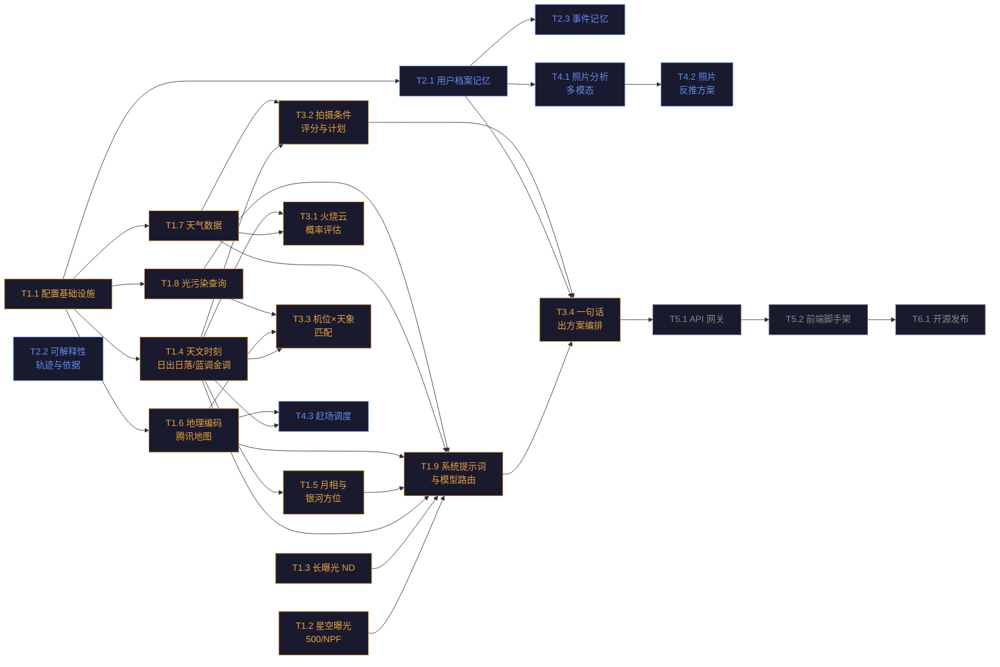

# LightTrail（光迹）· 开发进程路线图

> **版本**：v1.0
> **日期**：2026-08-16
> **作者**：架构师 高见远
> **定位**：指导后续接手的单个 agent 按步骤独立完成每个任务的原子化路线图
> **依据**：PRD v0.2、现有源码（Agent 骨架 v0.1）、TODO.md、UI 设计总览

---

## 1. 总览

### 1.1 项目现状

LightTrail Agent 骨架（v0.1，741 行）已完成：`config` / `llm/client` / `agent/core` / `agent/tools` 四层 + 两个演示工具（`get_current_time`、`equivalent_exposure`）+ CLI 入口 + pytest 测试。多轮对话、工具调用循环、串行 API 锁、容错重试等基础设施均已就绪。PRD v0.2 已定义「灵感→规划→决策→复盘」决策主线 + 记忆/可解释性地基。UI 高保真原型已交付。**当前缺口：决策主线工具层几乎空白，仅有曝光换算一个演示工具。**

### 1.2 阶段划分

| 阶段 | 主题 | 目标 | 对应 PRD |
|------|------|------|----------|
| 阶段一 | 决策主线工具层 | 打通 D3 参数推荐 + D2 基础数据（天文/天气/地理/光污染） | D3.2, D2.1, D2.3, A4 |
| 阶段二 | 记忆与可解释性地基 | 让 Agent「懂你、可信」 | M1, M2 |
| 阶段三 | 决策编排层 | 打通 D1 灵感 + D2 规划 + D3 临场决策的编排链路 | D1.1, D2.3, D3.1, D2.1-03 |
| 阶段四 | 多模态与差异化 | D4 复盘 + D1.2 照片反推 + D2.2 赶场调度 | D4, D1.2, D2.2 |
| 阶段五 | 前端工程化 | FastAPI 网关 + Web UI 脚手架，对接设计原型 | 交互层 |
| 阶段六 | 开源发布 | 文档完善、贡献指南、版本发布 | 开源目标 |

### 1.3 PRD 覆盖矩阵

| PRD 方向 | 路线图任务 | 优先级 |
|----------|-----------|--------|
| D3.2 曝光三角扩展 | T1.2（星空 500/NPF）、T1.3（长曝光 ND） | P0 |
| D3.2 风光场景参数 | T1.9（系统提示词升级，引导模型推理） | P1 |
| D3.2 月光补偿 | T1.2（星空工具含月光补偿参数） | P1 |
| D2.1 天文查询（日出日落/蓝调金调/月相月升） | T1.4、T1.5 | P0 |
| D2.3 天气工具（火烧云概率/通透度/云量） | T1.7、T3.1 | P0/P1 |
| D2.1 地理编码 | T1.6 | P0 |
| D2.1 光污染 | T1.8 | P1 |
| D2.1 机位×天象匹配 | T3.3 | P1 |
| D2.2 多机位赶场调度 | T4.3 | P1 |
| D2.3 拍摄条件评分+计划生成 | T3.2 | P0 |
| D1.1 一句话出方案（决策编排） | T3.4 | P0 |
| D1.2 照片反推方案 | T4.2 | P1 |
| D3.1 临场赌注决策（火烧云） | T3.1 | P1 |
| D4 照片智能分析（多模态） | T4.1 | P0 |
| M1 个性化记忆（档案/事件） | T2.1、T2.3 | P0/P1 |
| M2 可解释性（依据/来源/置信度） | T2.2 | P0 |
| A-06 模型路由 | T1.9 | P1 |

### 1.4 任务依赖图



---

## 2. 任务清单

### 阶段一：决策主线工具层

> 阶段目标：从「只有一个演示工具」扩展到覆盖拍摄参数推荐（星空/长曝光）+ 基础数据采集（天文/天气/地理/光污染）的完整工具链，并升级系统提示词使模型能正确编排这些工具。

---

#### T1.1 配置基础设施扩展

- **目标**：在现有 `Settings` 配置中增加用户默认位置、地图 API Key、数据目录等字段，为后续所有需要经纬度或外部 API 的工具奠定配置基础。
- **前置依赖**：无
- **输入上下文**：
  - `src/lighttrail/config.py`——现有 `Settings` dataclass（含 `api_key`/`base_url`/`model`/`model_reason` 四字段）与 `load_settings()` 函数；`PROJECT_ROOT` 常量指向项目根目录
  - `.env.example`——现有环境变量示例（`ECNU_API_KEY` / `ECNU_BASE_URL` / `ECNU_MODEL` / `ECNU_MODEL_REASON`）
  - `pyproject.toml`——项目元信息与依赖声明
- **输出交付物**：
  - `Settings` 新增字段：`latitude: float`、`longitude: float`、`tencent_map_key: str`、`data_dir: Path`
  - `load_settings()` 读取对应环境变量并返回扩展后的 `Settings`
  - `.env.example` 新增：`LIGHTTRAIL_LATITUDE`、`LIGHTTRAIL_LONGITUDE`、`TENCENT_MAP_KEY`、`LIGHTTRAIL_DATA_DIR`
  - 默认值：纬度 31.23、经度 121.47（上海），`data_dir` 默认为 `PROJECT_ROOT / "data"`
- **实现步骤**：
  1. 在 `Settings` dataclass 中新增四个字段，注意 `frozen=True` 不可变约束
  2. 在 `load_settings()` 中读取 `LIGHTTRAIL_LATITUDE`（`float`，默认 31.23）、`LIGHTTRAIL_LONGITUDE`（`float`，默认 121.47）、`TENCENT_MAP_KEY`（`str`，默认空串）、`LIGHTTRAIL_DATA_DIR`（`Path`，默认 `PROJECT_ROOT / "data"`）
  3. 在 `.env.example` 末尾追加四个变量的示例与注释说明
  4. 确保 `data_dir` 目录在首次使用时自动创建（在 `load_settings()` 或后续使用处加 `mkdir(parents=True, exist_ok=True)`）
- **验收标准**：
  - 运行 `python -c "from lighttrail.config import load_settings; s = load_settings(); print(s.latitude, s.longitude, s.tencent_map_key, s.data_dir)"`，输出 `31.23 121.47  <data_dir路径>` 无报错
  - 在 `.env` 中设置 `LIGHTTRAIL_LATITUDE=30.57`，重新运行确认读到 30.57
  - 运行 `pytest tests/` 确认现有测试不受影响
- **涉及文件**：`src/lighttrail/config.py`（修改）、`.env.example`（修改）
- **难度**：⭐
- **技术注意**：
  - `Settings` 是 `frozen=True` dataclass，新增字段需给默认值或通过 `load_settings()` 传入
  - 环境变量读取用 `os.getenv()` + 类型转换，注意 `float()` / `Path()` 的异常处理
  - 地图 Key 可为空（后续地理编码工具在无 Key 时返回提示而非崩溃）

---

#### T1.2 星空曝光工具（500 法则 / NPF 法则）

- **目标**：实现星空摄影最大不拖线快门计算工具，支持 500 法则与更精确的 NPF 法则，并结合器材给出推荐参数组合（含月光补偿）。
- **前置依赖**：无（纯数学计算，不依赖外部数据源）
- **输入上下文**：
  - `src/lighttrail/tools/exposure.py`——现有 `equivalent_exposure` 工具，参考其 `@registry.tool` 装饰器用法与返回 dict 的模式
  - `src/lighttrail/agent/tools.py`——`registry` 单例与 `@registry.tool(name=..., description=..., parameters={...})` 装饰器签名
  - `src/lighttrail/tools/__init__.py`——工具注册触发点，需新增 import
  - 术语参考（PRD 术语表）：500 法则 = `500 / (焦距 × 裁切系数)`；NPF 法则 = 考虑像素间距与光圈的更精确公式
- **输出交付物**：
  - 新文件 `src/lighttrail/tools/astro_exposure.py`，注册工具 `star_exposure`
  - 函数签名：`def star_exposure(focal_length: float, crop_factor: float = 1.0, aperture: float | None = None, pixel_pitch: float | None = None, moon_phase: float | None = None) -> dict`
  - 返回 dict 包含：`rule_500_shutter`（秒）、`npf_shutter`（秒）、`recommended_shutter`（取两者较短值）、`recommended_iso`（基础 3200，月光补偿下调）、`recommended_aperture`（若提供则原值）、`moon_compensation`（月光补偿说明）、`note`（取整建议）
  - 新文件 `tests/test_astro_exposure.py`，至少 3 个 pytest 用例
- **实现步骤**：
  1. 在 `astro_exposure.py` 中定义 `_rule_500(focal_length, crop_factor)` 内部函数，返回 `500 / (focal_length * crop_factor)` 秒
  2. 定义 `_npf_rule(focal_length, crop_factor, aperture, pixel_pitch)` 内部函数——NPF 公式：`t = (16.856 * N + 0.0997 * f * F * c + 13.713 * p * F * c) / (f * c)`，其中 N=光圈值、f=焦距、F=光圈f数、c=裁切系数、p=像素间距μm；若无 pixel_pitch 则退回 500 法则
  3. 实现 `star_exposure` 主函数：计算两种法则结果，取较短值为安全快门；若 `moon_phase` 提供（0=新月, 1=满月），按月相亮度递减 ISO（满月时 ISO 降至 800-1600）
  4. 用 `@registry.tool` 装饰器注册，`description` 写清适用场景（星空摄影、银河拍摄），`parameters` 用 JSON Schema 声明 `focal_length`（必填）、`crop_factor`/`aperture`/`pixel_pitch`/`moon_phase`（可选）
  5. 在 `tools/__init__.py` 加 `from lighttrail.tools import astro_exposure  # noqa: F401`
  6. 编写测试：验证 500 法则对 14mm 全画幅 ≈ 35.7s；验证 NPF 比 500 法则更保守；验证月光补偿逻辑
- **验收标准**：
  - `python -c "import json; from lighttrail.agent import registry; from lighttrail.tools import astro_exposure; print(json.loads(registry.dispatch('star_exposure', '{\"focal_length\": 14, \"crop_factor\": 1.0, \"aperture\": 2.8}')))"` 输出含 `rule_500_shutter` ≈ 35.7 的字典
  - `pytest tests/test_astro_exposure.py -v` 全部通过
  - `pytest tests/` 整体不受影响（注意全局 registry 单例，测试间无状态污染）
- **涉及文件**：`src/lighttrail/tools/astro_exposure.py`（新建）、`src/lighttrail/tools/__init__.py`（修改）、`tests/test_astro_exposure.py`（新建）
- **难度**：⭐⭐
- **技术注意**：
  - 工具返回 dict，由 `registry.dispatch()` 自动 `json.dumps` 序列化回传模型
  - NPF 公式中像素间距 `pixel_pitch` 可从机身规格查表（常见全画幅约 5.9μm、APS-C 约 3.8μm），若用户未提供则用裁切系数估算或退回 500 法则并注明
  - 月光补偿是经验值：新月 ISO 3200-6400、半月 ISO 1600-3200、满月 ISO 800-1600，在 `note` 中说明这是经验估算
  - 不要在工具内部调用 LLM 或其他工具——这是纯计算工具

---

#### T1.3 长曝光 ND 换算工具

- **目标**：实现中性密度（ND）滤镜长曝光换算工具，根据基准曝光与 ND 档位计算长曝光快门，并支持目标光圈调整。
- **前置依赖**：无（纯数学计算）
- **输入上下文**：
  - `src/lighttrail/tools/exposure.py`——现有曝光换算工具，参考 EV 计算思路（`factor = 2.0**adjust_stops`）与返回结构
  - `src/lighttrail/agent/tools.py`——`registry` 装饰器用法
  - `src/lighttrail/tools/__init__.py`——注册触发点
  - 术语参考：ND 滤镜每档减光 2 倍（1 档 = ND2，3 档 = ND8，6 档 = ND64，10 档 = ND1000）
- **输出交付物**：
  - 新文件 `src/lighttrail/tools/long_exposure.py`，注册工具 `nd_long_exposure`
  - 函数签名：`def nd_long_exposure(base_aperture: float, base_shutter: float, base_iso: int, nd_stops: float, target_aperture: float | None = None) -> dict`
  - 返回 dict 包含：`new_shutter`（秒）、`new_shutter_formatted`（如 "30s"、"2min 15s" 可读格式）、`nd_filter_label`（如 "ND1000 (10档)"）、`ev_compensation`（EV 变化说明）、`note`（实操提示：用 B 门、需三脚架、防抖关闭等）
  - 新文件 `tests/test_long_exposure.py`，至少 3 个 pytest 用例
- **实现步骤**：
  1. 在 `long_exposure.py` 中定义 `_stops_to_nd_label(nd_stops)` 辅助函数，将档数转为 ND 标签（如 10 → "ND1000"，6 → "ND64"，3 → "ND8"）
  2. 定义 `_format_exposure_time(seconds)` 辅助函数，将秒数格式化为可读时间（如 0.5 → "1/2s"，30 → "30s"，135 → "2min 15s"）
  3. 实现 `nd_long_exposure` 主函数：`new_shutter = base_shutter * (2 ** nd_stops)`；若提供 `target_aperture` 则额外补偿光圈变化档数：`aperture_stops = 2 * log2(target_aperture / base_aperture)`，`new_shutter *= 2 ** aperture_stops`
  4. 用 `@registry.tool` 注册，`parameters` 声明 `base_aperture`/`base_shutter`/`base_iso`/`nd_stops` 为必填、`target_aperture` 可选
  5. 在 `tools/__init__.py` 加 import
  6. 编写测试：验证 ND1000（10档）+ 基准 1/100s → 10.24s；验证目标光圈调整；验证格式化函数
- **验收标准**：
  - `python -c "import json; from lighttrail.agent import registry; from lighttrail.tools import long_exposure; print(json.loads(registry.dispatch('nd_long_exposure', '{\"base_aperture\": 8, \"base_shutter\": 0.01, \"base_iso\": 100, \"nd_stops\": 10}')))"` 输出 `new_shutter` ≈ 10.24
  - `pytest tests/test_long_exposure.py -v` 全部通过
- **涉及文件**：`src/lighttrail/tools/long_exposure.py`（新建）、`src/lighttrail/tools/__init__.py`（修改）、`tests/test_long_exposure.py`（新建）
- **难度**：⭐⭐
- **技术注意**：
  - ND 档数与 ND 编号关系：ND 编号 = 2^档数（如 3 档 = 2^3 = ND8）。工具接收的是**档数**，内部转换
  - 长曝光超过 30s 时提示用户使用 B 门模式
  - `log2` 可用 `math.log2()`（Python 3.10+ 内置）
  - 工具纯计算，不依赖外部服务

---

#### T1.4 天文时刻计算工具（日出日落 / 蓝调金调 / 晨昏蒙影）

- **目标**：实现基于经纬度与日期的天文时刻计算工具，输出日出日落、金色时刻、蓝调时刻、晨昏蒙影（天文/航海/民用）的精确时间。
- **前置依赖**：T1.1（需要 `latitude` / `longitude` 配置作为默认值）
- **输入上下文**：
  - `src/lighttrail/config.py`——`Settings` 中的 `latitude` / `longitude` 字段（T1.1 新增），`load_settings()` 函数
  - `src/lighttrail/agent/tools.py`——`registry` 装饰器
  - `src/lighttrail/tools/__init__.py`——注册触发点
  - PRD 术语表：黄金时刻（日出后/日落前约 1 小时）、蓝调时刻（日出前/日落后约 30min）、天文晨光/暮光（太阳地平线下 18°）
- **输出交付物**：
  - 新文件 `src/lighttrail/tools/astronomy.py`，注册工具 `get_sun_events`
  - 函数签名：`def get_sun_events(latitude: float | None = None, longitude: float | None = None, date: str | None = None) -> dict`
  - 返回 dict 包含：`date`、`location`（lat/lon）、`sunrise`/`sunset`（ISO 时间）、`golden_hour_morning_start/end`、`golden_hour_evening_start/end`、`blue_hour_morning_start/end`、`blue_hour_evening_start/end`、`astronomical_dawn`/`astronomical_dusk`、`nautical_dawn`/`nautical_dusk`、`civil_dawn`/`civil_dusk`、`day_length`（小时）、`note`
  - 新文件 `tests/test_astronomy.py`，至少 3 个 pytest 用例
- **实现步骤**：
  1. 在 `requirements.txt` 与 `pyproject.toml` 的 `dependencies` 中添加 `astral>=3.0`
  2. 在 `astronomy.py` 中导入 `from astral import LocationInfo` 和 `from astral.sun import sun`；导入 `from lighttrail.config import load_settings` 获取默认经纬度
  3. 实现 `get_sun_events`：若未传 lat/lon 则从 `load_settings()` 取默认值；若未传 date 则取当天；构造 `LocationInfo("Custom", "China", "Asia/Shanghai", latitude, longitude)`，调用 `sun(location, date)` 获取结果字典
  4. 从 `sun()` 返回的字典中提取各时刻（`astral` 的 `sun()` 返回含 `sunrise`/`sunset`/`golden_hour_start`/`golden_hour_end`/`blue_hour_start`/`blue_hour_end`/`dawn`/`dusk` 等键），将 `datetime` 对象格式化为 ISO 字符串
  5. 用 `@registry.tool` 注册，`description` 说明适用场景（判断拍摄时机、规划黄金/蓝调窗口），`parameters` 声明三个可选参数
  6. 在 `tools/__init__.py` 加 import
  7. 编写测试：验证上海夏至日日出早于 5:00、日落晚于 18:30；验证蓝调时刻在日落后；验证默认参数（不传 lat/lon）能从配置读取
- **验收标准**：
  - `python -c "import json; from lighttrail.agent import registry; from lighttrail.tools import astronomy; print(json.loads(registry.dispatch('get_sun_events', '{\"latitude\": 31.23, \"longitude\": 121.47, \"date\": \"2026-06-21\"}')))"` 输出含 `sunrise` / `sunset` / `golden_hour_evening_start` 等字段的字典
  - `pytest tests/test_astronomy.py -v` 全部通过
- **涉及文件**：`src/lighttrail/tools/astronomy.py`（新建）、`src/lighttrail/tools/__init__.py`（修改）、`tests/test_astronomy.py`（新建）
- **难度**：⭐⭐⭐
- **技术注意**：
  - `astral` 库 API 随版本变化较大——建议安装后先查 `astral.sun.sun` 的返回键名（`python -c "from astral.sun import sun; from astral import LocationInfo; help(sun)"` 或查看源码），以实际可用键为准
  - `astral` 3.x 使用 `LocationInfo` 而非旧版 `Location`；`sun()` 返回一个 dict-like 对象
  - 蓝调时刻在某些 `astral` 版本中可能需要通过民用暮光与航海暮光的边界手动计算
  - 时区固定为 `Asia/Shanghai`（小北在上海），后续可参数化
  - 若 `astral` 计算失败（如极昼/极夜），捕获异常返回 `{"error": "该日期/位置无法计算天文时刻"}`

---

#### T1.5 月相与银河方位计算

- **目标**：在 `astronomy.py` 中扩展月相、月升月落与银河中心方位角/仰角计算，为星空拍摄规划提供关键数据。
- **前置依赖**：T1.4（同一文件 `astronomy.py`，在其基础上添加函数）
- **输入上下文**：
  - `src/lighttrail/tools/astronomy.py`——T1.4 创建的天文工具文件，含 `get_sun_events` 与 `astral` 导入
  - `src/lighttrail/agent/tools.py`——`registry` 装饰器
  - `src/lighttrail/tools/__init__.py`——已 import `astronomy`（T1.4 已添加），无需再改
- **输出交付物**：
  - 在 `astronomy.py` 中新增工具 `get_moon_events` 和 `get_galactic_center`
  - `get_moon_events(latitude, longitude, date) -> dict`：返回 `moon_phase`（0-1，0=新月 1=满月）、`moon_phase_name`（新月/蛾眉月/上弦/盈凸/满月/亏凸/下弦/残月）、`moon_illumination`（百分比）、`moonrise`/`moonset`（ISO 时间，若当日有）
  - `get_galactic_center(latitude, longitude, datetime) -> dict`：返回 `azimuth`（方位角°，正北=0 顺时针）、`altitude`（仰角°，地平线=0）、`is_visible`（仰角>0 为 True）、`best_time`（银河中心最高点的近似时间）、`note`
  - 新增测试用例到 `tests/test_astronomy.py`（追加，不新建文件）
- **实现步骤**：
  1. 在 `requirements.txt` 添加 `ephem>=4.1`（轻量天文计算库，支持月相、月亮位置、恒星位置）
  2. 在 `astronomy.py` 中导入 `import ephem`；定义银心坐标常量 `_SGR_A_RA = "17:45:40"` / `_SGR_A_DEC = "-29:00:28"`（人马座 A* 赤经赤纬）
  3. 实现 `get_moon_events`：用 `ephem.Observer()` 设置经纬度和日期，`ephem.Moon()` 计算月相（`moon.phase` 返回 0-28 的月龄，换算为 0-1 的 `moon_phase = (phase % 29.53) / 29.53`）；`moonrise`/`moonset` 用 `observer.next_rising(moon)` / `observer.next_setting(moon)`
  4. 实现 `get_galactic_center`：用 `ephem.FixedBody()` 设置银心 RA/Dec，在 `ephem.Observer` 上计算 `alt`/`az`（弧度转度）；`is_visible = altitude > 0`；遍历当晚每小时取最高仰角时刻作为 `best_time`
  5. 用 `@registry.tool` 分别注册两个工具，description 说明用途（月相判断星空窗口、银心方位判断银河拍摄方向）
  6. 编写测试：验证满月日月照度≈100%；验证北半球夏季银心仰角>0（可观测）；验证南半球冬季银心不可见
- **验收标准**：
  - `python -c "import json; from lighttrail.agent import registry; from lighttrail.tools import astronomy; print(json.loads(registry.dispatch('get_moon_events', '{\"latitude\": 31.23, \"longitude\": 121.47}')))"` 输出含 `moon_phase` / `moon_illumination` 的字典
  - `python -c "import json; from lighttrail.agent import registry; from lighttrail.tools import astronomy; print(json.loads(registry.dispatch('get_galactic_center', '{\"latitude\": 31.23, \"longitude\": 121.47, \"datetime\": \"2026-07-15T02:00:00+08:00\"}')))"` 输出含 `azimuth` / `altitude` / `is_visible` 的字典
  - `pytest tests/test_astronomy.py -v` 全部通过（含新增用例）
- **涉及文件**：`src/lighttrail/tools/astronomy.py`（修改）、`tests/test_astronomy.py`（修改，追加用例）
- **难度**：⭐⭐⭐
- **技术注意**：
  - `ephem` 是 C 扩展库，需确保 `pip install ephem` 在目标环境可编译（通常有预编译 wheel）
  - `ephem.Observer` 的经纬度设置为字符串格式（`observer.lat = '31.23'`，`observer.lon = '121.47'`），注意南纬/西经为负
  - 月相名称判断：0-0.03 或 0.97-1.0 = 新月，0.22-0.28 = 上弦，0.47-0.53 = 满月，0.72-0.78 = 下弦，其余为蛾眉/盈凸/亏凸/残月（边界可微调）
  - 银心方位角对星空摄影很重要——摄影师需知道银心在哪个方向，以选择朝向合适的机位
  - `tools/__init__.py` 已在 T1.4 中 import 了 `astronomy` 模块，本任务新增的工具函数在同模块内定义，import 时自动注册，无需修改 `__init__.py`

---

#### T1.6 地理编码工具（腾讯地图）

- **目标**：实现地名→经纬度的地理编码与逆地理编码工具，对接腾讯地图 API，为天文/天气/光污染等工具提供「用户说地名→获取坐标」的桥梁。
- **前置依赖**：T1.1（需要 `tencent_map_key` 配置）
- **输入上下文**：
  - `src/lighttrail/config.py`——`Settings.tencent_map_key` 字段（T1.1 新增）、`load_settings()` 函数
  - `src/lighttrail/agent/tools.py`——`registry` 装饰器
  - `src/lighttrail/tools/__init__.py`——注册触发点
  - 腾讯地图地理编码 API：`GET https://apis.map.qq.com/ws/geocoder/v1/?address={地址}&key={key}`
  - 逆地理编码 API：`GET https://apis.map.qq.com/ws/geocoder/v1/?location={lat},{lng}&key={key}`
- **输出交付物**：
  - 新文件 `src/lighttrail/tools/location.py`，注册工具 `geocode` 和 `reverse_geocode`
  - `geocode(address: str) -> dict`：返回 `latitude`、`longitude`、`formatted_address`、`province`、`city`、`district`
  - `reverse_geocode(latitude: float, longitude: float) -> dict`：返回 `formatted_address`、`province`、`city`、`district`、`nearest_landmark`（若 API 返回）
  - 新文件 `tests/test_location.py`，至少 2 个 pytest 用例（可 mock HTTP 响应）
- **实现步骤**：
  1. 在 `requirements.txt` 添加 `httpx>=0.27`（HTTP 客户端，openai 已传递依赖但应显式声明）
  2. 在 `location.py` 中导入 `httpx`、`from lighttrail.config import load_settings`；定义内部函数 `_call_tencent_map(endpoint, params)` 封装 HTTP 调用与错误处理
  3. 实现 `geocode`：从 `load_settings()` 取 `tencent_map_key`，若为空返回 `{"error": "未配置腾讯地图 API Key"}`；调用地理编码 API，解析 JSON 返回 `result.location.lat` / `result.location.lng` 等字段
  4. 实现 `reverse_geocode`：调用逆地理编码 API，解析返回地址组件
  5. 用 `@registry.tool` 注册两个工具；`geocode` 的 description 说明「用户说地名时调用此工具获取经纬度」
  6. 在 `tools/__init__.py` 加 import
  7. 编写测试：mock `httpx.get` 返回固定 JSON，验证解析逻辑；验证无 Key 时的错误返回
- **验收标准**：
  - 配置有效 `TENCENT_MAP_KEY` 后，`python -c "import json; from lighttrail.agent import registry; from lighttrail.tools import location; print(json.loads(registry.dispatch('geocode', '{\"address\": \"上海外滩\"}')))"` 输出含 `latitude` ≈ 31.24 的字典
  - 未配置 Key 时返回 `{"error": "..."}`
  - `pytest tests/test_location.py -v` 全部通过（mock 模式，不依赖网络）
- **涉及文件**：`src/lighttrail/tools/location.py`（新建）、`src/lighttrail/tools/__init__.py`（修改）、`tests/test_location.py`（新建）
- **难度**：⭐⭐
- **技术注意**：
  - 腾讯地图 API 有 QPS 限制（免费版默认 5 次/秒），工具内不需要限流（由串行调用天然保证），但需注意错误码处理
  - `httpx` 调用设 `timeout=10`（NF-03 工具执行超时 10s）
  - API 返回的 `status` 字段：0=成功，非 0=失败，需检查并返回 `{"error": ...}`
  - 网络异常（`httpx.ConnectError` 等）捕获后返回 `{"error": "地图服务暂时不可用：..."}`，不崩溃
  - 腾讯地图 Key 需在腾讯位置服务控制台申请（https://lbs.qq.com/），免费额度足够 MVP 使用

---

#### T1.7 天气数据获取工具

- **目标**：实现天气预报数据获取工具，提供云量（总/低/中/高云层）、能见度、降水概率、风速、温度等字段，为拍摄规划与火烧云评估提供气象数据基础。
- **前置依赖**：T1.1（需要 `latitude` / `longitude` 默认配置）
- **输入上下文**：
  - `src/lighttrail/config.py`——`Settings.latitude` / `longitude`（T1.1 新增）
  - `src/lighttrail/agent/tools.py`——`registry` 装饰器
  - `src/lighttrail/tools/__init__.py`——注册触发点
  - 推荐数据源：Open-Meteo API（免费、无需 API Key、提供多层云量字段）
  - API 文档：`https://api.open-meteo.com/v1/forecast?latitude={lat}&longitude={lon}&hourly=cloudcover,cloudcover_low,cloudcover_mid,cloudcover_high,visibility,precipitation_probability,windspeed_10m,temperature_2m&forecast_days={days}&timezone=Asia/Shanghai`
- **输出交付物**：
  - 新文件 `src/lighttrail/tools/weather.py`，注册工具 `get_weather`
  - 函数签名：`def get_weather(latitude: float | None = None, longitude: float | None = None, days: int = 3) -> dict`
  - 返回 dict 包含：`location`（lat/lon）、`forecast_days`、`hourly`（列表，每项含 `time`/`cloud_cover`/`cloud_cover_low`/`cloud_cover_mid`/`cloud_cover_high`/`visibility`/`precipitation_probability`/`wind_speed`/`temperature`）、`daily_summary`（每日云量均值/降水概率峰值/能见度均值的摘要）、`data_source`（"Open-Meteo"）、`note`
  - 新文件 `tests/test_weather.py`，至少 2 个 pytest 用例（mock HTTP）
- **实现步骤**：
  1. 在 `weather.py` 中导入 `httpx`、`from lighttrail.config import load_settings`
  2. 定义 `_call_open_meteo(lat, lon, days)` 内部函数：构造 URL，`httpx.get(url, timeout=10)`，解析 JSON
  3. 实现 `get_weather`：若未传 lat/lon 取默认值；限制 `days` 在 1-7；调用 API；将 `hourly` 数据整理为时间序列列表；计算 `daily_summary`（按日期分组聚合）
  4. 用 `@registry.tool` 注册；`description` 写清适用场景（判断天气是否适合拍摄、火烧云评估、星空可见度判断），特别说明「提供高云/中云/低云分层云量，火烧云判断需要高云数据」
  5. 在 `tools/__init__.py` 加 import
  6. 编写测试：mock `httpx.get` 返回样例 JSON，验证解析与聚合逻辑；验证默认参数
- **验收标准**：
  - `python -c "import json; from lighttrail.agent import registry; from lighttrail.tools import weather; print(json.loads(registry.dispatch('get_weather', '{\"latitude\": 31.23, \"longitude\": 121.47, \"days\": 2}')))"` 输出含 `hourly` 列表与 `daily_summary` 的字典（需网络）
  - `pytest tests/test_weather.py -v` 全部通过（mock 模式）
  - 验证 `cloud_cover_high` 字段存在（火烧云评估依赖此字段）
- **涉及文件**：`src/lighttrail/tools/weather.py`（新建）、`src/lighttrail/tools/__init__.py`（修改）、`tests/test_weather.py`（新建）
- **难度**：⭐⭐⭐
- **技术注意**：
  - Open-Meteo 无需 API Key，免费额度充足（每天 10000 次），适合 MVP
  - `cloud_cover_high`（高云量）是火烧云判断的关键——火烧云需要高云（卷云）散射阳光，低云无霞
  - `httpx.get` 设 `timeout=10`；网络异常返回 `{"error": "天气数据获取失败：..."}`
  - 返回数据量较大时注意不要超出模型上下文——`hourly` 列表可截断为最近 48 小时，`daily_summary` 保留完整
  - `data_source` 字段用于 M2 可解释性的来源标注

---

#### T1.8 光污染查询工具

- **目标**：实现基于经纬度的光污染（Bortle 暗空等级）查询工具，评估星空拍摄可行性。
- **前置依赖**：T1.1（需要 `latitude` / `longitude` 默认配置）
- **输入上下文**：
  - `src/lighttrail/config.py`——`Settings.latitude` / `longitude`、`data_dir`（T1.1 新增，可存放数据文件）
  - `src/lighttrail/agent/tools.py`——`registry` 装饰器
  - `src/lighttrail/tools/__init__.py`——注册触发点
  - PRD 术语表：Bortle 等级（1-9，1=最暗、9=市中心）、SQM（mag/arcsec²，天空亮度）
  - 数据源方案（三选一，见「待明确事项」）：
    - 方案 A（推荐 MVP）：随项目内置一份精简的中国主要城市/暗空地点 Bortle 查找表（JSON），按最近邻匹配
    - 方案 B：调用在线光污染地图 API（如 lightpollutionmap.info）
    - 方案 C：基于距城市中心的距离估算 Bortle 等级（粗略但零依赖）
- **输出交付物**：
  - 新文件 `src/lighttrail/tools/lightpollution.py`，注册工具 `get_light_pollution`
  - 函数签名：`def get_light_pollution(latitude: float | None = None, longitude: float | None = None) -> dict`
  - 返回 dict 包含：`bortle_class`（1-9 整数）、`bortle_description`（如 "1: 典型暗空，银河结构清晰可见"）、`sqm_estimate`（mag/arcsec² 估算值）、`stargazing_suitability`（"极佳"/"良好"/"一般"/"差"/"不适合"）、`data_source`（标注数据来源与精度）、`note`
  - 新文件 `tests/test_lightpollution.py`，至少 2 个 pytest 用例
- **实现步骤**：
  1. 在 `lightpollution.py` 中定义 Bortle 等级描述表 `_BORTLE_DESCRIPTIONS`（1-9 各一条中文描述）与 SQM 估算映射
  2. 若选方案 A：在 `data/` 目录下创建 `bortle_locations.json`（含若干已知地点的 lat/lon/bortle），实现 `_nearest_lookup(lat, lon)` 按最近邻返回 Bortle 等级
  3. 若选方案 C：实现 `_estimate_by_distance(lat, lon)`——计算距最近大城市的距离，按距离阈值映射 Bortle（如 <5km → 8-9，5-20km → 6-7，20-50km → 4-5，>50km → 2-3）
  4. 实现 `get_light_pollution`：调用查询逻辑，组装返回 dict
  5. 用 `@registry.tool` 注册；`description` 说明「评估某地点的暗空等级，判断是否适合星空摄影」
  6. 在 `tools/__init__.py` 加 import
  7. 编写测试：验证上海市中心 Bortle ≥ 7；验证偏远山区 Bortle ≤ 3（方案 A/C）
- **验收标准**：
  - `python -c "import json; from lighttrail.agent import registry; from lighttrail.tools import lightpollution; print(json.loads(registry.dispatch('get_light_pollution', '{\"latitude\": 31.23, \"longitude\": 121.47}')))"` 输出含 `bortle_class` ≥ 7 的字典
  - `pytest tests/test_lightpollution.py -v` 全部通过
- **涉及文件**：`src/lighttrail/tools/lightpollution.py`（新建）、`src/lighttrail/tools/__init__.py`（修改）、`tests/test_lightpollution.py`（新建）；若方案 A 还含 `data/bortle_locations.json`（新建）
- **难度**：⭐⭐
- **技术注意**：
  - 光污染数据精度直接影响星空拍摄决策可信度——`data_source` 字段必须诚实标注是「精确查询」还是「粗略估算」
  - 方案 A 的查找表建议包含：上海/北京/广州市中心（Bortle 8-9）、崇明东滩/滴水湖（Bortle 5-6）、浙西山区/安吉天荒坪（Bortle 3-4）、青海冷湖/西藏阿里（Bortle 1-2）
  - `stargazing_suitability` 映射：Bortle 1-2 → 极佳、3-4 → 良好、5 → 一般、6-7 → 差、8-9 → 不适合
  - 此工具为 P1 优先级，可先用方案 C 快速实现，后续替换为精确数据源

---

#### T1.9 系统提示词升级与模型路由

- **目标**：升级 Agent 的系统提示词以描述所有新工具能力，并实现 ecnu-plus（工具调用/多模态）与 ecnu-max（深度推理）的模型路由策略。
- **前置依赖**：T1.2、T1.3、T1.4、T1.5、T1.6、T1.7、T1.8（需要知道所有已注册工具的名称与用途，以编写准确的系统提示词）
- **输入上下文**：
  - `src/lighttrail/agent/core.py`——`DEFAULT_SYSTEM_PROMPT` 常量（当前仅描述时间查询与曝光换算）、`Agent.__init__` 接受 `model` 参数、`Agent._run_loop` 调用 `self._client.chat(..., model=self._model, ...)`、`Agent._build_messages` 构建 system + history
  - `src/lighttrail/llm/client.py`——`ChatClient.chat(messages, model=, tools=, temperature=)` 方法签名
  - `src/lighttrail/config.py`——`Settings.model`（ecnu-plus）与 `Settings.model_reason`（ecnu-max）
  - PRD 附录 B：ecnu-plus 支持 工具调用+图片理解+thinking；ecnu-max 不支持工具调用但支持 thinking + reasoning_effort，1M 上下文
- **输出交付物**：
  - 更新 `DEFAULT_SYSTEM_PROMPT`：描述全部工具能力（时间、曝光换算、星空曝光、ND 长曝光、天文时刻、月相银心、地理编码、天气、光污染），明确行为准则（先调用工具获取真实数据再给建议、每条建议附依据、区分精确计算与经验估算）
  - `Agent` 新增 `reason(prompt: str, system: str = "") -> str` 方法：使用 `model_reason`（ecnu-max）做纯文本深度推理（不携带工具），用于计划编排等需要强推理的场景
  - `Agent.__init__` 新增可选参数 `model_reason: str | None = None`，缺省从 `Settings` 读取
- **实现步骤**：
  1. 重写 `DEFAULT_SYSTEM_PROMPT`：分段描述角色定位、可用工具清单（每个工具一行简述）、行为准则（调用工具优先、附依据、中文回答、区分精确与估算）、拍摄场景知识引导（风光/星空/火烧云三大题材的参数起点提示，对应 D3.2-04 风光场景参数建议）
  2. 在 `Agent.__init__` 中新增 `model_reason` 参数，存为 `self._model_reason`
  3. 实现 `reason(prompt, system="")` 方法：构建 `[{"role": "system", "content": system or self._system_prompt}, {"role": "user", "content": prompt}]`，调用 `self._client.chat(messages, model=self._model_reason, tools=None, temperature=0.3)`，返回 `content`
  4. 在 `_run_loop` 中保持 `self._model`（ecnu-plus）用于工具调用链路不变
  5. 更新 `cli.py` 中 `Agent` 构造，传入 `model_reason=settings.model_reason`
  6. 更新测试：验证 `reason()` 方法调用时 model 参数为 reason 模型、tools 为 None
- **验收标准**：
  - `python -c "from lighttrail.agent.core import DEFAULT_SYSTEM_PROMPT; print(len(DEFAULT_SYSTEM_PROMPT))"` 输出 > 500（提示词已扩充）
  - 现有 `pytest tests/` 全部通过
  - 新增测试验证 `reason()` 方法：用 FakeChatClient 检查传入的 `model` 参数为 reason 模型
- **涉及文件**：`src/lighttrail/agent/core.py`（修改）、`src/lighttrail/cli.py`（修改）、`tests/test_agent.py`（修改，追加用例）
- **难度**：⭐⭐
- **技术注意**：
  - ecnu-max **不支持工具调用**（PRD 附录 B），`reason()` 方法必须 `tools=None`
  - 系统提示词是模型行为的核心控制器——描述越精确，模型调用工具的准确率越高
  - 风光场景参数建议（D3.2-04）不做成独立工具，而是在系统提示词中注入场景知识，让模型推理给出起点参数（如「日落剪影建议 f/8-11、ISO 100、快门按测光」），这与 PRD「给决策不只是给数据」的定位一致
  - `reason()` 方法供 T3.4 编排层调用——编排层先用 ecnu-plus 采集工具数据，再用 ecnu-max 综合推理生成方案

---

### 阶段二：记忆与可解释性地基

> 阶段目标：实现 M1 个性化记忆（用户档案 + 事件记忆）与 M2 可解释性（工具调用轨迹 + 建议依据），让 Agent「越用越懂用户、每个决策都可追溯」。

---

#### T2.1 用户档案记忆

- **目标**：实现用户档案的存储、读取与注入机制——用户在 JSON 文件中配置器材/偏好/常拍点，Agent 每次对话自动将档案摘要注入系统提示词，实现「记得你的器材与偏好」。
- **前置依赖**：T1.1（需要 `data_dir` 配置确定存储路径）
- **输入上下文**：
  - `src/lighttrail/config.py`——`Settings.data_dir`（T1.1 新增）、`load_settings()` 函数
  - `src/lighttrail/agent/core.py`——`Agent.__init__` 接受 `system_prompt` 参数、`Agent._build_messages` 在消息列表头部插入 system 消息
  - PRD 5.1 M1：用户档案含器材（机身/镜头）、偏好、常拍点、技能水平；档案常驻注入 system prompt（M1.2-01）；无档案时主动询问（D1.1-02）
- **输出交付物**：
  - 新文件 `src/lighttrail/memory/__init__.py`（包初始化）
  - 新文件 `src/lighttrail/memory/profile.py`——`UserProfile` 类
  - 新文件 `src/lighttrail/agent/memory.py`——`MemoryManager` 类
  - 修改 `src/lighttrail/agent/core.py`——`Agent` 集成 `MemoryManager`
  - `UserProfile` 类设计：
    ```
    class UserProfile:
        path: Path  # JSON 文件路径
        data: dict  # 原始档案数据
        def load() -> UserProfile  # 类方法，从 data_dir/profile.json 加载
        def save() -> None
        def to_prompt_section() -> str  # 返回精简的档案摘要文本
        def is_empty() -> bool
        def update(fields: dict) -> None  # 更新档案字段
    ```
  - `MemoryManager` 类设计：
    ```
    class MemoryManager:
        profile: UserProfile
        def __init__(data_dir: Path)
        def build_system_prompt(base_prompt: str) -> str  # base + 档案摘要
        def get_profile_summary() -> str
    ```
- **实现步骤**：
  1. 创建 `src/lighttrail/memory/` 包与 `__init__.py`
  2. 实现 `UserProfile`：`load()` 读取 `data_dir/profile.json`（不存在则返回空档案）；`to_prompt_section()` 将器材/偏好/常拍点格式化为 ≤300 字的摘要文本（如「用户器材：松下 S5M2 + 契卡 14mm f/2.8 / 24-105mm f/4；偏好：风光、星空；常拍点：崇明东滩、滴水湖」）；`save()` 写回 JSON
  3. 创建 `data/profile.example.json` 模板文件（含字段示例：`camera_body`/`lenses`/`preferences`/`common_locations`/`skill_level`）
  4. 实现 `MemoryManager`：`__init__` 加载 UserProfile；`build_system_prompt(base)` 将 `profile.to_prompt_section()` 追加到 base prompt 末尾（若档案非空）
  5. 修改 `Agent.__init__`：新增可选参数 `memory: MemoryManager | None = None`；在 `_build_messages` 中若有 memory 则用 `memory.build_system_prompt(self._system_prompt)` 替代原始 system prompt
  6. 修改 `cli.py`：创建 `MemoryManager` 并传入 Agent
  7. 编写测试：验证空档案时 system prompt 不变；验证有档案时 prompt 末尾含器材信息
- **验收标准**：
  - 创建 `data/profile.json` 写入器材信息后，`python -c "from lighttrail.memory.profile import UserProfile; from lighttrail.config import load_settings; p = UserProfile.load(load_settings().data_dir); print(p.to_prompt_section())"` 输出含器材的摘要
  - `pytest tests/` 全部通过
  - 无 `profile.json` 时 Agent 正常工作（档案为空，不注入额外内容）
- **涉及文件**：`src/lighttrail/memory/__init__.py`（新建）、`src/lighttrail/memory/profile.py`（新建）、`src/lighttrail/agent/memory.py`（新建）、`src/lighttrail/agent/core.py`（修改）、`data/profile.example.json`（新建）
- **难度**：⭐⭐⭐
- **技术注意**：
  - 档案注入的摘要必须精简（≤300 字），避免上下文膨胀（NF-04）
  - `profile.json` 不存在时不应报错，返回空档案——首次使用时由用户手动创建（复制 `profile.example.json`）
  - `MemoryManager` 设计为可扩展——后续 T2.3 事件记忆会在此基础上增加事件检索注入
  - 记忆数据仅本地存储（NF-14 隐私），不外传
  - `agent/__init__.py` 需更新 `__all__` 导出 `MemoryManager`

---

#### T2.2 工具调用轨迹与可解释性

- **目标**：实现工具调用轨迹记录与建议依据生成机制——记录每轮对话调用了哪些工具、获取了什么关键数据，并引导模型在输出中附注决策依据与置信度。
- **前置依赖**：无（仅修改 Agent 核心循环，不依赖其他工具任务）
- **输入上下文**：
  - `src/lighttrail/agent/core.py`——`Agent._execute_tool_calls` 方法（逐条执行工具调用并回传模型）、`Agent.run` 方法（返回最终文本）、`Agent._run_loop` 方法（循环逻辑）
  - `src/lighttrail/agent/tools.py`——`registry.dispatch(name, arguments_json)` 返回 JSON 字符串
  - PRD 5.2 M2：M2-01 工具调用轨迹（记录并展示调用了哪些工具、关键数据）、M2-02 建议依据生成（每条结论附计算/推理依据）、M2-03 来源与置信度标注
- **输出交付物**：
  - 新文件 `src/lighttrail/agent/explainability.py`——`TraceRecorder` 类
  - 修改 `src/lighttrail/agent/core.py`——Agent 集成 TraceRecorder
  - `TraceRecorder` 类设计：
    ```
    class TraceRecorder:
        records: list[dict]  # 每条含 tool_name, arguments, result_summary, timestamp
        def record(tool_name: str, arguments: dict, result: dict) -> None
        def to_summary() -> str  # 格式化为可读的轨迹摘要文本
        def to_prompt_section() -> str  # 注入 system prompt 的轨迹提示
        def clear() -> None
        @property
        def is_empty() -> bool
    ```
  - `Agent.run` 返回值可扩展为含轨迹的结构（或新增 `run_with_trace` 方法）
- **实现步骤**：
  1. 实现 `TraceRecorder`：`record()` 将工具名、参数（截断至 200 字）、结果（提取关键字段，截断至 300 字）存入列表；`to_summary()` 格式化为「① 调用 get_sun_events → 日出 05:12 日落 18:47\n② 调用 get_weather → 高云量 45% 能见度 8km」式文本
  2. 修改 `Agent.__init__`：新增 `self._trace = TraceRecorder()`
  3. 修改 `Agent._execute_tool_calls`：在每次 `dispatch` 后调用 `self._trace.record(name, arguments, result_dict)`
  4. 修改 `Agent._build_messages`：在 system prompt 中追加轨迹提示段——「本轮已调用以下工具获取数据：{trace_summary}。请在回答中引用这些数据作为依据，并对经验估算类结论标注置信度。」
  5. 修改 `Agent.run`：每轮开始时 `self._trace.clear()`；返回最终文本
  6. 在 `agent/__init__.py` 导出 `TraceRecorder`
  7. 编写测试：用 FakeChatClient 触发工具调用，验证 TraceRecorder 记录正确、`to_summary()` 含工具名
- **验收标准**：
  - 用 FakeChatClient 触发一次工具调用后，`agent._trace.to_summary()` 非空且含工具名
  - `pytest tests/` 全部通过
  - 第二轮 LLM 请求的 system prompt 中包含轨迹摘要文本
- **涉及文件**：`src/lighttrail/agent/explainability.py`（新建）、`src/lighttrail/agent/core.py`（修改）、`tests/test_agent.py`（修改，追加用例）
- **难度**：⭐⭐
- **技术注意**：
  - 轨迹注入 system prompt 而非 user 消息——确保模型在生成回复时始终「看到」已获取的数据
  - 轨迹摘要要精简——只保留工具名与关键字段值，不回传完整 JSON（避免上下文膨胀）
  - M2-03 来源标注与置信度主要通过系统提示词引导模型行为实现（在 T1.9 的提示词中已包含「区分精确计算与经验估算」的要求），TraceRecorder 提供数据支撑
  - `result_summary` 的提取逻辑：对 dict 结果取前 3-5 个 key-value，值过长则截断

---

#### T2.3 事件记忆存储与检索

- **目标**：实现基于 SQLite 的事件记忆存储——记录拍摄记录、经验教训与纠错反馈，并支持按地点/题材/时间关键词检索后注入对话上下文。
- **前置依赖**：T2.1（需要 `MemoryManager` 框架，事件检索结果通过 MemoryManager 注入）
- **输入上下文**：
  - `src/lighttrail/agent/memory.py`——T2.1 创建的 `MemoryManager` 类（需扩展事件检索能力）
  - `src/lighttrail/config.py`——`Settings.data_dir`（SQLite 文件存放目录）
  - PRD 5.1 M1：事件记忆含拍摄记录、经验教训、纠错反馈；按「地点/题材/时间」关键词匹配后注入（M1.2-02）；对话自动抽取（M1.1-02，实验性）
- **输出交付物**：
  - 新文件 `src/lighttrail/memory/events.py`——`EventStore` 类
  - 修改 `src/lighttrail/agent/memory.py`——`MemoryManager` 集成事件检索
  - `EventStore` 类设计：
    ```
    class EventStore:
        db_path: Path
        def __init__(db_path: Path)
        def _init_db() -> None  # 建表
        def add_event(timestamp, location, subject_type, summary, lesson, tags: list[str]) -> int
        def search_events(query: str = "", location: str = "", subject_type: str = "", limit: int = 5) -> list[dict]
        def to_prompt_section(events: list[dict]) -> str  # 格式化为注入文本
    ```
  - `MemoryManager` 新增方法：`retrieve_events(query: str) -> str`——搜索事件并返回注入文本
  - `MemoryManager.build_system_prompt` 扩展：base + 档案 + 相关事件
- **实现步骤**：
  1. 在 `events.py` 中用 Python 标准库 `sqlite3` 实现 `EventStore`——`_init_db()` 建表（`events(id, timestamp, location, subject_type, summary, lesson, tags, created_at)`）；`add_event()` 插入记录；`search_events()` 用 SQL LIKE 匹配 `location`/`subject_type`/`summary`/`tags` 字段
  2. `to_prompt_section()` 将事件列表格式化为「历史经验：① [崇明东滩·星空] 上次银河拍摄 ISO 过高导致星点拖线，建议用 NPF 法则算快门」式文本
  3. 修改 `MemoryManager.__init__`：初始化 `EventStore(data_dir / "events.db")`
  4. 实现 `MemoryManager.retrieve_events(query)`：调用 `EventStore.search_events(query)`，返回 `to_prompt_section()` 结果
  5. 修改 `MemoryManager.build_system_prompt`：在档案摘要后追加「（如有相关历史经验会补充）」占位——实际事件注入由 Agent 在工具调用后按需触发（避免每轮全量注入）
  6. 注册一个 `search_memory` 工具（在 `memory/events.py` 或 `agent/memory.py` 中），让模型可主动检索历史经验
  7. 编写测试：添加事件后搜索能命中；空库搜索返回空列表
- **验收标准**：
  - `python -c "from lighttrail.memory.events import EventStore; from lighttrail.config import load_settings; s = EventStore(load_settings().data_dir / 'events.db'); s.add_event('2026-08-10', '崇明东滩', '星空', '银河拍摄', 'ISO 过高拖线', ['银河','NPF']); print(s.search_events('银河')))"` 返回含 1 条记录的列表
  - `pytest tests/` 全部通过
  - SQLite 文件在 `data/events.db` 自动创建
- **涉及文件**：`src/lighttrail/memory/events.py`（新建）、`src/lighttrail/agent/memory.py`（修改）、`tests/test_events.py`（新建）
- **难度**：⭐⭐⭐
- **技术注意**：
  - 用 Python 标准库 `sqlite3`，无需额外依赖
  - SQL 查询用参数化（`?` 占位）防注入
  - 事件注入策略是「按需检索」而非「全量注入」——模型通过 `search_memory` 工具主动检索，避免上下文膨胀（NF-04）
  - M1.1-02 对话自动抽取（从对话中识别新事实写回记忆）是实验性研究点，本任务先实现手动 `add_event` 接口，自动抽取留作后续研究任务
  - `tags` 字段存储为 JSON 字符串（`json.dumps`），搜索时用 LIKE 匹配

---

### 阶段三：决策编排层

> 阶段目标：在工具层与记忆地基之上，构建决策编排能力——火烧云临场赌注、拍摄条件评分、机位匹配、一句话出方案。这些任务组合多个工具的数据，产出「决策」而非「数据」。

---

#### T3.1 火烧云概率评估工具

- **目标**：实现火烧云（朝霞/晚霞）爆发概率评估工具——综合云量趋势、太阳高度角、云层高度，输出爆发概率、置信度与明确行动建议（去/等/放弃）。
- **前置依赖**：T1.7（天气数据，需高云量字段）、T1.4（天文时刻，需日落/日出时间）
- **输入上下文**：
  - `src/lighttrail/tools/weather.py`——T1.7 创建的 `get_weather` 工具及其内部 `_call_open_meteo` 函数（可复用获取天气数据）
  - `src/lighttrail/tools/astronomy.py`——T1.4 创建的 `get_sun_events` 工具（获取日落/日出时间）
  - `src/lighttrail/config.py`——`Settings.latitude` / `longitude`
  - PRD D3.1：火烧云概率评估（综合云量趋势+太阳高度角+云层高度判断爆发概率与等级）、时间窗口与机会成本（结合机位距离给来得及/来不及判断）、决策输出（去/等/放弃+概率依据+置信度）
  - TODO.md 灵感池：火烧云需高云（卷云）散射阳光，低云无霞；反烧是日落 20-40 分钟后残余霞光
- **输出交付物**：
  - 新文件 `src/lighttrail/tools/fire_cloud.py`，注册工具 `assess_fire_cloud`
  - 函数签名：`def assess_fire_cloud(latitude: float | None = None, longitude: float | None = None, commute_minutes: int = 0) -> dict`
  - 返回 dict 包含：`probability`（0-100 整数）、`confidence`（"高"/"中"/"低"）、`grade`（"爆发"/"良好"/"微弱"/"无"）、`cloud_analysis`（高云量/中云量/低云量/云量趋势）、`sun_status`（太阳高度角、距日落时间）、`recommendation`（"去"/"再等X分钟"/"放弃"）、`reasoning`（判断依据文本）、`data_sources`（["Open-Meteo", "astral"]）
  - 新文件 `tests/test_fire_cloud.py`
- **实现步骤**：
  1. 在 `fire_cloud.py` 中导入 `from lighttrail.tools.weather import _call_open_meteo`（复用天气获取）和 `from lighttrail.config import load_settings`
  2. 定义 `_compute_sun_altitude(lat, lon, dt)` 辅助函数——用 `astral` 或 `ephem` 计算给定时刻的太阳高度角
  3. 实现 `assess_fire_cloud`：
     a. 获取当前时间，调用天气 API 取最近 3 小时逐小时云量数据
     b. 调用天文计算获取日落（傍晚火烧云）或日出（朝霞）时间
     c. 评估火烧云条件：高云量 > 30% 且太阳高度角在 -6° 到 +6° 区间 → 概率高；高云量 < 15% → 概率低；中云量高但高云量低 → 概率中等
     d. 分析云量趋势（最近 3 小时高云量是否在增加）→ 影响置信度
     e. 结合 `commute_minutes`（用户到机位的通勤时间）判断来得及/来不及
     f. 输出 recommendation：若概率 > 60% 且来得及 → "去"；若概率 40-60% 且云量在增 → "再等X分钟观察"；若 < 40% → "放弃"
  4. 用 `@registry.tool` 注册；`description` 写清适用场景（「傍晚/清晨判断火烧云是否值得出门拍摄」）
  5. 在 `tools/__init__.py` 加 import
  6. 编写测试：mock 天气数据（高云量 50%、太阳高度角 2°）验证概率 > 50%；mock 低云量验证概率 < 20%
- **验收标准**：
  - `python -c "import json; from lighttrail.agent import registry; from lighttrail.tools import fire_cloud; print(json.loads(registry.dispatch('assess_fire_cloud', '{\"latitude\": 31.23, \"longitude\": 121.47, \"commute_minutes\": 20}')))"` 输出含 `probability` / `recommendation` / `reasoning` 的字典（需网络）
  - `pytest tests/test_fire_cloud.py -v` 全部通过（mock 模式）
- **涉及文件**：`src/lighttrail/tools/fire_cloud.py`（新建）、`src/lighttrail/tools/__init__.py`（修改）、`tests/test_fire_cloud.py`（新建）
- **难度**：⭐⭐⭐
- **技术注意**：
  - 火烧云判断本质是**经验估算**而非精确计算——`confidence` 和 `data_sources` 字段必须诚实标注（M2-03 来源与置信度）
  - 火烧云的关键条件：① 高云（卷云/卷层云）存在，散射阳光产生霞色；② 太阳低角度（地平线附近）使光线穿过更厚大气层；③ 云量适中（30-70%），太少无霞、太多遮蔽
  - 反烧判断：日落 20-40 分钟后，若残余高云仍存在，可能有反烧（天空再次染红）
  - 此工具内部调用天气 API——属于「复合工具」，自行获取数据而非依赖模型编排
  - 通勤时间 `commute_minutes` 由用户提供或从记忆中读取常拍点距离

---

#### T3.2 拍摄条件评分与计划生成

- **目标**：实现拍摄条件综合评分工具——对候选日期组合天文+气象数据打分，并生成结构化拍摄计划（时间线、参数建议、注意事项）。
- **前置依赖**：T1.4（天文时刻）、T1.7（天气数据）
- **输入上下文**：
  - `src/lighttrail/tools/astronomy.py`——`get_sun_events` / `get_moon_events` / `get_galactic_center` 函数（可复用）
  - `src/lighttrail/tools/weather.py`——`_call_open_meteo` 函数（可复用）
  - `src/lighttrail/tools/astro_exposure.py`——`star_exposure` 函数（星空参数推荐可复用）
  - `src/lighttrail/config.py`——`Settings.latitude` / `longitude`
  - PRD D2.3：天气数据获取、拍摄条件评分（综合天文+气象+潮汐对候选日期打分）、计划生成（时间线/参数建议/注意事项）、备选方案
- **输出交付物**：
  - 新文件 `src/lighttrail/tools/shoot_score.py`，注册工具 `score_shooting_conditions` 和 `generate_shoot_plan`
  - `score_shooting_conditions(latitude, longitude, subject_type, days=7) -> dict`：返回 `scores`（列表，每项含 date/score/factors/best_window），`best_date`，`reasoning`
  - `generate_shoot_plan(latitude, longitude, date, subject_type, location_name="") -> dict`：返回 `timeline`（时间线条目列表）、`params`（参数建议）、`gear`（器材建议）、`notes`（注意事项）、`backup_plan`（备选）
  - 新文件 `tests/test_shoot_score.py`
- **实现步骤**：
  1. 实现 `score_shooting_conditions`：
     a. 获取未来 N 天的天文数据（日出日落、月相）与天气数据
     b. 按 `subject_type`（星空/风光/火烧云）定义评分规则：
        - 星空：月相越接近新月分越高、高云量越低分越高、光污染越低分越高
        - 风光：云量 30-50%（有云增层次）分高、能见度高分高、风力 < 5 级
        - 火烧云：高云量 30-70% 分高、日落时段有云
     c. 综合评分 0-100，标注各因子贡献
  2. 实现 `generate_shoot_plan`：
     a. 获取指定日期的天文时刻与天气
     b. 按 subject_type 生成时间线（如星空：出发时间→到达机位→暗适应→开拍→收工）
     c. 调用 `star_exposure` 获取参数建议（星空题材）
     d. 生成器材建议与注意事项
  3. 用 `@registry.tool` 注册两个工具
  4. 在 `tools/__init__.py` 加 import
  5. 编写测试：mock 天气/天文数据验证评分逻辑；验证星空题材新月日评分高于满月日
- **验收标准**：
  - `pytest tests/test_shoot_score.py -v` 全部通过
  - `score_shooting_conditions` 返回的 `scores` 列表按分数降序排列
  - `generate_shoot_plan` 返回的 `timeline` 非空且条目含时间与动作
- **涉及文件**：`src/lighttrail/tools/shoot_score.py`（新建）、`src/lighttrail/tools/__init__.py`（修改）、`tests/test_shoot_score.py`（新建）
- **难度**：⭐⭐⭐
- **技术注意**：
  - 评分规则是经验模型——在返回中标注 `reasoning` 说明打分依据（M2-02 建议依据）
  - 评分工具内部复用 T1.4/T1.7 的数据获取函数，不通过 registry.dispatch 调用（直接函数调用更高效）
  - `generate_shoot_plan` 的时间线格式：`[{"time": "02:00", "action": "出发", "note": "车程约40分钟"}, ...]`
  - 备选方案：若主日期评分 < 60，自动推荐次优日期

---

#### T3.3 机位×天象匹配

- **目标**：实现机位与天象的匹配排序工具——根据拍摄题材的天象方位需求，结合光污染、可达性与用户常拍点，对候选机位排序推荐。
- **前置依赖**：T1.4（天文方位）、T1.6（地理编码）、T1.8（光污染）
- **输入上下文**：
  - `src/lighttrail/tools/astronomy.py`——`get_galactic_center`（银心方位角）、`get_sun_events`（日出日落方位）
  - `src/lighttrail/tools/location.py`——`geocode` 函数
  - `src/lighttrail/tools/lightpollution.py`——`get_light_pollution` 函数
  - `src/lighttrail/memory/profile.py`——`UserProfile.data` 中的 `common_locations`（用户常拍点）
  - PRD D2.1：天象方位查询（计算日出日落/银河中心相对拍摄点的方位角与仰角）、光污染等级查询、机位匹配排序（综合题材朝向×光污染×可达性×用户常拍点）
- **输出交付物**：
  - 新文件 `src/lighttrail/tools/location_match.py`，注册工具 `match_locations`
  - 函数签名：`def match_locations(subject_type: str, latitude: float | None = None, longitude: float | None = None, date: str | None = None, candidate_locations: list[dict] | None = None) -> dict`
  - 返回 dict 包含：`subject_type`、`target_azimuth`（目标天象方位角）、`ranked_locations`（列表，每项含 name/lat/lon/score/bortle_class/azimuth_match/accessibility/reasoning）、`recommendation`（最佳机位及理由）
  - 新文件 `tests/test_location_match.py`
- **实现步骤**：
  1. 在 `location_match.py` 中定义题材方位需求表：星空需银心方位（南偏西）、日落剪影需西方开阔、日出朝霞需东方开阔
  2. 实现 `match_locations`：
     a. 获取候选机位列表——优先从 `UserProfile.common_locations` 读取，若未提供则用 `candidate_locations` 参数
     b. 对每个候选机位：调用 `get_light_pollution` 获取 Bortle 等级、调用 `get_galactic_center` / `get_sun_events` 获取天象方位
     c. 评分：方位匹配度（机位朝向是否对准天象方位）× 0.4 + 光污染（Bortle 越低越好）× 0.3 + 可达性（距离越近越好）× 0.3
     d. 按分数排序返回
  3. 用 `@registry.tool` 注册；`description` 说明「根据拍摄题材推荐最佳机位，综合考虑天象方位、光污染与可达性」
  4. 在 `tools/__init__.py` 加 import
  5. 编写测试：mock 光污染与天文数据，验证星空题材优先推荐低 Bortle 机位
- **验收标准**：
  - `pytest tests/test_location_match.py -v` 全部通过
  - `ranked_locations` 按分数降序排列
  - 每个机位的 `reasoning` 说明得分理由
- **涉及文件**：`src/lighttrail/tools/location_match.py`（新建）、`src/lighttrail/tools/__init__.py`（修改）、`tests/test_location_match.py`（新建）
- **难度**：⭐⭐⭐
- **技术注意**：
  - 机位朝向匹配需要机位的「可拍摄方向」数据——用户常拍点应记录 `facing_directions`（如 ["S", "SW", "W"]）；若无此数据则默认全方向可用
  - 可达性评分若无距离数据，可暂时用「是否在用户常拍点列表中」作为加分项
  - 此工具可能调用多个外部 API（光污染 + 天文），注意总耗时——若候选机位 > 5 个，考虑限制查询数量
  - `candidate_locations` 参数格式：`[{"name": "崇明东滩", "latitude": 31.52, "longitude": 121.98}, ...]`

---

#### T3.4 一句话出方案编排

- **目标**：实现决策编排核心——用户一句话（如「这周拍银河」），Agent 自动识别题材、串行采集多源数据、用 ecnu-max 深度推理综合出完整拍摄方案（去不去、哪天、几点、去哪、带什么、什么参数）。
- **前置依赖**：T1.9（系统提示词与模型路由，需 `reason()` 方法）、T2.1（用户档案记忆，需器材自动补全）、T3.2（拍摄条件评分，需评分与计划生成能力）
- **输入上下文**：
  - `src/lighttrail/agent/core.py`——`Agent.run` 方法（工具调用主循环）、`Agent.reason` 方法（T1.9 新增，用 ecnu-max 深度推理）、`Agent._run_loop` 循环逻辑
  - `src/lighttrail/agent/memory.py`——`MemoryManager`（T2.1，提供用户档案注入）
  - `src/lighttrail/tools/shoot_score.py`——`score_shooting_conditions` / `generate_shoot_plan`（T3.2）
  - `src/lighttrail/tools/location_match.py`——`match_locations`（T3.3）
  - `src/lighttrail/tools/astro_exposure.py`——`star_exposure`（T1.2）
  - PRD D1.1：意图理解与方案启动、器材自动补全、多源数据综合（串行采集）、方案初稿生成
  - PRD 场景一：用户说「这周末想去拍银河」→ 光迹综合月相/云量/银河方位/光污染/交通，给出完整方案
- **输出交付物**：
  - 新文件 `src/lighttrail/agent/orchestrator.py`——`Orchestrator` 类
  - 修改 `src/lighttrail/agent/core.py`——Agent 集成 Orchestrator（或 Orchestrator 包装 Agent）
  - `Orchestrator` 类设计：
    ```
    class Orchestrator:
        agent: Agent  # 持有 Agent 实例
        def plan(user_request: str) -> dict
        # 返回结构化方案：{
        #   "feasible": bool,
        #   "summary": "一句话结论",
        #   "best_date": "...",
        #   "timeline": [...],
        #   "location": {...},
        #   "params": {...},
        #   "gear": [...],
        #   "notes": [...],
        #   "backup": "...",
        #   "reasoning": "决策依据"
        # }
    ```
- **实现步骤**：
  1. 实现 `Orchestrator.plan(user_request)`：
     a. **意图理解**：调用 `agent.run()` 让 ecnu-plus 识别题材（星空/风光/火烧云）与时间范围，返回结构化意图 JSON
     b. **器材补全**：从 `MemoryManager.profile` 读取用户器材，若为空则提示用户配置
     c. **条件评分**：调用 `score_shooting_conditions` 获取候选日期评分
     d. **机位匹配**：调用 `match_locations` 获取推荐机位
     e. **参数推荐**：根据题材调用相应参数工具（星空→`star_exposure`、长曝光→`nd_long_exposure`）
     f. **方案综合**：将上述所有数据组织为 prompt，调用 `agent.reason()` 用 ecnu-max 生成结构化方案文本
     g. 解析 ecnu-max 输出为结构化 dict 返回
  2. 在 `Agent` 中新增 `plan(user_request)` 便捷方法委托给 `Orchestrator`，或让 `cli.py` 直接使用 `Orchestrator`
  3. 更新 `cli.py`：检测用户输入是否为「出方案」类请求（如含「拍」「计划」「建议」），若是则走 `Orchestrator.plan()`，否则走普通 `agent.run()`
  4. 编写测试：用 FakeChatClient 模拟 ecnu-plus 返回意图识别结果 + ecnu-max 返回方案文本，验证 Orchestrator 流程
- **验收标准**：
  - 端到端测试（需 API Key + 网络）：`python -c "from lighttrail.agent.orchestrator import Orchestrator; ...; o = Orchestrator(agent); print(o.plan('这周末想去拍银河'))"` 返回含 `feasible` / `best_date` / `location` / `params` 的字典
  - `pytest tests/` 全部通过（含 mock 的编排测试）
- **涉及文件**：`src/lighttrail/agent/orchestrator.py`（新建）、`src/lighttrail/agent/core.py`（修改）、`src/lighttrail/cli.py`（修改）
- **难度**：⭐⭐⭐
- **技术注意**：
  - 编排流程中所有 LLM 调用**必须串行**——先用 ecnu-plus 做意图识别+工具调用，再用 ecnu-max 做方案推理，不能并行
  - ecnu-max 不支持工具调用（PRD 附录 B），方案综合阶段不能传 tools 参数——所有数据已在前面通过工具采集完毕
  - 方案综合的 prompt 需包含：用户意图、器材档案、候选日期评分、推荐机位、参数建议，让 ecnu-max 做综合判断
  - 输出格式建议用 JSON——在 prompt 中要求 ecnu-max 输出 JSON 格式方案，解析失败则返回文本方案
  - 此任务是整个项目的**核心价值交付**——「一句话出方案」是 LightTrail 与现有工具的根本差异
  - `agent/__init__.py` 需更新导出 `Orchestrator`

---

### 阶段四：多模态与差异化

> 阶段目标：实现 D4 照片智能分析（多模态）、D1.2 照片反推方案、D2.2 多机位赶场调度，补齐决策主线的差异化能力。

---

#### T4.1 照片分析工具（多模态）

- **目标**：实现照片上传与多模态分析工具——使用 ecnu-plus 的图片理解能力，分析照片的构图/曝光/色彩，并结合用户器材给出「下次怎么拍」的可执行处方。
- **前置依赖**：T2.1（用户档案记忆，需器材匹配建议）
- **输入上下文**：
  - `src/lighttrail/llm/client.py`——`ChatClient.chat(messages, model=, tools=)` 方法，messages 支持 OpenAI 多模态格式（content 可为 list 含 `image_url` 类型）
  - `src/lighttrail/config.py`——`Settings.api_key` / `base_url` / `model`（ecnu-plus 支持图片理解）
  - `src/lighttrail/memory/profile.py`——`UserProfile`（器材信息用于匹配建议）
  - PRD D4：照片上传与多模态理解（ecnu-plus 识别场景/主体/构图/曝光/色彩）、EXIF 读取、构图/曝光/色彩三维度评价、可执行处方（结合器材与记忆给「下次怎么拍」）
  - PRD 附录 B：ecnu-plus 支持图片理解 ✅
- **输出交付物**：
  - 新文件 `src/lighttrail/tools/photo.py`，注册工具 `analyze_photo`
  - 函数签名：`def analyze_photo(image_path: str, analysis_focus: str = "全面") -> dict`
  - 返回 dict 包含：`scene_type`（场景类型）、`composition`（构图评价）、`exposure`（曝光评价）、`color`（色彩评价）、`exif`（EXIF 信息，若可读取）、`suggestions`（改进建议列表）、`gear_advice`（器材匹配建议，结合用户档案）、`prescription`（可执行处方：下次同样场景怎么拍）
  - 新文件 `tests/test_photo.py`
- **实现步骤**：
  1. 在 `requirements.txt` 添加 `Pillow>=10.0`（图片处理）和 `exifread>=3.0`（EXIF 读取）
  2. 在 `photo.py` 中导入 `base64`、`pathlib.Path`、`PIL.Image`、`exifread`、`from lighttrail.config import load_settings`、`from lighttrail.llm.client import ChatClient`
  3. 定义 `_encode_image(path) -> str`：用 PIL 打开图片，缩放至最长边 ≤ 1024px（控制 token 消耗），转 base64 编码为 `data:image/jpeg;base64,...` 格式
  4. 定义 `_read_exif(path) -> dict`：用 exifread 读取 EXIF，提取光圈/快门/ISO/焦距/机身/镜头等字段
  5. 实现 `analyze_photo`：
     a. 验证图片路径存在
     b. 编码图片 + 读取 EXIF
     c. 构造多模态消息：`[{"role": "user", "content": [{"type": "text", "text": analysis_prompt}, {"type": "image_url", "image_url": {"url": base64_url}}]}]`
     d. 创建 `ChatClient`，调用 `chat(messages, model="ecnu-plus", tools=None)`
     e. 从模型返回文本中提取分析结果（可要求模型输出 JSON 格式）
     f. 加载用户档案，在 `gear_advice` 中判断「你的现有镜头能否拍出类似效果」
  6. 用 `@registry.tool` 注册；`description` 说明「分析用户上传的照片，给出构图/曝光/色彩评价与可执行改进处方」
  7. 在 `tools/__init__.py` 加 import
  8. 编写测试：mock ChatClient 验证消息格式正确（含 image_url）；验证 EXIF 读取；验证图片不存在时的错误处理
- **验收标准**：
  - 准备一张测试图片，`python -c "import json; from lighttrail.agent import registry; from lighttrail.tools import photo; print(json.loads(registry.dispatch('analyze_photo', '{\"image_path\": \"test.jpg\"}')))"` 返回含 `scene_type` / `composition` / `prescription` 的字典（需 API Key + 网络）
  - `pytest tests/test_photo.py -v` 全部通过（mock 模式）
- **涉及文件**：`src/lighttrail/tools/photo.py`（新建）、`src/lighttrail/tools/__init__.py`（修改）、`tests/test_photo.py`（新建）
- **难度**：⭐⭐⭐
- **技术注意**：
  - 此工具**自行创建 ChatClient** 调用 ecnu-plus——属于「智能工具」，不是纯计算工具。模块级串行锁 `_SERIAL_LOCK` 保证不与 Agent 主循环并发
  - 图片缩放很重要——原始照片可能 10MB+，base64 编码后会超出模型上下文限制。缩放至 1024px 足够分析构图与曝光
  - ecnu-plus 多模态消息格式遵循 OpenAI Vision API：`content` 为 list，含 `{"type": "text", "text": ...}` 和 `{"type": "image_url", "image_url": {"url": ...}}` 项
  - `prescription`（可执行处方）是 D4 与「泛泛点评」的根本区别——必须结合用户器材给出具体参数建议，如「下次用 14mm f/2.8 ISO 3200 快门 20s，前景补光用头灯轻扫 3 秒」
  - EXIF 读取可能失败（部分图片无 EXIF），失败时 `exif` 字段为空 dict，不阻塞分析

---

#### T4.2 照片反推方案

- **目标**：实现照片反推方案功能——用户上传参考图说「我也想要这种效果」，Agent 识别场景/光线/机位特征，反推拍摄条件并生成可执行复刻计划。
- **前置依赖**：T4.1（照片分析工具）
- **输入上下文**：
  - `src/lighttrail/tools/photo.py`——T4.1 创建的 `analyze_photo` 工具与内部函数
  - `src/lighttrail/agent/orchestrator.py`——T3.4 创建的 `Orchestrator` 类（方案生成逻辑可复用）
  - `src/lighttrail/memory/profile.py`——`UserProfile`（器材匹配）
  - PRD D1.2：参考图场景识别（多模态识别场景/光线/机位/后期风格）、拍摄条件反推（时间窗口/朝向/天气条件）、器材匹配建议、复刻计划生成
- **输出交付物**：
  - 修改 `src/lighttrail/agent/orchestrator.py`——新增 `reverse_plan(image_path, user_note="")` 方法
  - 修改 `src/lighttrail/tools/photo.py`——新增 `reverse_engineer_photo` 工具（或复用 `analyze_photo` 增加反推模式）
  - `reverse_plan` 返回 dict 包含：`scene_analysis`（场景识别结果）、`inferred_conditions`（反推拍摄条件：时间段/朝向/天气/后期风格）、`gear_match`（器材匹配：能否拍出类似效果 + 替代方案）、`replication_plan`（复刻计划：在哪/什么时候/怎么拍）
- **实现步骤**：
  1. 在 `photo.py` 中实现 `reverse_engineer_photo(image_path, user_note="")` 工具：
     a. 编码图片
     b. 构造反推专用 prompt——要求模型识别：场景类型、光线方向（顺光/逆光/侧光）、时间段（黄金/蓝调/正午）、机位特征（高/低/远/近）、后期风格（HDR/蓝调/黑白）
     c. 调用 ecnu-plus 多模态分析，返回结构化反推结果
  2. 在 `orchestrator.py` 中实现 `reverse_plan(image_path, user_note)`：
     a. 调用 `reverse_engineer_photo` 获取场景分析
     b. 加载用户器材档案，判断现有镜头焦段/光圈是否能覆盖参考图效果
     c. 根据反推条件（时间段/朝向/天气）调用 `score_shooting_conditions` 找匹配日期
     d. 调用 `match_locations` 找匹配机位
     e. 用 `agent.reason()` 综合生成复刻计划
  3. 用 `@registry.tool` 注册 `reverse_engineer_photo`（若做独立工具）
  4. 更新 `cli.py`：支持图片输入（检测输入为文件路径时走反推流程）
  5. 编写测试：mock 多模态分析返回，验证反推流程
- **验收标准**：
  - `pytest tests/` 含反推相关用例通过
  - `reverse_plan` 返回含 `replication_plan` 的字典，含「在哪/什么时候/怎么拍」信息
- **涉及文件**：`src/lighttrail/tools/photo.py`（修改）、`src/lighttrail/agent/orchestrator.py`（修改）、`src/lighttrail/cli.py`（修改）
- **难度**：⭐⭐⭐
- **技术注意**：
  - 反推是「从结果推条件」的逆向推理——模型识别画面特征后，需要摄影知识推断拍摄条件，ecnu-max 的推理能力适合此任务
  - `user_note` 参数让用户补充说明（如「这是蓝调后期」「我想拍类似的」），辅助反推
  - 器材匹配建议要具体：如「参考图疑似 14mm 超广角拍摄，你的 14mm f/2.8 可以覆盖；若想要更紧凑的构图可用 24-105mm」
  - 复刻计划应包含：推荐机位方向、最佳时间窗口、参数起点、后期建议

---

#### T4.3 多机位赶场调度

- **目标**：实现多机位赶场调度工具——计算同一晚多个拍摄窗口（火烧云→蓝调→星空）的时间边界，估算机位间通勤时间，输出「A 点拍到 X 点必须走」的临界时间与调度建议。
- **前置依赖**：T1.4（天文时刻，需光线时间窗）、T1.6（地理编码，需通勤估算）
- **输入上下文**：
  - `src/lighttrail/tools/astronomy.py`——`get_sun_events`（日落/蓝调/天文暮光时间）
  - `src/lighttrail/tools/location.py`——`geocode` 函数、腾讯地图路线规划 API
  - PRD D2.2：光线时间窗计算（火烧云→蓝调→星空的时间边界）、机位间通勤估算（车程判断是否赶得上）、赶场调度建议（临界时间+堵车风险取舍）
  - 腾讯地图驾车路线规划 API：`GET https://apis.map.qq.com/ws/direction/v1/driving/?from={lat},{lng}&to={lat},{lng}&key={key}`
- **输出交付物**：
  - 新文件 `src/lighttrail/tools/schedule.py`，注册工具 `plan_multi_location_schedule`
  - 函数签名：`def plan_multi_location_schedule(locations: list[dict], date: str | None = None) -> dict`
  - `locations` 格式：`[{"name": "外滩", "latitude": 31.24, "longitude": 121.49, "target_window": "火烧云"}, {"name": "滴水湖", "latitude": 30.86, "longitude": 121.98, "target_window": "星空"}]`
  - 返回 dict 包含：`date`、`windows`（各时间窗边界：火烧云/蓝调/星空的起止）、`schedule`（时间线条目列表，含地点/到达时间/拍摄时段/必须离开时间/通勤时长）、`feasibility`（整体可行性评估）、`warnings`（风险提示，如「通勤紧张，堵车可能错过」）
  - 新文件 `tests/test_schedule.py`
- **实现步骤**：
  1. 在 `schedule.py` 中导入 `httpx`、`from lighttrail.config import load_settings`、`from lighttrail.tools.astronomy import get_sun_events`
  2. 定义 `_get_driving_duration(from_lat, from_lon, to_lat, to_lon) -> int`：调用腾讯地图驾车路线规划 API，返回预估车程分钟数
  3. 定义 `_compute_windows(latitude, longitude, date) -> dict`：调用 `get_sun_events` 计算火烧云窗（日落前 30min ~ 日落后 20min）、蓝调窗（日落后 ~ 天文暮光）、星空窗（天文暮光 ~ 天文晨光）
  4. 实现 `plan_multi_location_schedule`：
     a. 计算各机位的光线时间窗
     b. 按时间窗先后排序机位
     c. 逐对计算通勤时间，判断是否赶得上下一窗口
     d. 生成时间线：每个机位的到达时间、拍摄时段、必须离开时间
     e. 标注风险：通勤时间 > 窗口间隔 → 警告
  5. 用 `@registry.tool` 注册
  6. 在 `tools/__init__.py` 加 import
  7. 编写测试：mock 通勤 API 返回 30 分钟车程，验证调度时间线正确
- **验收标准**：
  - `pytest tests/test_schedule.py -v` 全部通过
  - `schedule` 时间线条目含 `must_leave_by` 字段
  - 通勤时间超过窗口间隔时 `warnings` 非空
- **涉及文件**：`src/lighttrail/tools/schedule.py`（新建）、`src/lighttrail/tools/__init__.py`（修改）、`tests/test_schedule.py`（新建）
- **难度**：⭐⭐⭐
- **技术注意**：
  - 赶场调度的核心矛盾：多拍一个机位 vs 赶不上下一窗口——工具应给出「取舍建议」而非简单排程
  - 通勤时间估算依赖腾讯地图 API，无 Key 时可用直线距离 × 1.3 系数粗略估算（车速 40km/h），在 `data_source` 中标注精度
  - 反烧（日落后 20-40 分钟的残余霞光）可能影响调度——若用户计划拍完火烧云赶场，需考虑反烧窗口
  - 时间线格式：`[{"location": "外滩", "arrive_by": "17:30", "shoot_window": "17:30-18:15", "must_leave_by": "18:20", "commute_to_next": "35min"}, ...]`

---

### 阶段五：前端工程化

> 阶段目标：将 CLI 交互升级为 Web 服务 + 前端界面，对接已交付的高保真原型。此阶段为指导性任务，具体实现可根据团队资源调整。

---

#### T5.1 后端 API 网关（FastAPI）

- **目标**：用 FastAPI 封装 Agent 能力为 REST API，为前端提供对话、方案生成、照片分析等 HTTP 接口。
- **前置依赖**：T3.4（编排层完成，API 才有完整能力可暴露）
- **输入上下文**：
  - `src/lighttrail/agent/core.py`——`Agent` 类
  - `src/lighttrail/agent/orchestrator.py`——`Orchestrator` 类
  - `src/lighttrail/tools/photo.py`——`analyze_photo` 工具
  - `docs/design/DESIGN-OVERVIEW.md`——设计总览中提到的架构推荐「FastAPI 网关 + Python Agent」
- **输出交付物**：
  - 新文件 `src/lighttrail/api/app.py`——FastAPI 应用与路由
  - 新文件 `src/lighttrail/api/routes.py`——路由处理函数
  - 端点设计：
    - `POST /api/chat`——对话（接收 message，返回 reply）
    - `POST /api/plan`——一句话出方案（接收 request，返回结构化方案）
    - `POST /api/analyze-photo`——照片分析（接收 image，返回分析结果）
    - `GET /api/profile`——获取用户档案
    - `PUT /api/profile`——更新用户档案
- **实现步骤**：
  1. 在 `requirements.txt` 添加 `fastapi>=0.110` 和 `uvicorn>=0.29`
  2. 创建 `src/lighttrail/api/` 包
  3. 实现 `app.py`：FastAPI 实例、CORS 中间件、Agent/Orchestrator 单例初始化
  4. 实现 `routes.py`：各端点的请求/响应模型（Pydantic）、调用 Agent/Orchestrator 返回结果
  5. 照片分析端点用 `UploadFile` 接收图片，保存临时文件后调用 `analyze_photo`
  6. 编写 `python -m lighttrail.api.app` 启动入口
- **验收标准**：
  - `uvicorn lighttrail.api.app:app` 启动后，`curl -X POST http://localhost:8000/api/chat -d '{"message":"现在几点"}'` 返回 JSON
  - `/docs` (Swagger UI) 可访问
- **涉及文件**：`src/lighttrail/api/app.py`（新建）、`src/lighttrail/api/routes.py`（新建）、`requirements.txt`（修改）
- **难度**：⭐⭐
- **技术注意**：
  - Agent 是有状态的（维护对话历史）——多用户场景需要会话管理（session ID → Agent 实例映射），MVP 可用单例+全局历史
  - 照片上传需限制大小（如 ≤ 10MB）和格式（jpg/png）
  - API 层不直接调用 LLM，始终通过 Agent/Orchestrator 间接调用，保证串行约束

---

#### T5.2 前端工程脚手架

- **目标**：基于已交付的高保真原型（`docs/design/delivery/lighttrail-prototype.html`），搭建前端工程化脚手架，对接后端 API。
- **前置依赖**：T5.1（API 网关完成，前端才有接口可对接）
- **输入上下文**：
  - `docs/design/DESIGN-OVERVIEW.md`——设计系统令牌、6 页面 SPA 结构、组件清单
  - `docs/design/delivery/lighttrail-prototype.html`——高保真原型（单文件 HTML，含完整设计令牌与交互逻辑）
  - `docs/design/delivery/交付说明.md`——交付文档（导航/令牌/数据说明/接入方向）
- **输出交付物**：
  - 前端项目目录 `frontend/`（Vite + React + TypeScript）
  - 设计令牌提取为 CSS 变量 / Tailwind 配置
  - 6 页面骨架（旅程总览 / D1 灵感 / D2 规划 / D3 决策 / D4 复盘 / M1 记忆）
  - API 对接层（fetch wrapper）
- **实现步骤**：
  1. 用 Vite 初始化 React + TypeScript 项目
  2. 从原型 HTML 提取设计令牌（色彩/字体/间距/圆角）到 `tailwind.config.ts` 或 CSS 变量
  3. 按原型 6 页面结构创建路由骨架
  4. 实现 API 对接层：`src/api/client.ts` 封装 fetch 调用后端接口
  5. 将原型中的静态数据替换为 API 调用（原型已用 ID 绑定数据，换 fetch 即可）
- **验收标准**：
  - `npm run dev` 启动后浏览器可访问，6 页面可切换
  - 对话页可向后端发消息并显示回复
- **涉及文件**：`frontend/` 目录（新建，多个文件）
- **难度**：⭐⭐
- **技术注意**：
  - 原型已是完整的高保真参考——前端工程化主要是「拆组件 + 接真实数据」，设计层面无需重新决策
  - 设计令牌已变量化（原型中用 CSS 变量），直接迁移即可
  - 移动端特化（现场模式、底部抽屉）已在原型中实现，需在 React 中复刻
  - 此任务规模较大，可拆分为「脚手架+设计系统迁移」与「页面组件实现+API对接」两个子任务

---

### 阶段六：开源发布

---

#### T6.1 文档完善与开源准备

- **目标**：完善项目文档、贡献指南与开源发布准备，使项目可供其他开发者参考与贡献。
- **前置依赖**：T5.2（前端完成后项目功能完整，文档才有意义）
- **输入上下文**：
  - `README.md`——现有 README
  - `LICENSE`——已有 MIT 许可证
  - `AGENTS.md`——项目约定
  - `docs/PRD-v0.2.md`——PRD
  - `docs/DEVELOPMENT-ROADMAP.md`——本路线图
- **输出交付物**：
  - 更新 `README.md`——项目介绍、安装指南、使用示例、架构图、截图
  - 新建 `CONTRIBUTING.md`——开发环境搭建、代码规范、工具开发指南、PR 流程
  - 新建 `docs/ARCHITECTURE.md`——系统架构文档（分层设计、工具注册机制、记忆模型、编排流程）
  - 更新 `.env.example`——确保所有环境变量有注释说明
- **实现步骤**：
  1. 重写 README：项目定位（一句话）、特性清单、快速开始、架构示意图、工具清单、开发指南链接
  2. 编写 CONTRIBUTING：环境搭建（Python 3.10+ / pip install -e ".[dev]"）、代码规范（ruff）、工具开发指南（如何用 @registry.tool 注册新工具）、测试规范（pytest + FakeChatClient）
  3. 编写 ARCHITECTURE：四层架构图（交互→Agent→工具→基础设施）、工具注册表机制、串行调用约束、记忆模型（四层）、可解释性机制、编排流程
  4. 检查 .env.example 完整性
- **验收标准**：
  - 新用户按 README 可在 15 分钟内跑通 CLI
  - CONTRIBUTING 中工具开发指南含完整示例代码
- **涉及文件**：`README.md`（修改）、`CONTRIBUTING.md`（新建）、`docs/ARCHITECTURE.md`（新建）、`.env.example`（修改）
- **难度**：⭐⭐
- **技术注意**：
  - README 是开源项目的门面——突出「拍摄决策引擎」的差异化定位
  - 工具开发指南是降低贡献门槛的关键——给一个从零创建新工具的完整示例
  - 文档中的架构图用 Mermaid（GitHub 原生渲染）

---

## 3. 共享约定

### 3.1 工具注册与开发规范

- **注册方式**：在工具模块中用 `@registry.tool(name="tool_name", description="...", parameters={...})` 装饰器注册，然后在 `src/lighttrail/tools/__init__.py` 中加 `from lighttrail.tools import module_name  # noqa: F401` 触发注册
- **工具名命名**：小写下划线，如 `get_sun_events`、`assess_fire_cloud`，符合 OpenAI 工具名规则 `^[a-zA-Z0-9_-]{1,64}$`
- **工具返回**：一律返回 `dict`，由 `registry.dispatch()` 自动 `json.dumps(result, ensure_ascii=False, default=str)` 序列化为字符串回传模型
- **错误处理**：工具内部不抛异常给上层，捕获后返回 `{"error": "错误描述"}`，由模型据此修正参数重试
- **参数校验**：在函数入口校验参数合法性（如 `f_stop > 0`），非法时返回 `{"error": ...}`
- **description 写法**：描述须写清楚**何时该调用此工具**（如「当用户询问火烧云是否值得出门时调用」），模型据此选择工具

### 3.2 LLM 调用规范

- **串行约束**：所有 LLM 调用通过 `ChatClient.chat()`，模块级 `_SERIAL_LOCK` 保证同一进程内不并发请求（平台建议避免并行）
- **模型路由**：
  - `ecnu-plus`：Agent 主模型，支持工具调用 + 多模态 + thinking，用于对话与工具调用链路
  - `ecnu-max`：强推理模型，1M 上下文 + thinking + reasoning_effort，**不支持工具调用**，用于方案编排与深度推理（通过 `Agent.reason()` 调用）
- **容错**：429/5xx 自动指数退避重试，最多 3 次（已实现）
- **超时**：连接 30s、读取 120s（容忍 thinking 模式长响应）

### 3.3 配置管理规范

- 环境变量统一在 `.env` 文件配置，`.env.example` 提供示例
- `config.py` 的 `Settings` dataclass 是配置的唯一入口，`load_settings()` 返回不可变快照
- 新增环境变量须同步更新 `.env.example` 和 `Settings` 字段
- 敏感信息（API Key）仅存本地 `.env`，已被 `.gitignore` 排除

### 3.4 依赖管理规范

- 运行时依赖写入 `requirements.txt` 和 `pyproject.toml` 的 `[project.dependencies]`
- 开发依赖写入 `pyproject.toml` 的 `[project.optional-dependencies].dev`
- 新增依赖须注明版本下限（如 `astral>=3.0`）
- 尽量选择纯 Python 或有预编译 wheel 的库，避免编译依赖

### 3.5 测试规范

- 测试文件放 `tests/` 目录，命名 `test_*.py`
- 工具测试：直接调用函数或 `registry.dispatch`，验证返回 dict 结构与关键值
- Agent 测试：用 `FakeChatClient`（预置响应序列）离线验证循环逻辑，不依赖网络
- 网络相关工具测试：mock `httpx.get` 返回固定 JSON，不依赖真实 API
- 运行：`pytest tests/ -v`
- 全局 `registry` 是单例——测试间共享状态，注意工具名不冲突

### 3.6 可解释性约定（M2 贯穿）

- 每个工具返回的 dict 应包含 `data_source` 字段（标注数据来源，如 `"Open-Meteo"` / `"astral 计算"` / `"经验估算"`）
- 经验估算类工具（火烧云概率、评分）应包含 `confidence` 字段（"高"/"中"/"低"）
- 系统提示词引导模型在输出中附注依据（公式/数据/权衡），区分精确计算与经验估算
- `TraceRecorder`（T2.2）记录工具调用轨迹，注入 system prompt 供模型引用

### 3.7 记忆数据约定（M1 贯穿）

- 用户档案：`data/profile.json`（JSON，手动配置）
- 事件记忆：`data/events.db`（SQLite，程序写入）
- 记忆数据仅本地存储，不上传、不入仓库（`data/` 加入 `.gitignore`）
- 档案注入 system prompt 须精简（≤300 字），事件按需检索注入（不全量加载）

---

## 4. 待明确事项

以下问题需小北决策，列出供讨论：

### 4.1 天气数据源选型

| 选项 | 优点 | 缺点 |
|------|------|------|
| **Open-Meteo**（推荐） | 免费、无需 Key、提供分层云量（高/中/低）、全球覆盖 | 无火烧云专项指数、无国内专项优化 |
| 和风天气 | 国内数据精度高、有逐小时预报、免费额度 | 需注册 Key、云量分层字段不如 Open-Meteo 细 |
| 彩云天气 | 国内短临降水精准 | 云量/能见度字段不足、API 限制 |

**建议**：MVP 用 Open-Meteo（零成本启动），后续若需提升国内精度可叠加和风天气。T1.7 已按 Open-Meteo 设计。

### 4.2 光污染数据源

T1.8 列出三种方案（内置查找表 / 在线 API / 距离估算），需决定：
- 是否愿意维护一份内置的中国暗空地点 Bortle 查找表？
- 是否接受用「距城市距离」粗略估算（精度低但零依赖）？
- 是否有暗空地图数据的获取渠道（如 Light Pollution Map 的离线数据）？

**建议**：MVP 先用方案 C（距离估算），`data_source` 诚实标注为「粗略估算」，后续替换为精确数据源。

### 4.3 事件记忆存储格式

PRD 提到「JSON/SQLite」二选一。路线图按 SQLite 设计（T2.3），理由：
- 事件记忆会持续增长，SQLite 支持高效查询
- SQLite 是 Python 标准库，零额外依赖
- 后续可平滑迁移到 PostgreSQL（如果上 Web 服务）

**需确认**：是否同意用 SQLite，还是偏好纯 JSON（更简单但查询效率低）。

### 4.4 机位数据来源

T3.3 机位匹配需要候选机位列表，来源选项：
- 用户在 `profile.json` 的 `common_locations` 中手动配置（推荐 MVP）
- 内置一份上海周边热门机位数据库
- 后续考虑用户标记 + 沉淀（D2.1-04 机位知识库，P2）

**需确认**：MVP 阶段机位数据是否完全依赖用户手动配置？

### 4.5 前端技术栈

设计原型是单文件 HTML，前端工程化需要选型：
- **React + Vite + TypeScript + Tailwind**（推荐，生态成熟）
- Vue + Vite
- Svelte + SvelteKit

**需确认**：前端技术栈偏好。路线图 T5.2 按 React 设计，可调整。

### 4.6 多模态调用方式

T4.1 照片分析工具采用「工具自行创建 ChatClient 调用 ecnu-plus」的方案。备选方案是「修改 Agent.run 支持图片输入，由主循环处理多模态」。

**建议**：工具方案更模块化（不改 Agent 核心循环），且串行锁保证安全。但需确认是否接受工具层直接调用 LLM（打破「工具是纯函数」的简洁性）。

### 4.7 对话自动抽取记忆（M1.1-02）

PRD 标注为 P1 实验性功能——Agent 从对话中自动识别「新事实」（换镜头、新偏好、纠错）并写回档案。这是小北论文的核心研究点之一。

**路线图处理**：T2.3 只实现手动 `add_event` 接口，自动抽取留作后续研究任务。**需确认**：是否在 MVP 中加入自动抽取的初步实现，还是留到论文研究阶段？

### 4.8 潮汐数据（D2.3-01 提及）

PRD 提到「综合天文+气象+潮汐」打分，但潮汐数据源尚未确定（国内潮汐 API 较少）。海岸拍摄（如崇明东滩赶海）需要潮汐数据。

**建议**：MVP 暂不接入潮汐数据，评分仅综合天文+气象。后续按需补充。

---

## 附录：现有架构速查

供接手 agent 快速了解现有代码结构：

```
src/lighttrail/
├── __init__.py          # __version__ = "0.1.0"
├── config.py            # Settings dataclass + load_settings()  [4 字段]
├── cli.py               # CLI 入口，/exit /reset /help 命令
├── smoke.py             # 离线冒烟测试（FakeChatClient）
├── llm/
│   ├── __init__.py      # 导出 ChatClient, LLMError
│   └── client.py        # ChatClient: chat(messages, model, tools, temperature)
│                        #   模块级 _SERIAL_LOCK 串行锁 + 429/5xx 重试
├── agent/
│   ├── __init__.py      # 导出 Agent, ToolRegistry, ToolError, registry
│   ├── core.py          # Agent: run(input)->str, reset(), history
│   │                    #   _run_loop(): MAX_TOOL_ROUNDS=8, DEFAULT_SYSTEM_PROMPT
│   │                    #   _execute_tool_calls(): dispatch + 回传 tool 消息
│   └── tools.py         # ToolRegistry: @registry.tool 装饰器
│                        #   dispatch(name, json)->str, to_openai_schema()
└── tools/
    ├── __init__.py      # import basic + exposure 触发注册
    ├── basic.py         # get_current_time(tz) 工具
    └── exposure.py      # equivalent_exposure(f_stop, shutter, iso, stops) 工具

tests/
├── conftest.py          # import basic + exposure 触发注册
├── test_agent.py        # Agent 循环测试（FakeChatClient）
└── test_tools.py        # 工具注册与分发测试
```

**关键接口签名**：
- `Agent(client: ChatClient, registry: ToolRegistry, *, model: str, system_prompt: str, max_tool_rounds: int)`
- `Agent.run(user_input: str) -> str`
- `ChatClient.chat(messages: list[dict], *, model: str, tools: list[dict], temperature: float) -> dict`
- `registry.tool(name=, description=, parameters=) -> decorator`
- `registry.dispatch(name: str, arguments_json: str) -> str`
- `registry.to_openai_schema() -> list[dict]`
- `load_settings() -> Settings`

---

*本文档为开发路线图 v1.0，将随开发进展持续迭代。每个任务设计为单个 agent 一个 turn 内可完成的原子单元，接手 agent 只需阅读对应任务章节即可独立工作。*
