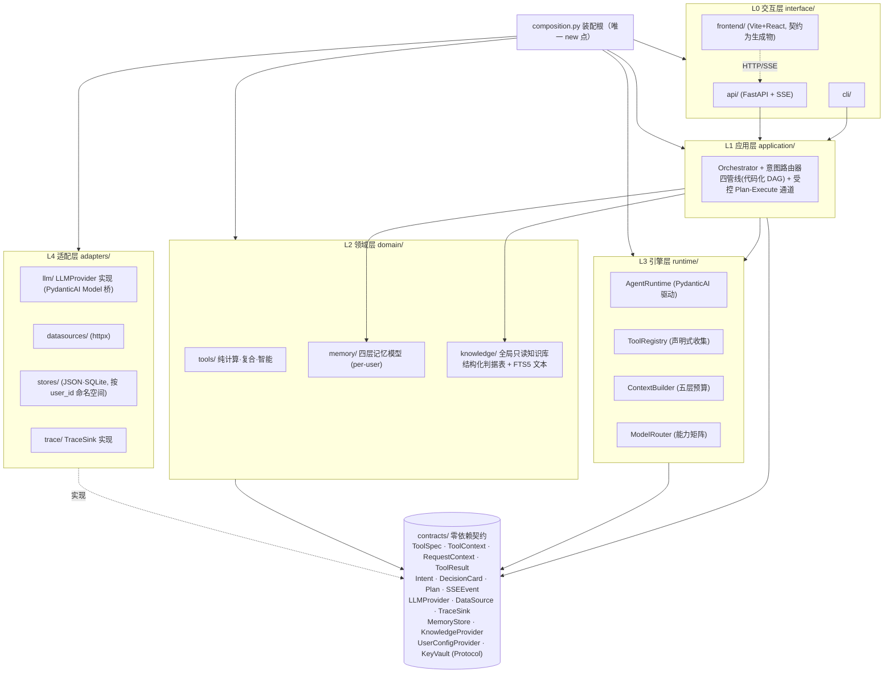

# LightTrail（光迹）· 架构重构方案 v4（整合版）

> **作者**：高见远（Gao，软件架构）｜ **日期**：2026-09-11｜ **状态**：小北已确认 D1–D14 与全部遗留项，方案定稿；本期重心 = 架构重构
> **输入**：v3.1 方案（结论经我逐条复核）＋ 小北拍板（D1–D14 逐项、功能优先但预留用户体系接口、per-user Key 后置但配置层预留、时间不设限质量优先）＋ 5 篇 Agent 系统设计参考文档（吸收映射见 §4）＋ 框架现状联网复核（2026-09-11，见 §3 D2）＋ 深度分析（`docs/archive/architecture-v4-deep-dive.md`，其 M1–M5 修订已并入本文，成为单一权威文档）。三项遗留项（路由混合判定 / D10-D14 解读 / 需求范围）已确认；火烧云工具化降为低优先级待议项
> **性质**：决策文档，未改动任何代码。文中 file:line 引用均为撰写时逐一核对过的现状。

---

## 0. 怎么用这份文档

- 只有一条主线：**诊断 → 目标架构 → 决策点 → 参考映射 → 保留/重写 → 迁移批次 → 用户体系预留 → 面试叙事 → 需求范围**。零修订留痕，所有结论都是当前结论。
- **§3 决策点均已定稿**（D1–D14），拍板值写在各决策点的定值行；候选对比保留供面试与复核使用。
- §1、§2、§5、§6、§7、§8、§9 是决策的支撑材料。**§9「需求范围与优先级」已定稿**（时间不设限 ≠ 全部本期做；本期重心 = 架构重构）。
- 全文无「待确认」项。文中「诚实清单 / 触发条件」是刻意的架构纪律，不是未决问题。

---

## 1. 诊断结论

> 本节结论继承 v3.1 §1，我于 2026-09-11 对全部 file:line 引用重新核对，**八组诊断全部成立，无需推翻**。此处压缩为一页。

### 1.1 三个根因（关键少数）

| 根因 | 证据 | 后果 |
|---|---|---|
| **R1 全局单例注册表做逆向控制** | `agent/tools.py:158` 模块级 `registry = ToolRegistry()`；7 个工具文件反向 import 它（`tools/astronomy.py:23`、`basic.py:7`、`exposure.py:13`、`memory_tool.py:15`、`photo_analysis.py:26`、`site_match.py:15`、`weather.py:24`） | 工具层反向耦合核心层，「六层架构」在依赖图上不成立 |
| **R2 契约层缺失** | 反向依赖实测共四组：`tools→orchestrator.schemas`（`tools/photo_analysis.py:32`）、`tools→agent.tools`、`infra/quota.py:19→llm.router`、`orchestrator/orchestrator.py:30→tools.astronomy`（死 import）；前后端 SSE 事件类型手抄双份（`api/events.py` vs `frontend/src/api/events.ts:3-11`），`DecisionCard` 同样双写（`orchestrator/schemas.py` vs `events.ts:20-29`） | 没有单一真源，漂移已发生：`infra/trace.py:53-66` 的 `_MAIN_FIELD` 缺 `analyze_photo`/`reverse_engineer_photo`/`search_memory` 三个已注册工具——报告主字段静默失真 |
| **R3 注释承诺大于实现** | 缓存：`llm/client.py:7` 与 `config.py:11` 注释提到「缓存策略」，全仓无 LLM 响应缓存实现；tokens：`agent/loop.py:77-81` 调 `record_llm` 从不传 tokens（恒 None）；坐标：`orchestrator/orchestrator.py:34-36` 与 `orchestrator/pipelines.py` 各写一份 `_DEFAULT_LAT/_LON` 与 `_candidate_sites`，`memory/manager.py` 已备 `sediment_favorite_spots` 却未接线 | 文档信用破产，新人（和面试官）读注释会被误导 |

### 1.2 工程质量清单（量大面广，批次化清理）

| 问题 | 证据 |
|---|---|
| **真 bug：会话死锁** | `api/session.py`：`_evict_if_needed`（:257）在持 `_lock`（`threading.Lock`，:161，不可重入）时被 `create`/`restore`/`save` 调用（:180/:221/:243），其内 `self.save(victim)`（:265）→ `save` 再取 `_lock`（:240）→ 同线程永久死锁。触发条件：缓存超 100 且被淘汰会话无磁盘文件——新建会话被淘汰时最易复现，现有测试未覆盖淘汰路径 |
| **真 bug：共享可变 + 锁外写** | `get()`（:183-197）返回缓存对象本体，路由层直接改；`save` 的 `write_text`（:237-239）在锁外，同 id 并发写损坏 JSON |
| **同步/异步双份实现** | `llm/client.py`：`chat`（:148-195）与 `acall`（:197-249）近乎逐行复制；并发机制三套并存——`threading.Lock`（:137）＋ 自研 `_AsyncGate` FIFO 闸门（:55-111）＋ `call_soon_threadsafe` 桥接（:109） |
| **重试三套** | `client.chat`（:180-194，指数退避）vs `tools/weather.py`（无退避立即重试）vs `tools/photo_analysis.py`（两套手写校验失败回传，未复用 `infra/validation.parse_with_retry`） |
| **新增工具改 5~6 处** | `tools/__init__.py:6` 导入清单、`infra/trace.py:53` `_MAIN_FIELD`、`infra/confidence.py` 三集合、`agent/context.py:44-52` 能力叙述硬编码（`DEFAULT_ROLE_PROMPT` 内手写工具清单）、前端事件形态、`tests/conftest.py` 逐工具导入 |
| **前端伪造数据** | `frontend/src/pages/D3Page.tsx:36-40` 置信度硬编码（78/58/34 常量表）、`:44` `verdictFrom` 中文正则猜 go/wait/risk、`:287` 小字承认「数值由置信度区间换算」——源头是常量表却呈现为真实评估 |
| **依赖声明不一致** | `pyproject.toml:12-20` 7 项 vs `requirements.txt:3-8` 4 项（缺 fastapi/uvicorn/python-multipart），且注释「仅依赖 openai SDK」与事实不符 |
| **死代码** | `agent/tools.py:26` `ToolError` 全仓无 raise；`orchestrator/orchestrator.py:30` 死 import `_parse_date` |
| **全局态测试注入** | `tools/photo_analysis.py` 与 `tools/memory_tool.py` 用模块级可写全局 + setter 注入客户端/存储（服务定位器模式），测试并发即互相污染 |

### 1.3 总判断

**架构错是关键少数（R1–R3），工程质量是量大面广（§1.2）。** R1+R2 是骨架级缺陷：控制反转缺失 + 契约层缺失，靠挪动 import 边修不掉，必须重写引擎骨架；领域工具算法、记忆模型、前端设计令牌、ADR-002/003、大部分测试是验证过的资产，必须保留。这直接决定 D1 的推荐（§3）。

---

## 2. 目标架构

### 2.1 分层图



与现状六层（`docs/architecture.md` §1）的差异有三点，都是结构性的：

1. **新增零依赖契约层 `contracts/`**：Intent / DecisionCard / ToolSpec / Plan / 各 Protocol 全部下沉到这里。工具、编排、基础设施只许依赖契约，不许互相 import——R1/R2 的解药。
2. **注册表方向反转**：工具不再 import 全局 registry 注册自己，而是**声明** `ToolSpec`，由装配根收集构造 `ToolRegistry`。控制反转归位。
3. **领域层拆分记忆与知识库**：`memory/`（per-user、可写）与 `knowledge/`（全局、只读）是两条独立链路（D10 修订）；应用层增加「受控 Plan-Execute 通道」（D3 修订）。

### 2.2 依赖方向规则与强制手段

```
L0 interface ─→ L1 application ─→ L3 runtime ─→ contracts
                     │                 │
                     ├─→ L2 domain ────┤
L2 domain ─→ contracts   （domain 不得 import runtime / application / adapters / interface）
L4 adapters ─→ contracts （实现 Protocol；不得被 domain 反向依赖）
contracts ─→ ∅           （零依赖，仅 stdlib + pydantic）
```

**强制手段（三道闸，不靠口头约定）：**

1. **import-linter**（主门禁）：`pyproject.toml` 声明分层契约与禁止契约，CI 跑 `lint-imports`，违规即红。完整配置片段：

```toml
# pyproject.toml
[tool.importlinter]
root_package = "lighttrail"

[[tool.importlinter.contracts]]
name = "分层契约：非法方向依赖"
type = "layers"
layers = [
    "lighttrail.interface",
    "lighttrail.application",
    "lighttrail.runtime",
    "lighttrail.domain",
    "lighttrail.contracts",
]

[[tool.importlinter.contracts]]
name = "契约层零依赖"
type = "forbidden"
source_modules = ["lighttrail.contracts"]
forbidden_modules = [
    "lighttrail.interface", "lighttrail.application", "lighttrail.runtime",
    "lighttrail.domain", "lighttrail.adapters",
]

[[tool.importlinter.contracts]]
name = "适配器只实现端口，不被领域反向依赖"
type = "forbidden"
source_modules = ["lighttrail.domain", "lighttrail.application", "lighttrail.runtime"]
forbidden_modules = ["lighttrail.adapters"]

[[tool.importlinter.contracts]]
name = "交互层不被任何层依赖"
type = "forbidden"
source_modules = [
    "lighttrail.contracts", "lighttrail.domain", "lighttrail.runtime",
    "lighttrail.application", "lighttrail.adapters",
]
forbidden_modules = ["lighttrail.interface"]
```

2. **pytest 架构测试**：`tests/test_architecture.py` 用 importlib + AST 遍历源码断言禁止边（给不装 import-linter 的环境兜底，也能抓函数内 import）。
3. **ruff `flake8-tidy-imports`**：禁止 `domain/` 出现 `lighttrail.adapters` import；品牌字面量（如 `"ecnu"`）只允许出现在 `adapters/llm` 与 `settings` 默认值（ADR-002 红线，静态检查兜底）。

**三者分工边界（为什么三条都要，不是冗余）：**

| 手段 | 能抓什么 | 抓不到什么 | 角色 |
|---|---|---|---|
| **import-linter** | 模块级分层与禁止依赖（layers / forbidden / independence） | 函数内 import、字符串形式动态 import、`__import__` | 主门禁 |
| **pytest AST 架构测试** | 源码级遍历可抓函数内 import；可自定义规则（如「domain 不得出现字面量 'ecnu'」） | 需自己维护；不覆盖运行期动态行为 | 兜底 + 自定义规则 |
| **ruff** | 单文件级 import 禁令、快速反馈（IDE 即时） | 表达不了跨模块分层契约 | 快速反馈 + 防品牌字面量 |

**过渡期 shim 与豁免纪律**：B1/B2 迁移期保留 re-export shim（如 `agent.Agent` 门面），shim 可能短暂违规 → 把该 shim 目录加入 `ignored_imports`，**豁免必须带 TODO 与删除批次，批次结束立即移除**。不做永久白名单（那等于把门禁又变回约定）。

### 2.3 关键抽象（签名级）

> 位置：`src/lighttrail/contracts/`。本期新增的用户体系预留接口（`RequestContext` / `UserConfigProvider` / `KeyVault`）在此一并定义，设计理由见 §7。

```python
# ---- contracts/tool.py ----
class Confidence(StrEnum): HIGH="high"; MEDIUM="medium"; LOW="low"

@dataclass(frozen=True)
class ToolSpec:
    """工具完整自描述：注册/trace/置信度/能力叙述全部来源于此（消灭 _MAIN_FIELD 漂移）。"""
    name: str
    description: str                       # 面向模型（含「何时使用」，见 §4 工具描述三法则）
    parameters: dict[str, Any]             # JSON Schema
    capabilities: frozenset[str] = frozenset()   # {"tools"} 等，供 Router
    main_field: str = ""                   # 替代 trace._MAIN_FIELD
    confidence: Confidence = Confidence.LOW      # 替代 confidence.py 三集合
    def to_openai_schema(self) -> dict[str, Any]: ...

@dataclass
class ToolContext:
    """工具运行上下文（注入式，替代 _DEFAULT_CLIENT/_DEFAULT_STORE/全局 registry）。"""
    request: "RequestContext"
    llm: "LLMProvider"
    datasource: "DataSource"
    memory: "MemoryStore | None" = None
    sink: "TraceSink | None" = None
    def emit(self, kind: str, name: str, **payload) -> None: ...

class Tool(Protocol):
    spec: ToolSpec
    def __call__(self, ctx: ToolContext, **kwargs: Any) -> "ToolResult": ...

# ---- contracts/context.py（用户体系预留，本期即落地）----
@dataclass(frozen=True)
class RequestContext:
    """一次请求的身份与配置上下文，贯穿 session/memory/quota/LLM 配置解析。
    本期恒为本地单用户（user_id="_local"），但签名上无处不在——
    未来接用户体系时业务代码零改动，只换装配根的构造方式。"""
    user_id: str = "_local"
    session_id: str = ""
    llm_overrides: "LLMConfig | None" = None   # per-user Key 的落点（本期恒 None）

# ---- contracts/llm.py ----
@dataclass(frozen=True)
class LLMConfig:
    api_key: str
    base_url: str
    model: str
    model_reason: str
    concurrency: int = 4          # 纯配置，无平台语义（见 §3 D5）
    reason_thinking: bool = True

class LLMProvider(Protocol):
    async def complete(self, messages, *, model=None, tools=None, temperature=0.2,
                       thinking=None, reasoning_effort=None) -> dict[str, Any]: ...
    def queue_position(self) -> int: ...

class UserConfigProvider(Protocol):
    """LLM 配置优先级链的唯一入口（详见 §7.2）。
    本期实现：DeploymentConfigProvider（只读 .env/默认值）。"""
    def resolve(self, ctx: RequestContext) -> LLMConfig: ...

class KeyVault(Protocol):
    """密钥保管抽象。本期实现：EnvKeyVault（从部署级配置取）。
    未来实现：EncryptedStoreKeyVault（per-user Key 加密落盘）。"""
    def get_api_key(self, user_id: str) -> str | None: ...
    def set_api_key(self, user_id: str, key: str) -> None: ...

# ---- contracts/datasource.py / observability.py ----
class DataSource(Protocol):
    async def get(self, name: str, params: dict[str, Any]) -> dict[str, Any]: ...

class TraceSink(Protocol):
    def emit(self, event: "TraceEvent") -> None: ...
    def subscribe(self, cb: Callable[["TraceEvent"], None]) -> Callable[[], None]: ...
    def to_prompt_section(self, limit: int = 12) -> str: ...

# ---- contracts/memory.py ----
class MemoryStore(Protocol):
    """记忆（per-user、可写）。所有读写经 RequestContext.user_id 隔离命名空间（详见 §7.1）。"""
    def build_injections(self, ctx: RequestContext, intent: str,
                         *, budget: "TokenBudget") -> list["MemoryBlock"]: ...
    def write_event(self, ctx: RequestContext, event: "EventRecord") -> int: ...
    def propose_semantic(self, ctx: RequestContext, content: str,
                         keywords: Sequence[str]) -> int: ...

# ---- contracts/knowledge.py（D10 修订：知识库 = 全局只读，不接 user_id）----
@dataclass(frozen=True)
class KnowledgeChunk:
    id: str
    text: str
    source: str          # 出处（论文/标准/经验），供溯源
    version: str

class KnowledgeProvider(Protocol):
    """知识库（'我知道世界'）：全局只读，检索不接 user_id。
    形态一：结构化判据表（键值/规则，精确查表）。
    形态二：SQLite FTS5 文本检索（中文 trigram/jieba）。
    向量检索为后续升级项（触发条件见 §7.5）。"""
    def lookup(self, key: str, *, table: str = "") -> "KnowledgeChunk | None": ...
    def search(self, query: str, *, k: int = 3, scope: str = "") -> list["KnowledgeChunk"]: ...

# ---- contracts/plan.py（D3 修订：受控 Plan-Execute 通道）----
@dataclass(frozen=True)
class PlanStep:
    tool: str
    args: dict[str, Any]
    purpose: str = ""

@dataclass(frozen=True)
class Plan:
    """受控计划：一等对象，可落 trace、可测、有步数上限。"""
    goal: str
    steps: tuple[PlanStep, ...]
    max_steps: int = 8

# ---- runtime/registry.py ----
class ToolRegistry:
    """声明式收集：由装配根用 ToolSpec 列表构造，不再有模块级单例。"""
    def __init__(self, specs: Iterable[ToolSpec]) -> None: ...
    async def dispatch(self, name: str, arguments_json: str, ctx: ToolContext) -> str: ...

# ---- runtime/agent.py ----
class AgentRuntime:
    """PydanticAI Agent 的组装门面：ReAct 对话、意图解析、reason 综合共用一套装配。
    LLM 交互经自定义 Model 桥走我们的 LLMProvider（ADR-002/003 适配层不丢）。"""
    async def run(self, messages: list[dict], ctx: ToolContext) -> "RunResult": ...
    async def reason(self, prompt: str, *, system: str = "", **kw) -> str: ...

# ---- runtime/planner.py（D3 修订：受控规划通道执行器）----
class Planner:
    """受控 Plan-Execute：LLM 产 Plan（pydantic 校验），按步执行，每步过 dispatch/trace/配额。"""
    async def make_plan(self, goal: str, ctx: ToolContext) -> Plan: ...
    async def execute(self, plan: Plan, ctx: ToolContext) -> "DecisionCard": ...
```

### 2.4 工具热插拔（新增工具只改 1 处）

1. 工具自带元数据：`main_field`/`confidence`/`capabilities` 全部作为 `ToolSpec` 字段写在工具定义旁——消灭 `_MAIN_FIELD`、confidence 三集合、`DEFAULT_ROLE_PROMPT` 手写工具清单（`agent/context.py:44-52`）三处漂移源。
2. 单一收集点：`domain/tools/__init__.py` 暴露 `TOOLS: tuple[Tool, ...]`；工具模块只 import `contracts`。新增工具 = 追加一行。
3. 能力叙述自动生成：ContextBuilder 工具层由 `registry.to_openai_schema()` 生成。
4. 前端零改动：新工具复用既有 `tool_call`/`tool_result` SSE 事件（契约生成物，见 §3 D8）。
5. 验收：`tests/test_hotplug.py` 动态构造 ToolSpec 注入，断言 dispatch/trace/confidence/能力叙述四处自动生效。

---

## 3. 决策点总表（已拍板 D1–D14）

> 每条：候选（优点/缺点/适用条件）→ 结论 → 一句话理由 → 来源。候选对比保留供面试与复核；**推荐值即小北拍板值**。
> 框架现状复核（2026-09-11 联网核实）：**pydantic-ai v2.41.0**（MIT，~20k stars，Production/Stable；V1 自 2025-09 承诺 API 稳定，V2.0 于 2026-06 发布，`output_type`/`result.output` 为现行 API）；**langchain 1.3.x / langgraph 1.2.11**（均 MIT，langgraph ~36.7k stars，LangChain 1.0 起其 agent 运行在 LangGraph 之上；LangSmith 为闭源商业产品）；**openai-agents v0.18.x**（MIT，~27k stars，仍 0.x，OpenAI 平台优先：默认 Responses API、tracing 默认流向 OpenAI 控制台，他家模型需走 LiteLLM 扩展）；**instructor v1.15.x**（MIT，~15k stars，维护活跃）。
> 编号说明：D1–D13 为 v4 原决策点，D14 为深度分析新增（知识库检索形态）。

---

### D1 重构力度

| 候选 | 优点 | 缺点 | 适用条件 |
|---|---|---|---|
| A 渐进重构（拆环修 bug） | 一次性成本低（~5-8 人日）；风险小 | 只修边不修根因；无强制边界，必然重新退化成环（本项目已实证） | 根因是局部语法问题时 |
| **B 骨架重写** ★已定 | 恰好重写「坏的那一层」（引擎骨架），保留 100% 领域 IP、文档、~65% 测试；求职叙事最强（自我诊断→重建） | 重写期约 1-1.5 周系统不完整，需 shim 保测试绿 | 根因是骨架级缺陷（R1/R2）时 |
| C 推倒重来 | 无历史包袱 | 烧毁已验证的领域算法与前端资产；3-4 周不可演示；叙事退化为「我又重写了一遍」 | 资产质量全面低劣时（不符合本项目） |

**结论：B（已拍板）。** 问题定位决定力度——R1/R2 是骨架级缺陷，B 重写根因所在的引擎骨架，保留验证过的领域正确性。｜ 来源：继承 v3.1。

---

### D2 Agent runtime 框架

| 候选 | 优点 | 缺点 | 适用条件 |
|---|---|---|---|
| A 全自研 ReAct 循环 | 每个行为可解释；零依赖 | 需自补 DI/校验重试/测试模型/用量上限 ≈ 3-5 人日；缺「生产框架实操」信号 | 循环逻辑有特殊定制且框架全部不适用时 |
| **B PydanticAI 混合** ★已定：框架管 LLM 交互（循环/DI/输出校验/TestModel/UsageLimits），自研管确定性编排/领域工具/能力路由，经自定义 `Model` 桥接 | 与我方契约几乎同构（`RunContext` DI、`output_type` 校验重试、`TestModel`）；MIT、v2.x 稳定、Pydantic 团队背书；`ModelSettings.extra_body` 为一等字段，ADR-003 扩展参数有正规落点；自定义 `Model` 桥保住 ADR-002/003 可审计适配层 | 需写 Model 桥（约 200 行）；V1→V2 有 breaking changes，需 pin 版本并跟升级指南 | 通用 agent 机制无差异化、且需要框架实操信号时 |
| C LangGraph | 状态图/checkpointer/中断恢复成熟；生态最大 | 解决的是「LLM 自主流程 + 长流程状态持久化」，我的流程是已知确定性管线；引入 state schema/checkpointer/节点通信三套概念；不解决能力矩阵路由 | 多用户+长流程+需断点续跑/人工介入时（触发条件见 §7.5，当前不成立） |
| D OpenAI Agents SDK | 极简原语、官方维护 | 仍 0.x；OpenAI 平台优先（Responses API、tracing 流向 OpenAI），与「任意 OpenAI 兼容 API」硬约束冲突 | 锁定 OpenAI 平台时（与本项目约束相反） |
| E Instructor | 结构化输出极简 | 只解决输出校验，不管循环/DI/测试 | 作为 D4 候选见下，不足以做 runtime |

**结论：B（已拍板）。** 通用机制（循环/DI/校验/测试夹具）框架成熟且自研无差异化，差异化（确定性管线/领域工具/能力路由）框架给不了——用 Model 桥把平台特性留在自己手里。｜ 来源：继承 v3.1，本轮联网复核更新（v3.1 写时引 v1.x，现 v2.41 稳定、`output_type` API 确认；结论不变，论据更强）。

---

### D3 管线编排形态：意图路由器 + 三类分发（确定性管线 + 分层兜底）

> 触发本次修订的问题：小北追问「现有任务流程固定，但可能用户提出不在固定任务之外的任务？」。这个追问成立——原 D3 的理由有精确边界，须澄清。

**候选：**

| 候选 | 优点 | 缺点 | 适用条件 |
|---|---|---|---|
| A 仅 ReAct 兜底（现状） | 零新增；简单 | 多步规划任务截断（现状 `MAX_TOOL_ROUNDS=8`）；需用户确认的任务无法暂停；无显式规划 | 任务域窄、开放问题简单时 |
| B 双层兜底 + 补强 ReAct（提高轮数、加轻量规划器） | 改动小；复用 ReAct | 轮数提高放大成本与失控风险；轻量规划器仍隐式、不可测 | 开放任务以「多几步工具调用」为主、少分支时 |
| **C 意图路由器 + 三类分发** ★已定 | 分工明确；已知流程保确定性、未知流程用受控规划；复用四管线基础设施 | 要新增一个规划通道与路由判定 | 存在「可规划但不在固定管线内」的任务时（本项目） |
| D 引入通用 agent 自主编排 | 最灵活 | 用 LLM 编排已知流程，放弃确定性（正是原 D3 否掉的路）；不可测、成本不可预 | 任务域完全开放、无固定流程时 |

**结论：C（已拍板）——「确定性管线 + 分层兜底」。**

**分发规则（意图路由器）：**

| 意图类别 | 分发目标 | 说明 |
|---|---|---|
| 已知意图（四管线覆盖：D1 灵感 / D2 规划 / D3 临场 / D4 复盘） | **代码化确定性 DAG**（现四管线） | 流程写死、每步可单测、LLM 调用次数固定可预算 |
| 可规划但非固定流程（如多步行程编排、跨管线复合任务） | **受控 Plan-Execute 通道** | LLM 产 `Plan`（pydantic 校验），按步执行；计划是一等对象、可落 trace、可测、有步数上限 |
| 开放对话 / 纯知识问答 | **ReAct** | `MAX_TOOL_ROUNDS` 由 8 提升至 **12**，上限/超时/预算作为可配置护栏 |
| 超出工具集能力 | **显式诚实告知** | 明确回复「暂不支持」并提供替代，不幻觉、不硬答 |

**为什么保留原「不用 LLM 自主编排已知流程」的理由——但要澄清其边界：**

原文理由「已知流程交给 LLM 规划等于放弃确定性」**只对已在 PRD 写死的四管线成立**。对管线之外的「可规划任务」，其流程**本来就不是已知的**，不存在「放弃确定性」的问题（本来就没有确定性可放弃）。所以这不是推翻原判断，而是**补上原判断缺失的另一半**：已知流程保确定性；未知流程给一个**受控**的规划通道，代价可控、产物可审。

**受控 Plan-Execute 与「ReAct 自由发挥」的本质区别**：计划先结构化（`Plan` 模型，`PlanStep` 列表），执行按步骤循环（本质是「运行时生成的浅 DAG」），每步有超时/重试/降级，计划整体有步数上限。计划是**可枚举、可审核、可复现的对象**——这满足「流程可被测试/被 trace」的工程要求。

**规划通道复用现有基础设施（不新造一套）：**

| 复用项 | 复用方式 |
|---|---|
| 工具注册表 `ToolRegistry` | 每步执行仍经 `dispatch(ctx, ...)`，不新增工具调用路径 |
| trace `TraceSink` | 计划本身作为 step 事件落 trace（「规划 → 执行 step1/2/3」），复用「trace 即 UI」闭环 |
| 配额 `QuotaLedger` | 规划 1 次 + 执行 N 次 LLM 调用全部走既有记账与预算门禁；执行前先预估 |
| 领域工具 | 计划步骤直接复用 15 个工具，零新增领域逻辑 |
| ContextBuilder | 每步复用五层上下文组装 |
| DecisionCard 契约 | 规划通道产物仍输出 `DecisionCard`，前端零新契约 |

**意图路由器的判定方式**：**混合判定（已定）**——规则优先匹配明确意图（现有 `default_mode` / `Intent.mode` 的确定性分流，命中直接走四管线）；规则不明确时用**轻量 LLM 判定一次**（复用 `RouteIntent.DEFAULT` 的轻量模型），判定结果落 trace 供审计。已知取舍：模糊请求会多一次轻量模型调用（小北已确认接受）。规则表与判定阈值均可配置。详见 §3.15。

**诚实清单（触发条件）**：若「需用户交互确认」成为高频需求，再评估 human-in-the-loop（与 §7.5 的 checkpointer 触发条件合流）；本期仅保证「不支持时明确告知并降级」，不实现暂停恢复。｜ 来源：v4 原 D3 在本轮修订（M1）。

---

### D4 结构化输出契约

| 候选 | 优点 | 缺点 | 适用条件 |
|---|---|---|---|
| **A pydantic 自研 `parse_with_retry` + PydanticAI `output_type` 双轨** ★已定 | 一份 schema 三处复用（LLM 校验/步骤间数据/FastAPI 模型）；管线内经 PydanticAI `output_type` 自动重试，管线外（自定义 Model 桥、无工具模型走 prompted 模式）复用自研自愈；reason 通道（无工具模型）纯结构化输出 Agent 不带 tools 即可成立 | 两条路径需约定边界 | schema 需一份真源三处复用 + 模型能力不一（有的无工具调用）时 |
| B Instructor | `response_model` + 自动重试极简；多 provider | 绑定客户端调用路径；假设模型支持 JSON mode/工具；与我方 Model 桥路径叠加后职责重叠 | 无自研契约负担的独立项目 |
| C 裸 JSON mode + 手写解析 | 零依赖 | 校验/重试/类型安全全靠自己，已实证会写烂（`photo_analysis.py` 两套手写重试） | 一次性脚本 |

**结论：A（已拍板）。** 契约必须一份真源三处复用，且要兼容「无工具调用的深推理模型」这一真实能力边界。｜ 来源：继承 v3.1（本轮随 D2 明确双轨边界）。

---

### D5 并发模型

前提（小北已拍板，直接陈述）：「ECNU 串行约束」不成立，并发为**纯配置**，无平台语义。

| 候选 | 优点 | 缺点 | 适用条件 |
|---|---|---|---|
| **A 单 `asyncio.Semaphore`，`LLM_CONCURRENCY` 默认 4** ★已定 | 信号量只包单次 LLM 往返，重试在外；消灭 Lock+自研闸门+threadsafe 桥三套机制；4 覆盖单机现实并发且低限流风险；多 worker 合法 | 并发下 QuotaLedger 记账需加锁（小改） | async-first 重写后 |
| B 保留默认串行 | 最保守 | 无端牺牲延迟；与拍板前提相悖 | 平台确实限流时（届时 `LLM_CONCURRENCY=1` 一行配置即可，不需要专门设计） |
| C 无边界全并发 | 最简单 | 撞平台限流不可控 | 私有部署无限流时 |

配套：① **并行取数**——管线内天气/天文/机位/光污染四数据源彼此无依赖，现为顺序 for 循环逐个 dispatch，改 `asyncio.TaskGroup` 并发，单源失败降级 `{error}` 不拖垮管线，采集阶段延迟预计降 50-60%（取数并发与 LLM 并发是两条独立边界，取数不受信号量约束）；② **删除 `LLM_SERIAL_LLM`**（被 `LLM_CONCURRENCY=1` 完全覆盖，保留只制造双开关歧义；旧 `.env` 作只读兼容别名过渡一版）；③ **async-first**：CLI 用 `asyncio.run` 包异步 runtime，不再维护同步/异步两份实现。

**统一可配置护栏（本轮新增，M4）**：D3 修订后开放域任务增多，需统一护栏防成本失控与死循环。以下上限**全部可配置**，写在 `settings`，并在 trace 中可见：

| 护栏 | 默认值 | 作用 |
|---|---|---|
| `LLM_CONCURRENCY` | 4 | 在途 LLM 请求上限 |
| `REACT_MAX_ROUNDS` | 12 | ReAct 单轮工具调用轮数上限（原 `MAX_TOOL_ROUNDS=8`） |
| `PIPELINE_MAX_STEPS` | 12 | 单条管线步骤上限 |
| `PLAN_MAX_STEPS` | 8 | 受控规划通道步数上限（`Plan.max_steps`） |
| `LLM_TIMEOUT` | (30, 120) | 连接/读取超时 |
| `REQUEST_BUDGET` | 由 QuotaLedger 水位决定 | 单次请求预算，超限降级或拒绝 |

**结论：A（已拍板）。** 并发是配置不是架构，默认 4 是「明显提速 + 低限流风险」的折中；护栏是开放域任务的安全网。｜ 来源：继承 v3.1（前提按小北拍板直接陈述；护栏为本轮 M4 补充）。

---

### D6 配置与装配

| 候选 | 优点 | 缺点 | 适用条件 |
|---|---|---|---|
| **A pydantic-settings + 显式 composition root** ★已定 | 环境变量解析/类型校验/别名（`LLM_`↔`ECNU_` 用 `AliasChoices` 原生表达）是 pydantic-settings 强项；装配根唯一 new 点，依赖关系可读可调试 | 大依赖图下手写装配略繁 | 依赖图规模中等（本项目 ~20 组件） |
| B DI 框架（dependency-injector） | 自动注入、声明式容器 | 新概念学习成本；隐式装配降低可读性；本项目规模用不上 | 组件数十+、多人协作大项目 |
| C 继续手写 `config.py` | 零新依赖 | 无类型校验、静默错误（现状：`_parse_bool` 宽松解析无告警） | 不推荐 |

**结论：A（已拍板）。** 配置用标准库、装配用显式 composition root——DI 框架解决的是大规模依赖图，本项目显式更可读。｜ 来源：继承 v3.1。

---

### D7 LLM 配置双模式与用户级 Key 优先级链

> 本期只实现部署级，但**优先级链与解析单点本期就定型**（详见 §7.2）。

**候选：**

| 候选 | 优点 | 缺点 | 适用条件 |
|---|---|---|---|
| **A 优先级链：`请求级（per-user，经 KeyVault）> 部署级 .env > 内置默认`，解析收敛在 `UserConfigProvider.resolve(ctx)` 单点** ★已定 | per-user Key 上线时只新增一个 Provider 实现 + 前端设置页，业务层零改动；部署级与 per-user 双模式天然兼容 | 签名上要带 RequestContext（已在 D6/§7 接受） | 已知未来要做 per-user Key 时 |
| B 只做部署级，未来再改 | 本期最省事 | 未来要在所有 LLM 调用点补穿透，成本高且易漏 | 确定永不做 per-user 时（与小北拍板相反） |
| C 前端直接存 Key 随请求上传 | 实现最快 | 密钥过网络/日志风险；无服务端保管抽象；安全评审不过关 | 纯本地玩具项目 |

**结论：A（已拍板）。** 解析单点现在定型，per-user Key 未来是「新增一个实现」而不是「改造一批调用」。

**为什么必须「解析收敛单点」（发散解析的代价）**：现状 `config.py:92-110` 的 `load_settings()` 每次直读环境变量，从「部署级」到「LLMConfig」之间无解析层。一旦支持 per-user Key，若每个需要 Key 的地方各自读配置（`config.py`、某工具、路由中间件），「这次请求该用谁的 Key」就散落 N 处：改一次优先级规则要改 N 处、漏一处即 bug、测试要 mock N 处、日志可能 N 处都打印过 Key。具体场景：用户 A 填了自己的 Key、用户 B 用平台 Key——若 `tools/photo_analysis.py:27` 这类「智能工具内部自建客户端」直接读部署级配置，A 的照片分析会走平台配额而非自己的额度，且极难排查。

**密钥安全四问（per-user Key 上线时必须回答）**：

| 问题 | 方案 |
|---|---|
| **存哪** | 不落明文。存加密密文（`EncryptedStoreKeyVault`），主密钥来自部署环境（KMS/环境变量），**主密钥与密文分离**；本地自用形态可用系统 keyring |
| **怎么加密** | 对称加密（AES-GCM / libsodium SecretBox），每条 Key 独立 nonce；主密钥不进仓库、不进日志 |
| **怎么防日志泄漏** | ① `LLMConfig.__repr__` 对 `api_key` 掩码（只露后 4 位）；② trace/SSE 事件的 payload 用白名单字段，不整包 dumps 请求体；③ 统一 `redact()` 出口过滤 |
| **泄漏爆炸半径** | per-user Key 泄漏只影响该用户自己的额度，不牵连平台 Key——这正是 per-user 化的安全收益；平台 Key 永不落库、永不进会话（现状 `api/session.py:11` 已声明「会话不落凭据」，要保持） |

**本地自用 vs SaaS 两形态差异**：

| 形态 | 用户来源 | Key 来源 | 存储 | 认证 |
|---|---|---|---|---|
| 本地自用（本期） | 恒 `_local` | 部署级 `.env` | 本地 JSON/SQLite | 无 |
| SaaS（未来） | 登录 token | per-user（KeyVault）> 部署级 | 加密 DB | 中间件 + 多用户隔离 |

两形态共用同一套 `UserConfigProvider`/`KeyVault` 接口，差异只在「注入哪个实现」。**常见误区**：① 「Key 从请求上传最方便」——错，浏览器直传 Key 会进网络/反代/trace 日志，客户端只该传「我已登录」；② 反直觉——优先级链的「请求级」不是只给 Key 用的，是整块 `LLMConfig` 覆盖（用户可能填了 Key 但临时想换 model）。｜ 来源：本轮新增（小北拍板 3）+ 深度分析并入。

---

### D8 前后端契约

| 候选 | 优点 | 缺点 | 适用条件 |
|---|---|---|---|
| **A pydantic 单一真源 → OpenAPI/JSON Schema → `openapi-typescript` 生成** ★已定 | 消灭手抄双份（`_MAIN_FIELD` 漂移、events.ts 双写已实证）；CI 跑 `gen:api && git diff --exit-code`，漂移即红 | 需建生成流水线（约半天） | 前后端分离、契约演进频繁时 |
| B 继续手抄 | 零工具链 | 漂移必然重演（已实证两次） | 不推荐 |
| C 共享 JSON Schema 文件手维护 | 比手抄类型好 | 仍是第二份真源 | 无 OpenAPI 可用的非 HTTP 场景 |

**结论：A（已拍板）。** 契约只能有一份真源，前端类型是生成物不是手写物。｜ 来源：继承 v3.1。

---

### D9 架构边界强制

| 候选 | 优点 | 缺点 | 适用条件 |
|---|---|---|---|
| **A import-linter CI 硬门禁 + pytest 架构测试兜底** ★已定 | 把「六层成环」从口头约定变成可执行契约，退化即 CI 红；这是本方案核心门禁 | 需维护契约声明 | 任何希望边界长期存活的项目 |
| B 仅约定 + code review | 零工具 | 本项目已实证「无强制即退化」 | 一次性代码 |
| C 仅 ruff 自定义规则 | 轻 | 表达不了分层契约（只能禁单个 import） | 作为 A 的补充而非替代 |

**结论：A（已拍板）。** 架构约束只有被工具执行才存在——本项目纸面六层就是反例。完整 `pyproject.toml` 配置与「import-linter / pytest AST / ruff 三重分工」见 §2.2。｜ 来源：继承 v3.1。

---

### D10 记忆与知识库：双链路（记忆 per-user + 知识库全局）

> 触发本次修订的问题：小北追问「是否分场景处理不同记忆，比如分开用户设备信息和工具所需专业知识库」。洞察成立，但准确形式化不是「记忆分两种」，而是**记忆与知识库是两类东西**。

**形式化区分（判定规则：绑不绑 user_id）**：

| 维度 | **记忆（Memory）** | **知识库（Knowledge）** |
|---|---|---|
| 归属 | 关于**这个用户** | 关于**世界与领域** |
| 可见性 | per-user 隔离 | 全局共享 |
| 写入权限 | 可写（用户声明 / 系统沉淀） | 只读（运行时不可写） |
| 写入防线 | double-confirm 防污染 | 版本化 + 人工/离线更新 |
| 检索方式 | 规则命中 / 命名空间查 | 精确查表 / FTS5 /（未来）向量 |
| 注入策略 | 分层：档案常驻、事件按需、语义择优 | 命中才取片段 |
| 生命周期 | 随使用增长、可遗忘 | 随版本迭代、稳定 |
| 失败代价 | 污染用户画像（要能撤销） | 提供错误知识（要能回滚版本） |
| **user_id** | **必须带** | **不需要** |

一句话：**记忆是「我知道你」，知识库是「我知道这个世界」。**

**候选：**

| 候选 | 优点 | 缺点 | 适用条件 |
|---|---|---|---|
| A 只保留记忆四层 | 简单 | 领域知识无落点，会污染记忆（每个用户存一份 ND 表） | 无领域知识需求时 |
| B 只做向量 RAG | 语义强 | 当前无可检索文本、数据量负优化 | 数据量大且语义检索刚需时 |
| C Mem0/Letta 记忆框架 | 现成分层 | 黑盒、丢叙事 | 通用对话产品 |
| **E 记忆/知识库双链路 + 知识库检索用「结构化表 + SQLite FTS5」，向量作后续升级** ★已定 | 各归其位：记忆 per-user 可写、知识库全局只读；检索形态确定（结构化查表 + 中文 FTS5）；向量可后置（触发条件见 §7.5） | 两套存储与链路 | 同时有「关于用户」与「关于世界」两类数据时（本项目） |

**结论：E（已拍板）。** 「E 混合」的确切含义 = **双链路（记忆 per-user + 知识库全局）× 知识库检索形态（结构化表 + FTS5）**（已确认）。

**现有 `memory/semantic.py` 是混装口袋，须拆分**（`memory/semantic.py:1-9` 定义为「结论型经验」）：`SemanticEntry` 只有 `content` + `keywords`，不区分「这句话关于用户还是关于世界」。「用户偏好低云量晚霞」（关于用户）→ 留记忆；「卷云冰晶对长波散射敏感」（关于世界）→ 迁知识库。拆法就是判定规则：**绑定用户事件提炼的留 `memory/semantic`；来自论文/领域的迁 `knowledge/`**。

**首个可立刻验证的落地案例（器材 vs 规格）**：`tools/exposure.py:137-140` 的 `star_shutter_rule` 参数 `pixel_pitch`，其描述**硬编码**「松下 S5M2（2400 万像素全画幅）约 6.0」，且目前**靠用户手填**。正确拆法：**档案（记忆）存「我有 S5M2」→ 运行时用机型名去知识库查规格表得到 pixel_pitch**。这同时消灭一处「知识写死在工具描述里」的 R3 类问题——**与本次重构目标直接相关**，且比火烧云判据表更小、可立刻验证。**这是知识库的首个落地案例（B6）。**

**落地接口**：`contracts/memory.py` 的 `MemoryStore`（带 `RequestContext`）+ 新增 `contracts/knowledge.py` 的 `KnowledgeProvider`（全局只读、不接 user_id）与 `KnowledgeChunk`（含 `source` 溯源），签名见 §2.3。存储：记忆 `data/users/{user_id}/memory/`；知识库 `data/knowledge/`（全局；结构化表 + FTS5 索引）。｜ 来源：v4 原 D10 在本轮修订（M2）+ 深度分析并入。

---

### D11 评估体系保留度

| 候选 | 优点 | 缺点 | 适用条件 |
|---|---|---|---|
| **A 自研三层评估（保留，仅对接新契约/并发）** ★已定 | 「工具即裁判」是垂直 Agent 独有红利（500 法则算一遍核对模型快门建议）；L2 cassette 回放零 LLM 成本；已交付 22/22 | 需随骨架重写做接口适配 | 垂直决策卡片 + 有确定性工具可反向校验时 |
| B Ragas / DeepEval | 通用指标现成 | faithfulness 等通用指标在决策卡片场景解释力不足；rubric 无领域判断 | 通用 QA/RAG 场景 |
| C Pydantic Evals | 与 D2 同生态 | 年轻，指标同样通用向 | 作为 L3 的可选补充观察，不替代 |

**结论：A（已拍板）。** 通用评估框架给不了「工具即裁判」，这是本项目工程成熟度的最强信号。

**三层各验证什么、成本多少**：

| 层 | 验证对象 | 方法 | 确定性 | 成本 |
|---|---|---|---|---|
| L1 工具层 | 纯计算/复合工具算法 | pytest 精确断言（NPF/500 法则边界、ND 档位、日出日落） | 完全确定 | 零（离线） |
| L2 管线层 | 端到端决策卡片结构与方向 | 黄金用例 + Fake 数据源 + LLM **cassette 录制回放** | 完全确定（回放） | 零 LLM 成本（分钟级） |
| L3 质量层 | 开放对话与综合表达质量 | LLM-as-judge 按 rubric 1-5 分 + 人工小样本校准 | 概率性 | 有配额（~500 credits/次，走 QuotaLedger） |

**「工具即裁判」的实现机制**（以 `star_shutter_rule`，`tools/exposure.py:114-196` 为例）：用确定性工具输出**反向校验模型的定性建议**——从决策卡片提取模型建议的快门，再用 `star_shutter_rule` 独立算一遍 500 法则上限（`rule_500 = 500.0 / eff_focal`，`:177`），超限（留 10% 容差）即判定为「违反物理法则」的假阳性：

```python
def judge_shutter_advice(model_card: DecisionCard, focal: float) -> tuple[bool, str]:
    advised = _extract_shutter(model_card.params)
    if advised is None:
        return True, "卡片未给快门建议，跳过"
    rule = star_shutter_rule(eff_focal=focal)            # 纯计算，可复现
    limit = rule["500 法则最大快门（秒）"]
    if advised > limit * 1.1:
        return False, f"模型建议 {advised}s 超过 500 法则上限 {limit}s，星点会拖线"
    return True, ""
```

当 judge 说「卡片质量高」但确定性校验发现「快门违反 500 法则」时，标记为 judge 假阳性。同理可用于火烧云（模型说「适合拍」但 `sunset_glow_score` 算出 20 分 → 质疑）。

**为什么通用框架（Ragas/DeepEval）解释力不足——具体论证**：① Ragas 的 `faithfulness`/`answer_relevancy` 均面向 RAG 问答（前提是「有检索上下文」），而 LightTrail 产出是决策卡片，**没有「检索文档」这个对象**；② 通用框架的校验器是「LLM 或 embedding 相似度」，**没有「调用 `star_shutter_rule` 独立算一遍」这种 hook**——而这恰是本项目评估的核心价值；③ 领域 rubric（参数是否符合曝光三角/机位朝向是否匹配天象方位/是否坦白不确定性）无法用通用 relevance/faithfulness 指标表达。反直觉点：评估成本大头在 L2 的 cassette 维护，而非判分逻辑；通用框架能省的正是小头（判分），省不了大头（领域 rubric + 确定性裁判）。

**骨架重写后的接口适配**：L1 基本不动；L2 采集路径改走新 `ToolRegistry.dispatch(ctx, ...)`，cassette 加 `RequestContext` 维度（本期恒 `_local`）；L2 断言目标 `DecisionCard` import 路径变（B1）；L3 judge 共用契约、`QuotaLedger` 记账随 B3 加锁；对外命令 `python -m evals.runner --level L2` 保持不变。
｜ 来源：继承 v3.1 + 深度分析并入。

---

### D12 观测性

| 候选 | 优点 | 缺点 | 适用条件 |
|---|---|---|---|
| **A 自研 TraceSink + 字段采用 OTel GenAI 语义命名** ★已定 | 保留「trace 即 UI」闭环（回注 prompt + 桥 SSE 实时上屏，外部工具做不到）；字段对齐 `gen_ai.*` 约定，未来可接任意 exporter | 自研维护 | 可解释性是产品差异化、且要求本地化时 |
| B 全量 OpenTelemetry SDK | 标准化导出 | 重依赖；实时 SSE 闭环仍需自建；单机自用过重 | 多服务分布式部署时 |
| C Langfuse / Phoenix | 现成 UI | 引入 SaaS/自托管依赖；丢失 SSE 实时闭环 | 团队化、多项目统一观测时 |

**结论：A（已拍板）。** 命名跟标准、实现保闭环——观测性是产品特性不只是运维工具。｜ 来源：继承 v3.1。

---

### D13 用户体系预留方式

| 候选 | 优点 | 缺点 | 适用条件 |
|---|---|---|---|
| **A 命名空间隔离 + 抽象层双轨** ★已定：`RequestContext.user_id` 贯穿 session/memory/quota + `UserConfigProvider`/`KeyVault` Protocol | 本期实现成本 ≈ 契约层多两个 Protocol + 签名带一个 ctx（B1/B2 反正要重写，顺手零成本）；未来接用户体系只动装配根与接口层，domain/runtime 零改动 | 签名略繁（一个 frozen dataclass 参数） | 已知未来要做用户体系、但本期不做时 |
| B 只做命名空间（存储路径带 user_id） | 更省 | LLM 配置/Key 无抽象落点，per-user Key 时仍要改调用链 | 只隔数据不隔配置时 |
| C 只留文档说明，代码不留接口 | 本期最简 | 未来补穿透要再改一遍所有签名——正是本次重构要消灭的那类成本 | 确定永不做用户体系时（与目标相反） |

**结论：A（已拍板）。** 为什么现在留成本最低：B1 契约层、B2 装配根本期就要新建，接口预留是「顺手写进新文件」；错过这个窗口，未来就是「逐文件补穿透」。详细设计与成本量化见 §7。｜ 来源：本轮新增（小北拍板 2/3）。

---

### D14 知识库检索形态

> 承接 D10 修订。知识库承载「关于世界与领域」的只读知识，需明确其检索技术选型。

**先按知识形态分类**（这是选型前提，不笼统答「要/不要 RAG」）：

| 知识类别 | 例子 | 是否向量 RAG | 用什么形态 |
|---|---|---|---|
| (a) 确定性算法的参数/判据 | 火烧云评分权重、500 法则、ND 档位 | **否** | 代码常量 + 结构化规则（要求可复现、可测） |
| (b) 结构化领域规则 | 题材×天象事件映射、方位差扣分表 | **否** | 结构化知识表（JSON/YAML/SQLite），**精确查表** |
| (c) 事实性文本知识 | 机位实际状况、地标信息、天气系统常识、摄影技巧解释 | **是**（RAG 正当场景） | SQLite FTS5（中文 trigram/jieba）起步；向量后置 |
| (d) 论文里的方法 | 云微物理参数化、光污染建模 | **部分** | 离线人工转化为 (a)/(b) + 论文元数据入库供溯源；RAG 只负责「找到并引用」，不负责执行 |

**候选：**

| 候选 | 优点 | 缺点 | 适用条件 |
|---|---|---|---|
| A 不引入（知识进 prompt 或写进代码） | 零依赖；确定 | 文本知识塞 prompt 撑爆预算；更新要发版 | 知识量极小、几乎不变时 |
| B 结构化知识库（JSON/YAML，精确查表） | 确定、可测、可版本化、零依赖 | 只适合键值型知识 | (b) 类结构化规则 |
| C SQLite FTS5 全文检索 | 词面检索毫秒级；本地化；BM25 排序；snippet 高亮；**零新依赖（sqlite3 内建）** | 中文需处理（见下）；不支持语义近似 | (c) 类事实性文本，千级~百万级 |
| D 向量 RAG（embedding + 向量库） | 语义检索强；支持「相似但不含关键词」 | 引入 embedding 链路 + 向量存储 + 网络往返；不可解释；当前数据量负优化 | 数据量上千/万且语义近似刚需时 |
| **E 混合：结构化表 + FTS5，向量作后续升级** ★已定 | 各取所长；向量可后置 | 两套存储 | 同时有 (b) 与 (c) 两类知识时 |

**结论：E（已拍板）。** (b) 类用结构化知识表（精确查表）；(c) 类用 SQLite FTS5 中文方案；向量 RAG 后置（触发条件见 §7.5）。

**中文关键事实（联网核实 2026-09-11）**：SQLite FTS5 默认 `unicode61` 分词器**把连续中文整段当一个 token**——实测把「华为云开发者社区」入库后查「开发者」命中 **0**。解决两条：① `tokenize='trigram'`（SQLite ≥3.34 内建，切 3 字节重叠片段，任意子串可命中，代价是索引体积大）；② 写入/查询前用 jieba 分词（两端切法必须一致）。性能上 FTS5 万级文本查询 ~0.14ms、百万级 ~0.04s，比 `LIKE` 快 15 倍以上。**结论：中文场景用 FTS5 必须显式选 trigram 或接 jieba，不能裸用默认分词器。**

**平台已备 `ecnu-embedding-small`（bge-m3, 1024 维）与 `ecnu-rerank`**：意味着向量 RAG 的技术门槛很低（无需自建 embedding 服务），但这是「诱因」不是「理由」——**记为「降低未来向量升级成本的优势」，而非「现在就上」的依据**。｜ 来源：本轮新增（M3）。

---

### 3.15 遗留问题（**已全部确认**）

> 以下三项在深度分析中提出，小北已全部确认；此处留存以便追溯与面试复述。

**(1) 意图路由器的判定方式 —— 混合判定（已确认）**

- 候选：① 规则判定（确定、覆盖窄）；② LLM 判定（概率、泛化好）；③ **混合**。
- **定为 ③**：**规则优先**匹配明确意图（现有 `default_mode` / `Intent.mode` 的确定性分流，规则命中直接走四管线）；**规则不明确时**用**轻量 LLM 判定**（复用 `RouteIntent.DEFAULT` 的轻量模型，输出 `Intent` 或新增 `RoutingDecision` 之一），判定结果落 trace 供审计。
- 理由：纯规则覆盖窄（新意图漏判），纯 LLM 多一次调用且不稳定；混合让「已知意图零成本确定、新意图有一次轻量兜底」。规则表与 LLM 判定阈值均可配置。**已知取舍（小北已确认接受）**：模糊请求会多一次轻量模型调用。

**(2) D10 中「E 混合」的确切含义 —— 双链路 × 检索形态（已确认）**

- 解读：**「E 混合」= 双链路（记忆 per-user + 知识库全局）× 知识库检索形态（结构化表 + FTS5）**；向量 RAG 为后续升级项（触发条件见 §7.5）。见 §3 D10 结论。

**(3) 需求范围 —— 见 §9（已确认）**

- §9「需求范围与优先级」列出全部功能需求的保留/延后/砍掉建议；小北确认，**本期重心 = 架构重构（B0–B7）**；火烧云工具化降为低优先级待议项。

---

## 4. 参考文档原则吸收映射

> 5 篇参考文档中**适用于 LightTrail** 的原则，及其在方案中的落点。判断标准：能映射到本项目具体决策的才收录，泛泛 Agent 常识不抄。

| # | 来源 | 原则 | 在 LightTrail 的落点 |
|---|---|---|---|
| 4.1 | 掘金《万字长文讲透 AI Agent 架构设计》 | 四模式选型表：「步骤明确可规划 → Plan-Execute 类；多步开放推理 → ReAct；简单单步 → 直接 Function Calling」 | 直接背书 D3 分层兜底：D1-D4 管线 = 步骤明确类（Plan 由代码写死）；管线外可规划任务 → 受控 Plan-Execute；开放问答 → ReAct。选型表本身即「按任务类型分发」的论据 |
| 4.2 | 同上 | 工具描述工程三法则（说清何时用 > 做什么；给参数示例与默认值；写明限制条件） | `ToolSpec.description` 写作规范（§2.3 注释）；B2 重写工具声明时按三法则重写 15 个工具描述 |
| 4.3 | 同上 | 工具风险三级分级（safe/write/dangerous），写操作需确认 | LightTrail 工具全只读（safe），唯一写路径是经 MemoryManager 写记忆（double-confirm 已有，语义一致）；未来开放第三方工具时引入分级闸门（列入路线图，本期不做） |
| 4.4 | 同上 | 模型分层成本控制（路由用便宜模型、核心推理用贵模型、超预算降级） | 强化 ModelRouter 能力矩阵 + QuotaLedger 降级链的论据：意图解析走轻量模型、末端综合才用深推理，配额水位 >90% 自动降级并标注 |
| 4.5 | 知乎《从零开始设计实现一个 AI Agent 框架》 | Agent 三拆解：LLM Call 无工程变量（用库）、Tools Call 有最佳实践、**上下文工程是唯一大变量、是智能核心** | 本项目资产分配与之完全同构：LLM 交互交框架（D2），上下文工程（ContextBuilder 五层 + 记忆四层注入策略）是最核心的自研资产；佐证「框架可换，Harness 是竞争力」 |
| 4.6 | 同上 | 「代码库越简单，上下文越清晰，Agent 越智能」 | 支撑克制清单与骨架简洁原则；也支持 B5 死代码清理——清理不只是洁癖，是降低上下文噪声 |
| 4.7 | 淘天 SRE《如何设计一个 AI Agent 系统》 | 三种设计范式（最小可用/工作流式/动态规划）；「**工作流外壳 + 智能内核**混合架构是落地常态」 | 与本项目三层分发逐字对应：四管线是工作流外壳，受控 Plan-Execute 是「动态规划但受控」，LLM 在入口（意图）与出口（综合）做智能内核。这是工业界背书，可进面试叙事 |
| 4.8 | 同上 | 「**智能是奢侈品，稳定是必需品**」；分层策略（简单高频用规则与小模型，复杂低频用大模型，关键环节人工审核） | 背书确定性最大化原则与降级链设计：评分代码化、置信度规则推导（不让模型自评）、配额降级标注 |
| 4.9 | 同上 | 「无评估不迭代，无数据不优化」；实验驱动的评估-迭代循环 | 背书 D11：三层评估是迭代前提，prompt/规则任何变更跑 L1+L2 回归 |
| 4.10 | wxquare《AI Agent 系统设计完整指南》 | 职责划分铁律：LLM 管推理、工具管执行、传统后端管确定性逻辑；三类职责划分（「不该用 LLM 的清单」） | 背书工具纯计算红线（曝光/天文必须代码算，模型说错曝光不可接受）与评分代码化；也背书 D10「知识库检索用确定性查表/FTS5，不盲目上 LLM 语义」 |
| 4.11 | 同上 | 状态机 + ReAct 混合：状态机管宏观生命周期（可控），ReAct 管微观推理（灵活） | 与「四管线（确定性宏观流程）+ ReAct（开放式微观推理）+ 受控 Plan-Execute（中间层）」同构；佐证 D3 修订 |
| 4.12 | 同上 | 五大设计陷阱：过度依赖 LLM / 忽视成本 / 缺乏可观测 / 状态管理混乱 / 工具不安全 | 逐条有对应机制：三层分发 / QuotaLedger + 统一护栏 / TraceSink / 代码化 DAG + 受控 Plan / 工具第一方只读+写记忆确认。可作面试「你怎么避坑」的标准答案索引 |
| 4.13 | 同上 | 成本优化四策略：Prompt 优化、模型降级、Context Pruning、缓存 | 已对应：prompt 分层静态前缀（命中平台缓存）、降级链、ContextBuilder 分层预算截断 |
| 4.14 | bojieli《深入理解 AI Agent》 | **Agent = LLM + 上下文 + 工具；Harness 工程才是竞争力**；好的设计原则穿越模型迭代周期 | 本方案的总纲：模型与框架都可换（ADR-002 平台中立 + D2 Model 桥），Harness（上下文工程/工具体系/评估/可解释性）是沉淀的资产 |
| 4.15 | 同上 | 上下文决定能力上限；评估是把表现变成可比较信号；「模型会不会吃掉 Harness」 | 分别背书 ContextBuilder 核心地位、三层评估定位、以及「知识库 vs 模型内置知识」的边界（Harness 沉淀的是可溯源知识，不是模型参数） |
| 4.16 | 知乎《从零开始设计实现一个 AI Agent 框架》 | 记忆/知识库的落地手段（短期/长期/主动/被动记忆、动态 RAG、文件系统即上下文） | 背书 D10：记忆与知识库分离——记忆是「被动/主动记忆」，知识库是「动态 RAG 的语料」；「文件系统即上下文」对应知识库以文件/SQLite 承载、版本化 |

**一条反面校准**：掘金文建议「先用 CrewAI/LangGraph 验证想法，确认设计合理后再决定是否自研」——LightTrail 已越过原型验证期（E1-E8 交付、212 测试），框架问题的形态已从「快速验证」变为「哪些通用机制值得交出去」，这正是 D2 混合路线的判断语境，与该建议不矛盾而是其后一阶段。

---

## 5. 保留 vs 重写清单（按模块）

| 模块 | 规模（估） | 判定 | 处置 |
|---|---|---|---|
| `tools/` 领域算法（曝光/天象/天气评分/机位匹配/basic） | ~1.4-1.8k 行 | **高**——纯计算、边界清晰、有精确单测，是项目真正的领域 IP | **保留逻辑**，仅改注册/依赖外壳（import contracts，声明 ToolSpec） |
| `memory/` 四层模型 | ~0.7-0.9k 行 | **中高**——四层 + 规则检索 + double-confirm 设计正确 | **保留逻辑**，接口 Protocol 化 + 加 user_id 命名空间 + 预算显式化；`semantic` 层按「绑不绑 user_id」拆分（用户偏好留记忆、领域结论迁知识库） |
| `knowledge/`（新增，D10/D14） | 新增 | — | **新建**：结构化判据表（JSON/YAML/SQLite，精确查表）+ 事实性文本（SQLite FTS5，中文 trigram/jieba）；全局只读、版本化；**首个落地案例 = `pixel_pitch` 机型规格表**（§3 D10，档案存机型 → 知识库查规格，消灭工具描述写死知识） |
| `orchestrator/` 意图路由与规划通道（D3 修订） | 新增 | — | **新建**：意图路由器（规则优先 + 轻量 LLM 兜底）+ 受控 `Planner`（`Plan` 一等对象）；复用工具注册表/trace/配额/ContextBuilder/DecisionCard |
| `llm/client.py` | ~370 行 | **中**——重试/扩展参数/串行语义正确（ADR-002/003），但 chat/acall 复制、SRP 混杂 | **重写**为 async-first LLMProvider 实现 + PydanticAI Model 桥，保留 `_NATIVE_REASON_PARAMS` 探测与 extra_body 双路径（ADR-003 语义不丢） |
| `agent/`（loop/context/core/tools） | ~0.7k 行 | **低**——全局单例 + 反向依赖 + 显式穿透 | **重写**（ContextBuilder 五层逻辑保留迁入 runtime，其余由 PydanticAI + 声明式 registry 替代） |
| `orchestrator/` | ~0.9k 行 | **中**——管线思路正确，含重复实现与死 import | **重写骨架**，保留四管线语义；消双份 `_DEFAULT_LAT/LON`，坐标改从 favorite_spots 取 |
| `infra/` | ~0.85k 行 | **中**——trace/quota/confidence/validation 概念对，`_MAIN_FIELD` 漂移 | **部分重写**——元数据内聚进 ToolSpec；trace 改 TraceSink Protocol + OTel 命名 |
| `api/` | ~0.9k 行 | **中低**——死锁/共享态/锁外写三 bug | **重写装配**（修复并发三 bug：锁外落盘+锁内更新、get 返回不可变快照、临时文件+os.replace 原子写） |
| `frontend/src` | ~2.9k 行 | **中高**——设计令牌/组件是资产，数据层是伪造 | **保留令牌与组件**，数据层重接（删 D3Page 常量表/verdictFrom 正则/JSON 正则解析，改接真实字段与生成物类型） |
| `docs/`（ADR/PRD/架构） | — | **高**——ADR-002/003 是最成熟的工程产物 | **全保留**；architecture.md 同步基线（`web/`→`frontend/`、ephem→astral 等）；新增 ADR-004（并发为纯配置） |
| 测试 212 用例 | ~4.3k 行 | 约 130-150 属确定性工具/路由/配额/记忆，可保留；约 60-80 属 e2e/装配随骨架重写 | **大部分保留**；8 处自建 FakeChatClient 由 PydanticAI TestModel 统一替换；补会话淘汰/并发写用例 |

### 5.1 低优先级待议项：火烧云判据工具化（灵感池）

> **定位**：这是**暂时性想法，本期不承诺实现，不作为重构范围**。小北原话：「火烧云工具化只是一个暂时的想法，不必现在就搞清楚怎么做，现在主要是架构重构」。以下四条件缺口评估是**已完成的技术研究**，未来若决定做可直接复用（「研究结论已备，待未来决定是否实施」）。

**现有实现**：`tools/weather.py:251-398` 的 `sunset_glow_score`（已注册工具）——拉 Open-Meteo 逐小时数据，对「日落前后 3 小时」窗口做五分量加权启发式评分（云量 0.45 / 高云 0.25 / 能见度 0.15 / 降水 0.10 / 风 0.05），阈值分级，工具自标「经验启发式模型」。

**小北设想**：把它做成一个工具，实现文章里的判断方法（云层信息 → 判断「中高云多、低云少、光路好、空气通透」）。**逐条对照（研究结论）**：

| 条件 | 现有实现是否覆盖 | 缺口 | 数据源能否支撑 |
|---|---|---|---|
| **中高云多** | 部分：看总云量 30-70%（`weather.py:342`）+ 高云占比 ≥40%（`:344-345`） | **中云未单独看**；高云用「高云/总云量比」间接表达，未直接判「中高云总量」 | ✅ **可支撑**：Open-Meteo 有 `cloud_cover_mid`（3-8km）与 `cloud_cover_high`（8km+）分层字段（已联网核实）。现状请求参数（`weather.py:144`）只取了 `cloud_cover`/`cloud_cover_high`/`cloud_cover_low`，**未取 `cloud_cover_mid`** → 若实施需补一个字段 |
| **低云少** | 否：当前未单看低云 | **需新增低云上限阈值**（低云 = 遮蔽地平线光路的主要因素） | ✅ **可支撑**：已有 `cloud_cover_low` 字段（`weather.py:144` 已取），只差一个判据项 |
| **光路好** | 否：当前看的是全天空云量 | **关键缺口**：需判断**日落方位（西侧地平线）**的云量，而 Open-Meteo 云量是**全天空面积分数，不按方位分层** | ⚠️ **不可能完全支撑**：无方位分层云量。**降级方案**见下 |
| **空气通透** | 是：能见度 ≥20km 满分（`weather.py:347`） | 可增强：加气溶胶/露点差（`dew_point_2m` 与 `temperature_2m` 之差，或 `relative_humidity_2m`） | ✅ **可支撑**：Open-Meteo 有 `dew_point_2m`、`relative_humidity_2m`（已联网核实） |

**「光路好」的降级方案（若未来实施）**：Open-Meteo 不提供方位分层云量，无法直接算「西侧地平线云量」。可行替代：① **低云占位的代理判据**——低云（≤3km）最易遮蔽地平线光路，用低云上限作光路的主要代理指标，并诚实标注为代理；② **可选未来增强**——接入卫星云图（如 Himawari）按方位切片，成本高，属更远的触发项；③ 工具在 `依据` 里明确写「光路以低云占比为代理估计，非方位实测」，与现状 `weather.py:397` 的诚实标注风格一致。

**若未来实施的形态**（研究结论）：判据阈值与权重从代码常量抽到知识库（(b) 类结构化表，每条附 `source` 出处），工具只留确定性算法骨架——与 D10/D14 的知识库方向一致。**注意：这不是本期范围，也不作为 B6 的交付内容。**

**UGC 知识来源（小红书等）**：(c) 类事实性文本的采集渠道之一。**合规要求**：平台 ToS 通常禁止自动化爬取，且内容版权归属用户——**建议人工整理/摘编而非自动爬取**，先列为路线图项（§9），不本期实现。若未来接入，只存「摘要 + 出处链接」，遵守 robots 与 ToS，并保留人工审核闸门。

---

## 6. 迁移批次

> 通则：**每批结束 pytest 全绿 + ruff 0 + 系统可用（CLI 与 Web 均可跑）**；批间用 re-export shim 保向后兼容；每批独立可回退（git 分支/标签）。时间不设限，但批次纪律不变——随时可演示是求职作品的硬需求。

```mermaid
graph LR
    B0[批次0 止血护栏<br/>修3 bug+补tokens+清假注释] --> B1
    B1[批次1 契约层+配置<br/>contracts/ + pydantic-settings<br/>+ RequestContext/UserConfigProvider/KeyVault] --> B2
    B1 --> B4
    B2[批次2 引擎重写<br/>声明式 ToolSpec + composition root<br/>+ PydanticAI 接入] --> B3
    B3[批次3 适配层+并发<br/>async-first + Semaphore(4) + 并行取数<br/>+ tenacity/httpx + import-linter 全开] --> B5
    B3 --> B7
    B4[批次4 契约单一真源+前端重接<br/>OpenAPI→TS 生成 + 去假数据] --> B5
    B5[批次5 记忆命名空间+预算+清理+文档<br/>user_id 落地 + 死代码清理 + ADR-004] --> B6
    B6[批次6 知识库链路<br/>knowledge/ + FTS5 中文 + KnowledgeProvider<br/>+ pixel_pitch 机型规格表]
    B7[批次7 意图路由+受控规划通道<br/>规则优先+轻量LLM兜底 + Planner<br/>+ ReAct 轮数护栏]
```

| 批次 | 目标 | 涉及模块 | 验收门禁 | 可回退点 | 依赖 |
|---|---|---|---|---|---|
| **B0 止血护栏** | 修会话死锁/共享态/锁外写三 bug；`record_llm` 补 tokens；假注释变真实现或删注释；补淘汰路径测试 | `api/session.py`、`infra/trace.py`、`agent/loop.py`、`orchestrator/*`、`llm/client.py`、`config.py`、`tests/test_session.py` | pytest 全绿（新增淘汰/并发写用例）；ruff 0；CLI 可用 | 单 commit revert | 无 |
| **B1 契约层 + 配置** | 新建零依赖 `contracts/`；迁移 Intent/DecisionCard/TraceEvent/Plan；**定义 RequestContext/UserConfigProvider/KeyVault/LLMConfig/KnowledgeProvider（§7、§3.15）**；`config.py` 换 pydantic-settings（`LLM_CONCURRENCY` 默认 4，`LLM_SERIAL_LLM` 作只读兼容别名）；落统一护栏配置项（D5） | `contracts/`（新）、`config.py`、`orchestrator/schemas.py`（转 shim） | pytest 全绿；import-linter「契约零依赖」通过；配置单测覆盖 LLM_/ECNU_ 别名、并发默认值、护栏项 | 保留旧 import 路径 shim | 无 |
| **B2 引擎重写** | 反转注册表（声明式 ToolSpec + `ToolRegistry(specs)` + composition root）；去全局单例；工具改依赖 contracts；接入 PydanticAI（Agent 组装 + 自定义 Model 桥 + ToolSpec→Tool 适配）；TestModel 替换 FakeChatClient | `runtime/`（新）、`domain/tools/*`、`composition.py`（新）、`adapters/llm`、`agent/`（转门面 shim） | pytest 全绿；`test_hotplug.py` 通过；import-linter 禁止边通过；15 工具名不变 | 保留 `agent.Agent` 门面 shim | B1 |
| **B3 适配层 + 并发** | async-first LLMProvider（单 Semaphore，默认 4）；管线并行取数（`asyncio.TaskGroup`）；tenacity 统一重试；httpx 数据源；TraceSink/OTel 命名；开启全量 import-linter | `adapters/*`、`application/pipelines.py`、`api/*` 装配 | pytest 全绿（含异步/并发用例）；`lint-imports` 全契约通过；`LLM_CONCURRENCY` 切换测试；死锁回归；采集阶段延迟降 ≥40% | 保留同步 shim 供 CLI | B2 |
| **B4 契约单一真源 + 前端重接** | pydantic→OpenAPI→openapi-typescript；删前端手抄类型、置信度常量表、正则解析，改接真实字段 | `contracts/models.py`、`api/`、`frontend/src/api/generated.ts`（新）、`D3Page/HomePage/D2Page` | `npm run build` 通过；`gen:api && git diff --exit-code` 通过；前端无硬编码置信度表 | 生成物可回滚 | B1（与 B2/B3 并行） |
| **B5 记忆命名空间 + 清理 + 文档** | MemoryStore 落地 user_id 命名空间（`data/users/{user_id}/`）；预算显式化；`semantic` 层拆分（用户偏好留记忆、领域结论迁知识库）；坐标改用 favorite_spots；删死代码；`requirements.txt` 对齐 pyproject；文档同步；落盘 ADR-004 | `memory/`、`application/`、死代码文件、`docs/`、`requirements.txt` | pytest 全绿；lint-imports 通过；文档基线=实际 HEAD | 分文件回退 | B2、B3 |
| **B6 知识库链路（D10/D14）** | 新建 `knowledge/`（全局只读）：结构化判据表（`data/knowledge/*.yaml`/SQLite）+ 事实性文本 FTS5（**中文 trigram 或 jieba**）；`KnowledgeProvider` 实现；**首个落地案例 = `pixel_pitch` 机型规格表**（`exposure.py:137-140` 去手填；档案存机型 → 知识库查规格）。**火烧云判据表不在本批**（低优先级待议，§5.1） | `knowledge/`（新）、`contracts/knowledge.py`、`domain/tools/exposure.py`、`data/knowledge/` | pytest 全绿；中文 FTS5 查询用例通过；`star_shutter_rule` 可由机型查规格（不再手填），`pixel_pitch` 案例端到端 | 分文件回退 | B5 |
| **B7 意图路由 + 受控规划通道（D3）** | 意图路由器（**规则优先 + 轻量 LLM 兜底**，§3.15(1)）；受控 `Planner`（`Plan` 一等对象、步数上限、每步过 dispatch/trace/配额）；ReAct 轮数上限 8→12 + 统一护栏生效；超工具集显式告知 | `application/router.py`（新）、`runtime/planner.py`（新）、`contracts/plan.py`、`agent/loop.py`（轮数）、`api/routes.py` | pytest 全绿；路由分发用例（规则命中/LLM 兜底/超集告知）通过；规划通道产物 schema 合法且落 trace；护栏项生效测试 | 关闭规划通道（退回四管线+ReAct） | B2、B3（可与 B6 并行） |

**可并行**：B4 与 B2/B3 独立（只依赖 B1）；B6 与 B7 相互独立（分别依赖 B5 与 B2/B3），可由不同时段并行。
**时间不设限**：不按日历裁剪批次；但每批结束系统可用，保证随时可演示。

---

## 7. 用户体系与 per-user API Key：接口预留设计

> 小北拍板：本期**不实现**注册/登录/多租户/per-user Key，但架构必须预留接口。本节回答三个问题：现在留什么、将来怎么接、为什么现在留成本最低。

### 7.1 现在留什么（三处，全部在 B1/B2 顺手完成）

| 预留 | 形态 | 本期实现 | 未来接入 |
|---|---|---|---|
| **① `RequestContext` 贯穿** | 契约层 frozen dataclass（`user_id` / `session_id` / `llm_overrides`），作为 ToolContext、MemoryStore、QuotaLedger、SessionManager 的第一参数 | 装配根恒构造 `RequestContext(user_id="_local")` | 接认证后由中间件从 token 解析构造，**业务层零改动** |
| **② 存储命名空间隔离** | 所有持久化路径/键含 user_id：`data/users/{user_id}/sessions/`、`data/users/{user_id}/memory/`、quota 账本按 (user_id, window) 记账 | 恒 `_local` 单目录（行为与现状等价） | 多用户时天然隔离；多 worker 时换后端实现（JSON→DB），接口不变 |
| **③ 配置与密钥抽象** | `UserConfigProvider` / `KeyVault` Protocol（§2.3） | `DeploymentConfigProvider`（读 .env/默认）+ `EnvKeyVault` | 新增 `EncryptedStoreKeyVault`（per-user Key 加密落盘/数据库）+ 前端设置页 + `UserConfigProvider` 组合实现 |

### 7.2 LLM 配置优先级链（D7 的落地）

```
UserConfigProvider.resolve(ctx) -> LLMConfig
  1. ctx.llm_overrides        —— 请求级（未来：用户界面填的 Key，经 KeyVault 取出后挂到 ctx）
  2. 部署级 .env / 环境变量     —— LLM_API_KEY / LLM_BASE_URL / LLM_MODEL ...（本期唯一来源）
  3. 内置默认值                —— base_url/model 的兜底默认
```

LLM 调用方（AgentRuntime/管线/智能工具）**只拿 resolve 结果**，永不直读环境变量——这是 per-user Key 未来零侵入的前提，也是 ADR-002「约束进配置」的延伸。

### 7.3 未来接用户体系时：动哪些层、不动哪些层

| 改动范围 | 未来接认证时会改的文件 | 绝不改的文件 |
|---|---|---|
| **动** | `api/middleware.py`（新增：解析 token → 构造 `RequestContext`）、`api/routes.py`（从请求取 ctx）、`composition.py`（注入 `EncryptedStoreKeyVault` + 组合 Provider）、`adapters/stores/*`（路径拼 user_id；多 worker 时换 DB）、前端设置页 + `PUT /api/settings/llm` | — |
| **不动** | — | `contracts/*`（Protocol 已定）、`domain/tools/*`、`runtime/*`、`application/pipelines.py`、`memory/*` 逻辑（只消费 `ctx.user_id`） |

**为什么「不动」成立**：这些层只调用 `ctx.user_id` 与 `resolve(ctx)`，**从不自己决定「我是谁」或「用哪个 Key」**——身份与配置的决策被推到边界（L0 中间件 + composition root）。这是依赖倒置：内层依赖抽象，具体身份由外层注入。

**多用户 + 多 worker 时会话存储换 DB 的临界点**：

- **单进程多用户**：JSON 落盘 + 路径带 user_id 即可，**不用换 DB**。
- **多 worker + 会话需跨进程共享**：JSON 落盘会因「worker A 写的会话 worker B 读不到」失败 → **必须换共享存储（DB）**。
- 判断条件：部署形态从单进程变为多 worker，**且**同一 session 的请求可能落到不同 worker → 换 DB。接口层（`SessionManager`）不变，只换实现（`adapters/stores` 加 `DbSessionStore`）。此条与 §7.5 一致。

### 7.4 为什么现在留成本最低（含量化对比）

| 成本项 | 现在预留（B1/B2 顺手） | 事后补穿透 |
|---|---|---|
| 契约层新增 | 2 个 Protocol + 1 个 dataclass（写进本就要新建的文件）≈ 0.2 人日 | — |
| 签名穿透 | B2 重写时顺手把 `ctx` 设为第一参数，**零额外**（每个签名反正要重写） | 全仓调用点重穿：session/memory/quota/各工具/各路由，约 **15-25 个签名 + 所有调用点** ≈ 3-5 人日，且极易漏（死锁 bug 就是「漏一处」的教训） |
| 存储命名空间 | B5 记忆改造时一并做 ≈ 0.3 人日 | 迁移既有数据目录结构 + 全路径改 ≈ 1-2 人日 |
| KeyVault/Provider 抽象 | B1 定义 Protocol ≈ 0.2 人日 | 未来重构调用链 ≈ 2-3 人日 |
| **合计** | **约 0.7 人日（几乎全在「本就要写的代码」里）** | **约 6-10 人日 + 漏改风险** |

差异不是 10 倍，而是「**顺手** vs **返工**」。返工还伴随隐性成本——事后补穿透时边界已定型，容易被「为省事就地读配置」的诱惑侵蚀，重蹈 R3（注释即承诺）覆辙。

**反面证据现成**：本项目已有一次「把平台特性当架构前提、事后花一个 ADR 才拆出来」的教训（ADR-002）。预留接口是同一判断的正向应用——**已知的未来需求，在结构新建期留下接缝，几乎免费**。

### 7.5 重新评估触发条件（诚实清单）

以下机制当前**不引入**，触发条件写成文字，避免未来重犯「把平台特性当前提」的错误：

| 机制 | 触发条件 |
|---|---|
| LangGraph checkpointer / human-in-the-loop | 出现「多用户 + 长流程 + 需断点续跑/人工审批」（如多日拍摄计划跨天跟踪）。届时 PydanticAI 的 durable execution 集成（Temporal/DBOS）作为并列候选重估 |
| 向量检索（记忆） | 事件记忆上千级，或需「找类似这张的照片」跨模态检索（先 SQLite FTS 过渡） |
| **知识库向量化**（M5 新增） | 满足任一：① **事实性文本（(c) 类）条目 > 500 且 FTS5 词面回查命中率 < 70%**（说明查询与文档用词不一致，需语义近似）；② 出现「相似但不含关键词」的检索需求（如按参考图找相似机位/场景）；③ 跨模态检索需求成立（用图找历史拍摄）；④ 多语言/多表述归一化成为高频诉求。未满足前：结构化知识表 + SQLite FTS5（中文 trigram/jieba）足够，向量后置；升级路径为「换 `KnowledgeProvider` 实现」，不动上层 |
| 多 Agent 协作 | 出现真正异构对抗性角色（如审美评审 vs 技术评审）且代码评分无法表达 |
| 数据库会话存储 | 多 worker 部署且会话需跨进程共享（接口已预留，届时只换实现） |

---

## 8. 面试叙事映射

| # | 决策 | 面试官会怎么问 | 答题骨架 |
|---|---|---|---|
| 1 | 分层依据 | 「你为什么这么分层？边界依据是什么？」 | 按**变化频率与变化原因**切：交互形态会换（L0）、领域流程固定（L2）、通用推理稳定（L3）、外部依赖最易变（L4）。判据是「哪个需求变化牵动哪些文件」。边界用 import-linter 变成 CI 门禁，不是口头约定。我的原型六层是纸面架构（工具反向依赖核心），这是我亲手发现并修正的。 |
| 2 | 为什么 PydanticAI 而不用 LangGraph | 「你用框架了吗？为什么这么选？」 | 我做了框架评测：PydanticAI（MIT、v2 稳定、Pydantic 团队）与我的契约同构——RunContext DI、output_type 校验重试、TestModel、UsageLimits，所以通用 LLM 交互交给它；**仍不用 LangGraph**，因为它解决「LLM 自主流程 + 长流程状态」，而我的流程是已知的确定性管线，代码化 DAG 更可控，且它不解决能力矩阵路由。通用机制交框架、差异化自研——这是判断题不是偏好。 |
| 3 | 框架边界 | 「把平台接进框架，怎么保证不丢平台中立？」 | 我用**自定义 PydanticAI Model 包装自己的 LLMProvider**：框架只驱动循环/校验/DI，平台差异（thinking 字段、extra_body、无工具模型）留在我的适配层、可审计（ADR-002/003）。框架边界由我划定，不由框架给定。 |
| 4 | 确定性 vs 智能 | 「哪些该用代码、哪些该用 LLM？」 | 三条线：LLM 管推理（意图、综合表达），工具管数据与计算（曝光/天文必须代码算——模型说错曝光不可接受），代码管流程与评分（管线、置信度规则）。这对应工业界「工作流外壳 + 智能内核」的混合常态；智能是奢侈品，稳定是必需品。 |
| 4b | **不是所有任务都已知**（D3 修订） | 「你的管线之外的任务怎么办？」 | 我一开始说不用 LLM 规划，理由是摄影流程已知——但同事追问『管线外的任务』是对的。我澄清了这个理由的边界：它只对已写死的四管线成立。所以我把它修正为「确定性管线 + 分层兜底」：已知意图走代码化 DAG；**可规划但非固定流程**走受控 Plan-Execute（计划是 pydantic 的一等对象、可落 trace、可测、有步数上限）；开放对话走 ReAct；超出工具集就诚实告知。**已知流程的确定性不放弃，但承认不是所有任务都已知**——给它一个受控规划通道，而不是硬塞进管线或放任自由发挥。 |
| 5 | 并发模型 | 「你的并发模型为什么是对的？」 | 并发是纯配置 `LLM_CONCURRENCY`（默认 4）驱动单个 Semaphore，只包单次 LLM 往返、重试在外；工具/HTTP 取数在信号量外，管线四数据源用 TaskGroup 全并发，采集延迟降约一半；async-first 一套实现，消灭同步/异步复制与三套并发机制。另有一组统一护栏（ReAct 轮数/管线步数/规划步数/超时/预算）防开放域任务失控。 |
| 6 | 契约防漂移 | 「前后端契约为什么不会漂移？」 | 单一真源：pydantic → OpenAPI/JSON Schema → openapi-typescript 生成；CI 跑 gen:api + git diff --exit-code，漂移即红。原型期我手抄过事件类型，结果是字段静默失真——所以用生成物替代手写物。 |
| 7 | 平台中立 | 「换掉 LLM 平台要改多少？」 | 零业务改动：改 .env 的 base_url/model + 并发度 + 能力矩阵（ADR-002/003）。我专门写过 ADR，因为原型曾把「平台建议串行」错当架构前提——真实的架构教训。品牌字面量只允许在适配层，静态检查兜底。 |
| 8 | 记忆 vs 知识库（D10 修订） | 「为什么不用向量库/MemGPT？专业知识放哪？」 | 我把「记忆」和「知识库」分开——记忆是『我知道你』，per-user、可写、要防污染；知识库是『我知道这个世界』，全局、只读、版本化。判定标准是绑不绑 user_id。这能解决一个真实混乱：我原来的语义记忆层是个口袋，『用户偏好低云量晚霞』（记忆）和『卷云冰晶对长波散射敏感』（知识）都会往里塞。分开后用户目录只放记忆，领域知识进全局只读知识库。检索上，结构化判据用精确查表、事实性文本用 SQLite FTS5（中文要 trigram/jieba），向量等数据量够了再上——我给它的升级写了明确触发条件。 |
| 8b | **知识分类决定技术选型**（D14） | 「专业知识要不要上 RAG？论文知识怎么办？」 | 我先把知识分四类：确定性判据、结构化规则、事实性文本、论文方法。前两类**不能进 RAG**——它们要求可复现可测，必须落成代码或结构化规则；论文是这两类的原料，离线人工转化，RAG 只负责溯源。只有事实性文本才是 RAG 的正当场景。落到项目：机型规格、ND 档位这类是结构化规则，用精确查表；论文/机位常识这类才是 FTS5/向量。平台备了 bge-m3 embedding 是优势，但不是现在就上的理由——数据量不够就上向量是负优化。 |
| 9 | 评估 | 「怎么证明 Agent 变好了？」 | 三层评估：L1 工具精确断言、L2 黄金用例 cassette 回放（零 LLM 成本）、L3 LLM-as-judge。差异化是「工具即裁判」——确定性工具反向校验模型建议（500 法则算一遍核对快门），通用评估框架如 Ragas 的 faithfulness 面向 RAG 问答、我的产出是决策卡片没有检索上下文、也接不了确定性裁判的 hook。无评估不迭代。 |
| 10 | 最大的技术判断 | 「这个项目最有价值的判断是什么？」 | 我判断出**自己的六层架构是纸面架构**：依赖图四组反向边，根因是全局单例注册表做逆向控制。我没粉饰，引入零依赖契约层 + 声明式注册 + import-linter 门禁，把边界变成可执行约束。而且我会**修正自己**——最初的「不用 LLM 规划」被证明有边界，我改成了分层兜底；最初把领域知识混在记忆里，我拆成了记忆 + 知识库。会自我证伪、会修正，比会写代码更难。 |
| 11 | 可解释性 | 「可解释性怎么落地？」 | TraceSink 被动记录，三种消费：回注 prompt、桥接 SSE（trace 即 UI）、事后 TraceReport。置信度是规则推导不是模型自评。字段用 OTel GenAI 语义命名，实现自研换本地化与实时闭环。知识库的每条条目带 `source` 出处（如 `pixel_pitch` 规格表标明机身来源），决策卡片的「依据」可溯源。 |
| 12 | 用户体系预留 | 「单体应用怎么演进成多用户 SaaS？」 | 我在骨架重写期留了三处接缝：RequestContext 贯穿（身份）、存储 user_id 命名空间（数据）、UserConfigProvider/KeyVault 抽象（配置与密钥，含 per-user API Key 优先级链）。接用户体系时只动接口层与装配根，domain/runtime 零改动。成本量化：现在预留约 0.7 人日（全在本就要写的文件里），事后补穿透 6-10 人日 + 漏改风险。 |

---

## 9. 需求范围与优先级（已确认）

> 小北已明确「时间预算不设限，质量优先」。但这**不等于**全部本期做——仍需按「求职价值 × 成本」排序。本节列出全部功能需求与保留/延后/砍掉建议。判断维度：**求职叙事价值**（面试能否讲清、是否体现工程判断力）与**成本/风险**（工程量、外部依赖、演示稳定性）。

| 需求 | 状态 | 求职价值 | 成本/风险 | 建议 |
|---|---|---|---|---|
| **D1 灵感**（一句话出方案 / 照片反推） | 已实现 | **高**（核心决策力 + 多模态） | 低（已交付） | **保留**（随骨架重写适配） |
| **D2 规划**（机位×天象匹配 / 拍摄计划编排） | 已实现 | **高** | 低 | **保留** |
| **D2.2 多机位赶场调度** | 规划中（依赖地图通勤 API） | 中（能讲多约束调度，但演示依赖真实路网、不稳） | **高**（地图 key + 通勤估算 + 拥堵） | **缩减**为「机位间直线距离 + 手工用时估算」MVP；真实通勤延后 |
| **D3 临场决策**（火烧云赌注 / 参数推荐） | 已实现 | **高**（动态概率判断，是差异化亮点） | 低 | **保留** |
| **D4 复盘** | 已实现 | **高**（多模态 + 处方） | 低 | **保留** |
| **M1 记忆**（四层 / 注入策略） | 已实现 | **高**（记忆设计是强叙事） | 低 | **保留** + D10 修订拆记忆/知识库 |
| **M2 可解释性**（trace / 置信度 / 来源） | 已实现 | **高**（「trace 即 UI」独有） | 低 | **保留** |
| **知识库链路**（D10/D14） | 本期新增 | **高**（记忆 vs 知识库的区分是强判断力信号；知识可溯源） | 中 | **保留本期做**（B6）——是 D10/D14 的落地；**首个案例 = `pixel_pitch` 机型规格表**（小而可立刻验证、消灭写死知识） |
| **火烧云判据工具化**（§5.1） | 未实现（暂时性想法） | 中（四条件可解释，但缺方位分层云量） | 中-高（需补数据字段 + 判据知识表 + 光路降级） | **低优先级 / 本期不做**（暂时性想法）；研究结论已备（§5.1），待未来决定是否实施 |
| **意图路由 + 受控规划通道**（D3 修订） | 本期新增 | **高**（「不是所有任务都已知」的修正叙事极加分） | 中 | **保留本期做**（B7） |
| **E8 评估三层** | 已实现 | **高**（工程成熟度最强信号） | 低（已交付） | **保留** + 随契约/并发适配 |
| **E9 主动提醒**（复拍提醒 / 就近推荐 / 定时推送） | 未实现 | 中（能讲被动 Agent，但偏离决策主线） | **高**（时空上下文 + 短临扫描 + 常驻进程） | **被动 MVP 延后**（E9-1 复拍 / E9-2 就近）至核心重构后；**E9-3 定时推送砍掉**（常驻进程，演示价值低） |
| **E10 体验项**（token 流式 / sessions 端点 / 相似历史 UX / 倒计时刷新） | 部分未实现 | 低-中 | 低-中 | **sessions 端点低成本先做**；token 逐字流式**延后**（动底层、回归风险高）；其余随前端批次 |
| **光污染 Bortle / 潮汐 / UGC 机位** | 未实现（PRD P1/P2） | 低 | 中-高 | **本期不做**（留路线图）；其中「光污染」可作知识库 (b) 类表的扩展点 |
| **UGC 知识来源**（小红书等） | 未实现 | 中（能讲知识采集 + 合规意识） | 中（**平台 ToS / 版权 / 反爬风险**） | **延后**，列路线图；若做则**人工整理而非自动爬取**，只存摘要 + 出处链接（§5.1） |
| **多用户 / per-user Key / 付费** | 未实现 | 中 | 高 | **延后**（接口已预留，D13）；本期不做 |
| **多 Agent 协作** | 未实现 | 低 | 高 | **砍掉**（决策流程已知且线性，触发条件见 §7.5） |
| **向量 RAG（运行时）** | 未实现 | 中 | 中-高 | **延后**（触发条件见 §7.5；先 FTS5） |

**本期重心 = 架构重构（B0–B7）**：小北确认「现在主要是架构重构」。上表「保留本期做」的项即重构范围内内容；「延后/砍掉/低优先级」项均不占本期范围。

**预算再分配**：把 D2.2 缩减 + E9 延后 + P2 项暂缓省下的时间，投入到 **知识库链路（B6）+ 意图路由/规划通道（B7）**——直接提升「决策引擎」的核心体验与叙事深度，且零外部依赖风险、零配额成本。（火烧云工具化不在本期投入。）

**排序原则（一句话）**：**先做能讲清「判断力」的（分层骨架、记忆/知识库、分层兜底、评估），再做能展示「产品力」的（前端体验），最后做外部依赖重、演示不稳定的（多机位通勤、UGC 爬取、主动推送）。**

---

*v4 方案已全部确认，可开工。建议从 B0 止血护栏起步（独立可交付，每批结束 pytest 全绿 + ruff 0）。任务拆解见 `docs/REFACTOR-ROADMAP.md`（B0-1 ~ B7-6）；深度分析全文归档于 `docs/archive/architecture-v4-deep-dive.md`（其结论已并入本文，本文档为单一权威）。*
