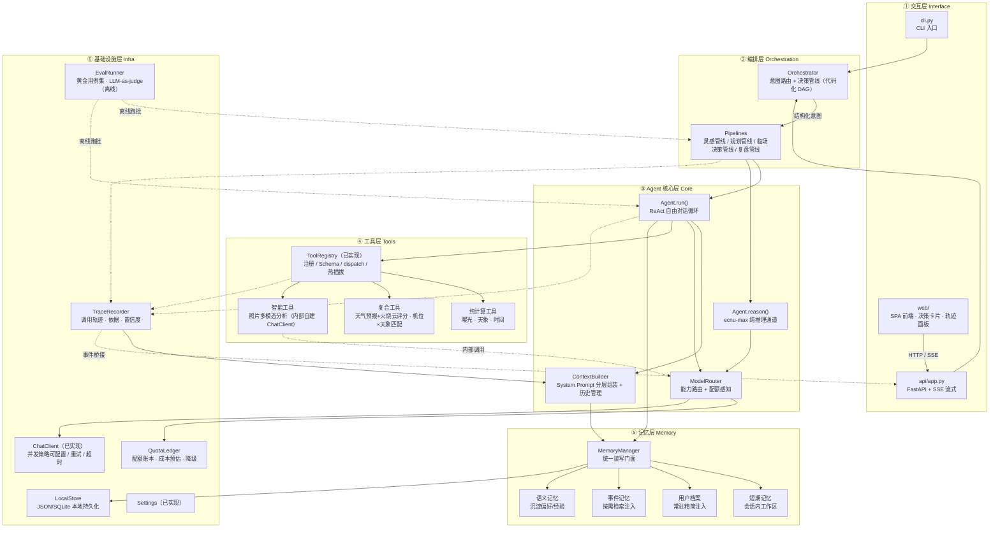
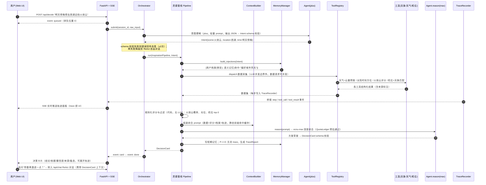

# LightTrail（光迹）Agent 架构设计文档

**版本**：v2.0.3 ｜ **作者**：高见远（Gao，软件架构）｜ **v2.0 修订**：架构通 ｜ **对应 PRD**：v0.3
**代码基线**：**E1–E7 已实现**（37 commits，已 push 至 origin/main，HEAD 8b58fd5）——src+tests ~1.1w 行 + `frontend/`（Vite + React + TS），15 个已注册工具（含 analyze_photo / reverse_engineer_photo / search_memory），pytest 212 全绿、ruff 0 告警、smoke 21 项通过；E6-0 四管线真实联调 + E7-0 SSE 真实联调均通过；`npm run build` 通过

> **v2.0.3 变更摘要**（2026-09-09）：代码基线刷新至 E1–E7 全部落地（212 测试，15 工具，前端 SPA 就绪）；§2.8 SSE 事件协议与 §2.9 并发模型已由 `api/`（FastAPI 五端点 + TraceBridge）+ `infra/trace.subscribe` 落地（threadsafe 入队、协议映射收敛 api/events.py）；`acall()` + `_AsyncGate` 串行闸门实现 §2.9 的 async 并发边界（serial_llm 驱动，排队位置可查）。架构主体设计不变。
>
> **v2.0.2 变更摘要**（2026-09-07）：代码基线刷新至 E1–E6 全部落地（177 测试，15 工具，E6-0 真实联调通过）；§2.4 智能工具约束已由 `tools/photo_analysis.py` 落地验证（depth=1 红线 + VISION 路由 + pydantic 自愈）；ADR-003 扩展参数适配已落地（thinking/reasoning_effort 收敛 ChatClient 适配层）。架构主体设计不变。
>
> **v2.0.1 变更摘要**（2026-09-07）：代码基线刷新至 E1–E5；§2.3 / §2.9 补注 **ADR-002 平台中立性重构**已落地（串行可配置、能力矩阵可注入、`LLM_` 前缀、移除「深推理与工具互斥」假设——模型名只出现在 config 默认值/.env/能力矩阵）。架构主体设计不变。
>
> **v2.0 变更摘要**：
> 1. 交互层从「仅 CLI」升级为 **CLI + FastAPI Web 服务 + Web UI**，新增 SSE 流式协议设计（§2.8）；
> 2. 新增**并发与会话模型**：并发策略收敛为平台适配配置（`serial_llm` 开关 + 可注入能力矩阵），平台约束不再绑架架构（§2.9）；
> 3. 新增**结构化输出契约**与自愈重试机制（§2.10）；
> 4. 新增**三层评估体系（Evals）**：从「能跑」到「能证明好」（§2.11）；
> 5. 模型路由升级为**配额感知路由**（§2.3 增补 QuotaLedger）；
> 6. 克制清单更新：Web UI / 流式输出的触发条件已满足，移入正式设计（§4）；
> 7. 演进路径补充 E7（Web 层）、E8（评估体系）（§5）。

---

## 1. 架构总览：六层分层架构



**各层职责与边界**：

| 层 | 职责 | 不做什么（边界） |
|---|---|---|
| ① 交互层 | 输入输出、会话外壳、SSE 事件推送、决策卡片渲染 | 不含任何业务逻辑；CLI 与 Web 共享同一 Orchestrator API，交互形态可继续替换（TUI/小程序） |
| ② 编排层 | 意图识别、把 D1–D4 决策主线映射为**确定性管线**、步骤间数据组装 | 不做自由对话；不直接调 LLM，只调核心层 API |
| ③ 核心层 | ReAct 循环、模型路由、上下文组装、reason 通道 | 不知道"摄影"是什么，领域知识全部在工具与管线里 |
| ④ 工具层 | 可验证的原子能力（计算/数据/多模态） | 不做决策，只返回数据与评分；副作用只允许写记忆 |
| ⑤ 记忆层 | 四层记忆的读写、注入策略、本地持久化 | 不参与推理；检索策略确定性（不用向量库，见 §4） |
| ⑥ 基础设施层 | LLM 通信、可观测性、持久化、配额账本、离线评估、配置 | 对上透明，可被 Fake 实现替换（测试） |

**边界设计的核心原则**：领域智能（摄影知识）沉淀在②④层，通用智能（推理与对话）收敛在③层，工程保障（并发策略/重试/追踪/配额/评估）沉淀在⑥层。这让"换 LLM 平台"只动⑥，"加摄影场景"只动②④，"换交互形态"只动①——CLI 到 Web 的演进将零改动②–⑥层，这是对边界设计最直接的验证。

---

## 2. 核心设计决策

> 每条按「决策 → 候选对比 → 选择理由 → PRD 映射」展开。

### 2.1 Agent 循环模式：编排管线 + ReAct 自由对话的**双模混合**

**决策**：不是单一 ReAct，也不是纯 Plan-and-Execute，而是按入口分流的双模架构：
- **结构化入口**（"一句话出方案"、火烧云临场决策、拍摄计划编排）→ 走编排层的**确定性管线**（类 Plan-and-Execute，但 Plan 是代码写死的）；
- **开放式入口**（"明天杭州适合拍什么？""这个参数什么意思？"）→ 走现有 **ReAct 循环**（`Agent.run`），模型自主选工具；
- 管线的**末端**可以回落到 ReAct 对话（方案出来后用户继续追问/调整，由 `Agent.run` 接管，携带管线产出作为上下文）。

**候选对比**：

| 方案 | 可控性 | 成本 | 体验 | 判断 |
|---|---|---|---|---|
| 纯 ReAct（一切交给模型循环） | 低：步骤数/顺序不可控，MAX_TOOL_ROUNDS=8 可能截断长管线 | 高：每步一次 LLM 往返 | 自由但不稳定 | 适合开放问答，撑不起 D2 多机位调度这类固定流程 |
| 纯 Plan-and-Execute（LLM 先生成计划再执行） | 中：计划本身仍是 LLM 产物，会漂移 | 高：多一次规划调用 | 流程感强但计划质量依赖模型 | 摄影决策流程**本来就是固定的**（采集→评分→匹配→综合），让 LLM 规划一个已知的流程是浪费 |
| **代码化管线 + ReAct 混合** | 高：关键路径确定性 | 低：管线内 LLM 调用次数固定可预算 | 结构化场景快且稳，开放场景灵活 | ✅ 采纳 |

**理由**：双模不是过度设计，因为两种入口的**不确定性来源不同**——"该不该去拍火烧云"的不确定性在数据与评分（该由代码控制流程），"聊聊星空摄影"的不确定性在话题走向（该由模型自主）。强行用一种模式覆盖两种场景才是设计缺陷。工程上还复用了同一套 `Agent`/`ToolRegistry`/`ChatClient`，混合的边际成本很低。

**PRD 映射**：D1–D4 的"决策主线"（管线）+ A1"多轮对话与工具调用"（ReAct）。

---

### 2.2 编排层：代码化管线（显式 DAG），而非 LLM 自主规划

**决策**：Orchestrator 是**代码化的有向管线**，每条管线 = 一组有依赖关系的步骤函数（如 `意图解析 → 条件评分 → 机位匹配 → 参数推荐 → ecnu-max 综合`），步骤间传递结构化 `PipelineContext` 数据对象。不引入图执行框架，用普通 Python 函数 + dataclass 表达 DAG（依赖浅、分支少，函数调用就是 DAG）。

**候选对比**：

| 方案 | 可控性 | 可解释性 | 成本/配额 | 可测试性 |
|---|---|---|---|---|
| LLM 自主规划（AutoGPT 式） | 步骤不可枚举，失败模式不可枚举 | 计划藏在模型隐状态里 | 规划+执行多次调用，配额杀手 | 只能端到端测，无法单步断言 |
| **代码化管线** | 步骤即代码，完全可枚举 | 每步输入输出可落 Trace | LLM 调用次数 = 固定常数 | 每步可独立单测（Fake 数据注入） |

**理由**：垂直领域的核心优势是**流程已知**。通用 Agent 框架之所以需要 LLM 规划，是因为任务域开放；而 LightTrail 的 D1–D4 每条主线的步骤在 PRD 里已经写明了。把已知流程交给 LLM 规划，等于放弃了垂直领域最大的确定性红利，还引入不可控性。代码化管线同时直接兑现了 M2 可解释性——每一步的输入/输出/评分细则都能进 TraceRecorder，"建议依据"天然产生。

**PRD 映射**：D2"机位×天象匹配、赶场调度"（固定步骤序列）、M2"建议依据、推理可见"、非功能"默认串行/配额有限"。

---

### 2.3 模型路由：能力矩阵驱动 + 配额感知

**决策**：`ModelRouter` 按**能力声明**而非"任务大小"路由。每个模型声明自己提供的能力（tools / vision / deep），调用方声明意图（`needs_tools` / `needs_vision` / `needs_deep_reasoning`），路由按矩阵线性匹配第一个满足的模型——而不是让 Router 猜测，也**不绑定特定品牌**。

- **默认矩阵**（面向 ECNU 双模型）：`ecnu-plus` 提供 tools+vision，`ecnu-max` 提供 deep；默认对话走 plus；
- **矩阵可注入**：接入其他 API 时传入自定义 `capability_matrix` 即可，路由逻辑零改动。单模型全能（`default_model == reason_model`）时默认视为全能矩阵；
- **非法声明/矩阵无法满足** → `RouterError` 显式抛错，不静默回退。能力名白名单 {tools, vision, deep} 校验防拼写错误。

**ECNU 情况说明**：ECNU 的 plus/max **能力互补且互斥**（plus 有工具/视觉，max 有长上下文/深推理）是该平台的特性，**不是架构前提**——架构只要求"模型×能力"的绑定收敛在矩阵里，路由逻辑只认能力声明。这使「同时要工具+深推理」能否满足变成由矩阵决定，而非代码预设。

**v2.0 增补：QuotaLedger 配额账本**。配额是账号级资源（ECNU 为 5h/日/月 credits，plus/max 计价不同，输入分缓存命中/未命中）。路由之前先过账本：

1. **记账**：每次调用按 token 实际消耗入账，滚动窗口统计（5h/日/月）；
2. **预估**：管线入口按步骤数 × 历史均值预估本趟成本，超预算时在管线入口就拒绝或降级，而不是跑到一半断粮；
3. **降级链**：配额水位 >90% 时，深推理综合降级为默认模型综合 + thinking（质量略降、成本约 1/3），并在 DecisionCard 中标注"降级原因"——降级本身也是可解释性的一部分。

**候选对比**：统一只用默认模型（浪费深推理模型的上下文与推理深度，且小上下文在长轨迹注入下有压力）vs 动态 LLM 路由（让模型判断该用谁——引入第三个不可控环节，能力矩阵规则已穷尽）。**选择理由**：能力矩阵是**确定性枚举**——模型能力是已知、有限、可声明的，规则路由即可穷尽，无需模型参与。默认（ECNU）配置下收益明显：把最贵的综合调用收敛到管线末端唯一一次，再由账本兜底极端情况。

**PRD 映射**：A3 模型路由 + LLM 平台约束（模型能力差异、默认串行、配额）。

---

### 2.4 工具体系：三层分类——纯计算 / 复合 / 智能

**决策**：在统一 `ToolRegistry` 之下，按**能力来源与约束**分三类，分类体现在代码组织与文档约定上，不引入新的基类复杂度（仍是 `@registry.tool`）：

| 类别 | 定义 | 约束 | 例子 | 合理性 |
|---|---|---|---|---|
| 纯计算 | 确定性数学/天文计算，无外部依赖 | 必须**离线可算、可精确单测**；不得内嵌 LLM | 曝光换算、500/NPF 法则、太阳方位、银心窗口 | 摄影决策的"事实地基"必须可验证——模型说错曝光是不可接受的，代码算错可以测出来 |
| 复合 | 内部聚合多数据源，输出融合评分 | 单工具 ≤10s 超时预算内完成全部子请求；子源失败要降级（返回部分结果 + 标注缺失），不整体报错 | 天气+云量+湿度 → 火烧云评分；机位×天象匹配 | 把"多源聚合"这一固定模式收进工具内部，Agent 循环只看到一次调用——减少 ReAct 轮次、降低 token 占用 |
| 智能 | 工具内部自建 `ChatClient` 调多模态 LLM | 内部 LLM 调用**不允许再触发工具**（深度=1，防递归）；必须走同一个并发边界与配额账本；输出必须结构化（JSON Schema 约束） | 照片多模态分析（EXIF+画面 → 技术诊断） | "LLM-in-a-tool" 让 Agent 把多模态分析当作普通工具调用，主循环零改动；深度限制为 1 是防失控的关键红线 |

**统一约束**：所有工具返回 JSON 字符串；错误以 `{"error": ...}` 回传让模型自修正（已实现，保留）；任何工具不写对话历史，写记忆必须经 MemoryManager。

**PRD 映射**：A2 工具注册表、A4 数据源接入、D3"火烧云赌注决策"、D4"照片多模态分析"、非功能"工具超时 10s / 热插拔"。

---

### 2.5 记忆架构：四层记忆，注入策略分层

**决策**：四层记忆 + `MemoryManager` 统一门面，**读写路径与注入策略各不相同**——这是设计的核心：

| 层 | 内容 | 写路径 | 读/注入策略 | 依据 |
|---|---|---|---|---|
| 短期记忆 | 当前会话的对话历史 + 管线中间产物（如刚算出的火烧云评分） | 每轮自动 | **全量**在对话窗口内，超阈值由 ContextBuilder 截断/摘要 | 就是上下文窗口本身 |
| 用户档案 | 机身/镜头群、常在城市、水平、偏好题材 | 用户显式声明或确认后写入 | **常驻精简注入**：压缩为 ≤300 token 的固定段落，每轮都在 system prompt | PRD 明确"档案常驻精简"；档案决定所有建议的个性化基线，缺它等于没有个性化 |
| 事件记忆 | 历史拍摄事件：时间/地点/条件/结果/成败 | 复盘管线（D4）结束时结构化写入 | **按需检索注入**：仅当查询涉及地点/题材匹配时，由代码规则检索 top-k 注入，不常驻 | PRD"事件按需注入"；事件量大且稀疏相关，常驻是浪费 token |
| 语义记忆 | 从事件中沉淀的偏好/经验（"该用户在低云量火烧云上成功率高"） | 由复盘/归档流程**提炼**写入（人审或规则提炼，非每轮自动） | 命中规则时注入 1–2 条到档案段落旁 | 语义记忆是"结论"，token 效率最高，但写入必须克制防污染 |

**与上下文工程的关系**：四层记忆对应四种 token 预算策略——短期全量、档案常驻、事件按需、语义择优。MemoryManager 对 ContextBuilder 暴露的是 `build_injections(intent) -> list[MemoryBlock]`，由编排层/ContextBuilder 决定本次组装用哪些块。**记忆数据全部本地化**（JSON 起步，规模上来换 SQLite，接口不变）。

**候选对比**：只用对话历史（无个性化，违背 M1）vs 全量常驻（token 爆炸，256K 也经不起轨迹+事件堆积）vs 向量检索全包（见 §4 克制清单）。**PRD 映射**：M1 四层记忆、非功能"上下文管理 / 记忆数据本地化"。

---

### 2.6 可解释性 / 可观测性：TraceRecorder 贯穿三层

**决策**：`TraceRecorder` 是基础设施层的**被动记录器**，三个写入点：(1) 每次 LLM 调用（模型、prompt 摘要、耗时、token）；(2) 每次工具调用（名称、参数、结果、耗时、数据来源标注）；(3) 每个管线步骤（输入/输出快照 + 评分细则）。对外提供三种消费形态：
- **运行时**：ContextBuilder 把精简轨迹注入 prompt，让模型在回答里能引用"我怎么得到这个结论的"；
- **实时**：trace 事件桥接到 SSE 推送给 Web 前端——用户实时看到"正在查天气 → 火烧云评分 62 → 匹配机位 top-3"（见 §2.8，这是 M2 在 UI 上的直接兑现）；
- **事后**：`TraceReport` 结构化输出——M2 的"建议依据 / 来源与置信度标注"的数据来源。

**置信度模型**：每条建议携带 `sources: [{tool, field, confidence}]`，置信度规则化计算（如：天气预报时效 ≤6h → high，云图外推 → medium，模型主观判断 → low），规则硬编码在管线里，**不让模型自评置信度**（模型自评不可控）。

**对应 Agent 工程概念**：这就是 Agent 领域的 **tracing / observability**（对照 LangSmith / OpenTelemetry GenAI 语义约定），区别是我们自研最小闭环：记录→注入→报告→实时推送，没有外部 SaaS 依赖，符合本地化约束。面试叙事：先讲 tracing 的三层需求（调试、信任、审计），再讲我们如何用 200 行内实现核心闭环，以及"trace 即 UI"如何让可解释性从后端能力变成用户可感知的产品特性。

**PRD 映射**：M2 可解释性全部四条（工具调用轨迹 / 建议依据 / 来源与置信度 / 推理可见）。

---

### 2.7 上下文工程：System Prompt 分层组装

**决策**：`ContextBuilder` 将 system prompt 明确分为**五个有序层**，每层独立的 token 预算与更新频率：

```
① 角色与使命（静态，~200 tok）      —— "你是 LightTrail 摄影决策引擎……"
② 行为准则（静态，~300 tok）        —— 并发边界/置信度表达规范、不确定性坦白原则
③ 工具使用说明（半静态）            —— 由 ToolRegistry.to_openai_schema() 的精简描述生成
④ 用户档案 + 命中语义记忆（常驻动态，≤400 tok）—— MemoryManager 注入
⑤ 会话轨迹摘要（动态，按需）        —— TraceRecorder 精简注入
```

**历史管理策略**：滑动窗口 + 分层截断——工具结果（占大头）优先压缩为结论摘要，保留最近 N 轮原文；管线运行时把管线中间产物以结构化块而非原始对话注入。**原则：上下文是稀缺资源，每一段的进入都要有预算和理由**——这与 2.5 的记忆注入策略是同一枚硬币的两面（记忆层决定"有什么可注入"，上下文层决定"这轮注入什么"）。

**v2.0 增补：prompt 分层带来两个工程红利**——(1) ①②③层静态前缀在多轮对话间完全不变，天然命中平台的 prompt 缓存（命中价 1/5，日常命中率约 90%），分层顺序按"变化频率升序"排列就是为缓存命中率服务；(2) 每层独立版本号，prompt 改动可 diff、可回归（配合 §2.11 的评估体系，改 prompt 不再靠手感）。

**PRD 映射**：M1 注入策略、A1 多轮对话质量、非功能"上下文管理（档案常驻精简、事件按需注入）"。

---

### 2.8 【新增】Web 交互层：FastAPI + SSE 事件流，「trace 即 UI」

**决策**：Web 呈现采用 **FastAPI 薄服务层 + Server-Sent Events（SSE）流式推送 + 静态 SPA 前端**。服务层只做协议转换与会话管理，不含业务逻辑——这是 §1 边界原则的直接兑现。

**API 形态**（`api/` 包）：

| 端点 | 方法 | 说明 |
|---|---|---|
| `/api/chat` | POST → SSE | 自由对话（ReAct），流式回传 token 与工具事件 |
| `/api/decide` | POST → SSE | 决策管线入口（D1–D3），流式回传步骤事件 + 最终 DecisionCard |
| `/api/photos/review` | POST( multipart ) → SSE | 照片复盘（D4），上传图片走多模态管线 |
| `/api/profile` | GET / PUT | 用户档案读写（M1.1-01，档案编辑页） |
| `/api/sessions/{id}` | GET | 会话历史与 TraceReport 查询（回放"当时为什么这么建议"） |

**SSE 事件协议**（复用 TraceRecorder 事件类型，前后端共享一份 schema）：

```
event: queued     —— 已进入 LLM 并发队列（见 §2.9），附排队位置
event: step       —— 管线步骤开始/完成（名称、耗时、输出摘要）
event: tool_call  —— 工具调用（名称、参数）
event: tool_result—— 工具结果（结构化数据 + 来源标注）
event: token      —— 模型流式输出片段（ReAct 对话）
event: card       —— 最终 DecisionCard（结论/依据/置信度/来源/备选）
event: error      —— 错误与降级说明
event: done       —— 流结束
```

**SSE 而非 WebSocket 的理由**：决策管线的数据流是**服务端主导的单向事件流**（用户发一句话，服务端推一串事件），没有双向实时需求；SSE 基于 HTTP、天然支持断线序号重连、浏览器 EventSource 原生支持、且能穿过反向代理与 HTTP/2——WebSocket 在这里只增加连接管理的复杂度，不增加能力。

**「trace 即 UI」是本设计的核心叙事**：M2 可解释性要求的"工具调用轨迹、建议依据、来源标注"，在 CLI 时代只能事后翻日志；Web 化后，TraceRecorder 的事件**零转换**桥接为 SSE 事件，前端左栏渲染决策卡片、右栏实时滚动轨迹面板——可解释性从后端能力升级为用户可感知的产品差异化。前端原型（`docs/design/delivery/lighttrail-prototype.html`，6 页 SPA）已定义视觉语言，工程化时组件化为：决策卡片 / 轨迹面板 / 参数表 / 档案编辑 / 照片上传复盘。

**PRD 映射**：A1、M2 全部、非功能"单轮响应 ≤10s/15s/30s"（SSE 首事件 <1s，体感远优于等整包）。

---

### 2.9 【新增】并发与会话模型：并发策略是平台适配，不是架构前提

> **v2.0 修正**：ECNU 平台「建议串行调用」是**该平台的特性**，不是 LightTrail 产品需求——后续可能用其他支持并发的 API 做测试，因此并发策略收敛为**可配置的平台适配层**，不绑架架构。若未来接入支持并发的 API，只需关闭开关，无需改动业务代码。

**问题**：现有 `threading.Lock` 只能串行化单进程内的同步调用，且同步锁在 FastAPI 的 async 事件循环里会阻塞所有请求。Web 化必须正面回答：多会话并发时，LLM 调用并发的边界在哪？

**决策**：三件事——

1. **执行层：并发策略可配置，默认串行**。`ChatClient` 增加 `serial_llm` 开关（由 `Settings.serial_llm` 注入，默认 `True` 适配 ECNU「避免并行请求」；接入支持并发的 API 时设 `False`）。**串行锁是实例级且只包住单次 API 往返**，重试在锁外——关闭串行后，重试、缓存、超时策略与并发互不掣肘。
   - **Web 形态**：async 通道 `ChatClient.acall()` 配合全局并发控制（默认 `asyncio.Semaphore(1)` 即串行）。**串行的只是 LLM 调用，不是整个系统**——工具计算、HTTP 数据获取（天气/地图等非 LLM 请求）在信号量外可并发，不让慢天气 API 堵住别人的对话。
   - 关闭开关（`LLM_SERIAL_LLM=false`）时，把信号量/锁调大或移除即可——**并发边界是配置，不是代码每个分支**。
2. **会话层：`SessionManager`**。`session_id → {消息历史, PipelineContext, 记忆工作区}`，进程内字典 + JSON 落盘（A-08 对话持久化一并兑现）。多会话共享 LLM 并发边界，各自独立的上下文与记忆命名空间。单机自用场景不需要认证体系，预留 `user_id` 字段即可。
3. **体验层：排队显式化**。请求入队即推 `queued` 事件（附位置），用户看到的是"排队第 1 位 · 预计 8s"而不是转圈——在默认（ECNU）配置下，串行从缺陷变成可解释的体验；并发配置下该事件同样存在（只是队列常空）。

**部署形态**：默认（ECNU 串行）配置下，水平扩展零收益——十个 worker 也只有一个能调 LLM，反而引入分布式锁问题，所以单进程 uvicorn 即最优。**但这只是默认配置的推论，不是架构约束**：若换用支持并发的 API（`serial_llm=false`），多 worker/水平扩展是自由的——架构不预判也不禁止。这是"约束驱动"的正确姿势：**约束进了配置，架构保持中立**。

**PRD 映射**：NF-02 串行调用约束（转为默认配置）、A-08 对话持久化、NF-01 响应时间。

---

### 2.10 【新增】结构化输出契约：Schema 约束 + 自愈重试

**决策**：管线内所有 LLM 输出的跨步骤数据——`Intent`、`DecisionCard`、照片诊断结果——都定义为 **pydantic 模型（JSON Schema）**，构成管线的"类型系统"：

- **生成侧**：prompt 中注入 schema 与示例，要求严格 JSON 输出；
- **校验侧**：输出经 pydantic 校验，类型/枚举/数值范围（如置信度 ∈ [0,1]、机位数 ≤5）全部强约束；
- **自愈侧**：校验失败时，把**校验错误信息本身**回传模型要求修正（最多 2 次），复用现有"工具错误回传自修正"的同款机制；仍失败则管线降级到 ReAct 自由对话（§2.1 双模的兜底价值）；
- **演进侧**：schema 即文档、即契约、即测试断言目标——评估体系（§2.11）对 LLM 输出的断言全部基于 schema 字段，而非脆弱的文本匹配。

**为什么是 pydantic 而非 function calling 强约束**：意图识别与综合两步都可能走 ecnu-max（不支持工具调用），JSON 模式 + 校验是两款模型的**能力交集**；且 pydantic 模型同时服务三件事——LLM 输出校验、管线步骤间数据传递、FastAPI 请求/响应模型（Web 层免费获得 OpenAPI 文档）。一份 schema，三处复用。

**PRD 映射**：D1.1-01 意图理解、M2（DecisionCard 的依据/置信度是 schema 必填字段，结构性保证可解释性不落空）、NF-06 容错。

---

### 2.11 【新增】评估体系（Evals）：三层评估，从「能跑」到「能证明好」

**决策**：Agent 项目最常见的短板是"没有评估，只有演示"。LightTrail 按**确定性递增**分三层，全部离线跑批、配额预算可控：

| 层 | 对象 | 方法 | 现状/计划 |
|---|---|---|---|
| L1 工具层 | 纯计算/复合工具 | pytest 精确断言（NPF 公式、500 法则边界、ND 档位换算） | ✅ 已实现，43 用例全绿 |
| L2 管线层 | 代码化管线端到端 | **黄金用例集**：固定 Intent + Fake 数据源 → 断言 DecisionCard 的 schema 合法性与关键字段（结论方向、机位数、置信度区间）；LLM 综合步骤用录制回放（cassette）保证确定性 | E8 落地 |
| L3 质量层 | 开放对话与综合表达 | **LLM-as-judge**：ecnu-max 按 rubric（决策合理性/依据完整性/个性化程度/不确定性坦白）1–5 分打分；黄金集 ~30 条覆盖三题材 × 四主线；与人工标注的小样本校准相关性 | E8 落地 |

**回归门禁**：prompt 任一层、评分规则、管线步骤变更后，跑 L1+L2（分钟级、零 LLM 成本）；版本发布前跑 L3（配额预算 ~500 credits/次，账本预估通过后执行）。评估结果存档，形成质量曲线——**"改 prompt 提升还是回退"从玄学变成数据**。

**为什么自研而非接 Ragas 等框架**：评估对象是垂直决策卡片而非通用 QA，rubric 必须含摄影领域判断（如"参数建议是否符合 500 法则"可由 L1 的纯计算工具反向校验——**工具即裁判**，这是垂直 Agent 独有的评估红利：确定性工具可以自动验证模型的定性建议）；框架的通用指标（faithfulness 等）在这个场景解释力不足。自研评估器 ~150 行，且本身就是面试可展开的工程产物。

**PRD 映射**：非功能可测试性、开源"文档完善可供参考"（评估体系是最能体现工程成熟度的部分）。

---

## 3. 关键流程时序：「一句话出方案」（D1 灵感主线，Web 形态）



**每步设计理由**（时序中的关键取舍）：
- **意图识别单独一次 plus 调用**（步骤 4–5）：把自然语言转成强类型 Intent，管线后续全部消费结构化数据——LLM 的不确定性被约束在管线入口一处，内部全确定；
- **数据采集是工具调用而非对话轮次**（步骤 9–12）：管线内直接 `registry.dispatch`，不经过"模型决定调哪个工具"的 ReAct 循环，省掉每工具一次 LLM 往返（配额与延迟双省）；
- **评分代码化**（步骤 15）：火烧云概率规则明确（云量/高度/湿度/时效），代码评分 = 可单测 + 置信度可审计 + 可作 L3 评估的自动裁判；
- **max 只出现在末端综合**（步骤 17–18）：全管线唯一一次"贵"调用，输入已预处理为纯文本，完美匹配 max 能力边界；QuotaLedger 先预估后执行，断粮风险在入口拦截；
- **trace 事件实时桥接 SSE**（步骤 13–14）：可解释性不等结果出来才展示，过程本身即产品体验；
- **结束后可回落 ReAct**（步骤 24）：结构化产出与自由对话无缝衔接，双模架构价值的直接体现。

---

## 4. 克制清单：明确不做什么

> 每条：被否决方案 → 为什么现在不需要 → 什么条件下才重新评估。

| 否决方案 | 现在不需要的理由 | 重新评估的触发条件 |
|---|---|---|
| **多智能体协作框架**（AutoGen 式多 Agent 对话/辩论） | 决策流程已知且线性，单 Agent + 代码管线已全覆盖；多 Agent 会把确定性流程变成不可调试的对话 | 出现真正异构角色（如"审美评审"与"技术评审"需要对抗性立场）且代码评分无法表达时 |
| **向量数据库 / RAG** | 事件记忆量级（用户个人百级事件）用规则检索（地点/题材/时间匹配）足够且**更可解释**；引入 embedding 链路带来新依赖、新不可解释性 | 事件记忆超过千级、或需要跨模态相似检索（"找类似这张的照片"）时，先用 SQLite FTS，再考虑向量 |
| **引入 LangGraph/LangChain** | 现有骨架已实现其核心子集（循环/注册表/串行）；引入框架带来版本耦合、黑盒抽象、与面试"讲出门道"目标相悖 | 团队化协作需要生态组件（现成 checkpointer、LangSmith 集成）且自研维护成本超过学习成本时 |
| **WebSocket / 全双工实时** | 数据流是服务端主导的单向事件流，SSE 已穷尽需求且更轻（见 §2.8） | 出现协同编辑、多人实时会话等真双向场景时 |
| **水平扩展 / 分布式部署** | 默认（ECNU 串行）配置下扩展零收益，单进程 uvicorn 即最优（见 §2.9）；接入支持并发的 API 后此项自然解除 | 换用支持并发的 API（`serial_llm=false`）且用户量真实增长时，多 worker 自由扩展 |
| **并行 LLM 调用** | 默认（ECNU）配置下避免并行请求；单工具 10s 超时下串行总时长可预算 | 换用支持并发的 API、且赶场调度等场景的延迟成为真实瓶颈时（关闭 `serial_llm` 开关即可） |
| **工具沙箱 / 权限系统** | 工具全部是第一方代码，无第三方工具执行风险 | 开放第三方工具插件生态时 |
| **Fine-tuning 摄影垂域模型** | Prompt 工程 + 工具化知识（500 法则等已代码化）完全覆盖；微调数据不存在且配额不允许 | 有真实用户复盘数据积累（千级 D4 记录）且平台支持微调时 |
| **持久化管线状态机 / checkpoint 恢复** | 管线单次执行分钟级，失败重跑代价低 | 管线出现小时级任务（如多日拍摄计划持续跟踪）时 |
| **在线评估 / 自动 A/B**（LLM-as-judge 进运行时链路） | 单机自用，流量不支持统计显著性；judge 调用本身消耗配额 | 多用户上线、prompt 迭代频率高到离线回归跟不上时 |

**已移出克制清单（v2.0）**：~~Web UI~~ 与 ~~流式输出~~——触发条件"项目以网页形式呈现"已满足，分别见 §2.8 与 §2.8 的 SSE 设计。移出时同步验证：交互层边界（①层可替换）在 v1.0 已预留，本次升级零改动②–⑥层，证明当时的边界判断成立。

这一清单的判断标准是一致的：**每个机制必须能映射到 PRD 的具体需求或已发生的痛点，而不是"主流 Agent 项目都有"**。

---

## 5. 演进路径：2300 行基线 → 目标架构

**原则：每步保持测试全绿 + 向后兼容（`Agent.run` 与 `@registry.tool` 签名不变），模块按依赖序落地。**

| 阶段 | 动作 | 涉及文件（src/lighttrail/） | 兼容保证 |
|---|---|---|---|
| **E1 地基拆分** | `agent/core.py` 拆出：`agent/loop.py`（ReAct 循环）、`agent/context.py`（ContextBuilder）、`llm/router.py`（ModelRouter） | `agent/{core,loop,context}.py`、`llm/router.py` | `Agent.run()` 委托给 loop，公开 API 不变；现有用例不动 |
| **E2 可观测性** | 新增 `infra/trace.py`（TraceRecorder + TraceReport + 事件订阅接口）；在 loop、registry.dispatch 挂写入点 | `infra/trace.py` | 纯增量，记录器可关闭，关闭时行为同现状 |
| **E3 记忆层** | 新增 `memory/manager.py`、`memory/store.py`、`memory/profile.py`；ContextBuilder 接入 build_injections | `memory/{manager,store,profile}.py` | 无记忆文件时注入为空段，行为退化为现状 |
| **E4 reason 通道与配额** | `Agent.reason()` + Router max 路由规则 + `infra/quota.py`（QuotaLedger 接入 ChatClient） | `agent/loop.py`、`llm/router.py`、`infra/quota.py` | 纯新增方法；账本默认宽松模式 |
| **E5 编排层与输出契约** | `orchestrator/orchestrator.py`、`orchestrator/pipelines.py`、`orchestrator/schemas.py`（Intent/DecisionCard pydantic 模型 + 自愈重试）；cli 增加 `--pipeline` 入口 | `orchestrator/{orchestrator,pipelines,schemas}.py` | 自由对话路径完全不变；管线失败降级到 ReAct |
| **E6 智能工具与事件/语义记忆** | 照片分析工具（内部 ChatClient、深度=1 红线、schema 输出）、复盘管线写事件记忆、语义记忆提炼 | `tools/photo_analysis.py`、`memory/{event,semantic}.py` | 新工具走现有热插拔注册 |
| **E7 Web 层** | `ChatClient` 增加 async 通道（`acall` + 并发控制，默认 `Semaphore(1)` 串行）、`api/app.py`（FastAPI + SSE 路由）、`api/session.py`（SessionManager）、`web/`（SPA 工程化，原型组件化）；trace 事件桥接 SSE | `llm/client.py`、`api/{app,session,routes}.py`、`web/` | CLI 路径完全不变；同步 ChatClient 保留为 async 的薄封装 |
| **E8 评估体系** | `evals/golden/`（黄金用例集）、`evals/runner.py`（L1–L3 跑批）、`evals/judge.py`（LLM-as-judge + rubric）；接入 QuotaLedger 预算门禁 | `evals/`（顶层目录） | 纯离线，不进运行时链路 |

拆分后 `agent/core.py` 收敛为对外门面（组合 loop/context/router），单文件均控制在 ~200 行内，符合 ruff line-length=100 与现有代码风格。

---

## 6. 与主流框架的对照（面试叙事）

| 主流概念 | LightTrail 对应物 | 差异与自研理由 |
|---|---|---|
| LangChain `AgentExecutor` / ReAct loop | `agent/loop.py`（≈100 行） | 核心循环就 40 行：chat→tool_calls→dispatch→回传。LangChain 的 Executor 为通用性付出了多层回调/解析器抽象，而我们只需要 OpenAI 兼容协议一种。**自研让每一个行为（重试、锁、错误回传自修正）都可解释、可面试展开** |
| LangGraph 状态图 | `orchestrator/pipelines.py`（代码化管线） | LangGraph 用图抽象解决"流程控制"，代价是状态 schema、checkpointer、节点通信三套概念。我们的管线 DAG 浅且静态，普通函数调用即 DAG——**用零抽象成本拿到同等可控性**；且 LangGraph 不解决我们的真问题（模型能力路由、记忆注入策略、配额约束） |
| OpenAI Agents SDK / function calling | `agent/tools.py` + `orchestrator/schemas.py` | SDK 的 Runner 面向"模型驱动一切"的场景；我们的双模架构里结构化入口由代码管线驱动，模型只在入口/出口两点出现。schema 契约用 pydantic 自研是因为要同时服务 LLM 校验、管线数据传递、FastAPI 模型三处（§2.10） |
| AutoGen 多 Agent 对话 | 不采用（见 §4） | 多 Agent 对话的本质是用 LLM 通信替代程序控制流，在垂直确定性场景是反模式 |
| LangSmith / OTel GenAI | `infra/trace.py` | 保留 tracing 的三层价值（调试/信任/审计），去掉 SaaS 依赖；精简轨迹还能回注 prompt、桥接 SSE 实时上屏（"trace 即 UI"）——这是 LangSmith 做不到的闭环 |
| MemGPT / Letta 记忆分层 | `memory/` 四层 + 注入策略 | 理念同源（记忆分层 + 分页注入），但我们用**规则检索**替代其向量分页，因为数据量级不需要且规则更可解释 |
| Router 类（GPT-Router 等） | `llm/router.py` 能力矩阵 + QuotaLedger | 通用 router 按"成本/难度"猜测路由；我们按**能力声明**确定性路由——模型能力是已知有限的可声明集合，规则即穷举，无需学习；能力矩阵可注入，不绑定品牌 |
| Ragas 等评估框架 | `evals/` 三层评估 | 垂直决策卡片需要领域 rubric；**确定性工具可反向校验模型建议**（500 法则算一遍就知道模型推的快门对不对），这是通用评估框架给不了的"工具即裁判"红利 |
| Web 实时推送（WebSocket/SSE 方案） | SSE 事件流 | 单向事件流场景 SSE 穷尽需求：HTTP 原生、断线重连、过代理；不引入连接管理复杂度（§2.8） |

**自研 vs 套框架的一句话总结**：框架的价值在通用场景的生态与现成组件，代价是抽象税与黑盒；LightTrail 的场景是垂直、流程已知、平台约束适配层明确（默认串行/配额/能力矩阵可注入），自研轻量骨架在可控性、可解释性、可测试性上全面占优，且基线代码已证明核心机制并不复杂——**架构的复杂度应该花在记忆、可解释性、上下文工程、评估体系这些真正决定 Agent 质量的地方，而不是花在框架本身**。

---

## 附：设计原则回顾

1. **能力矩阵驱动路由**：模型×能力绑定收敛在可注入矩阵，路由只认能力声明，不绑定品牌（默认矩阵对应 ECNU，换 API 注入即可）；
2. **约束驱动简化（仅默认配置）**：ECNU 串行+配额约束 → 默认单进程部署、显式排队、配额账本——限制被转化为默认配置下的红利，但约束进配置、架构保持中立（换 API 即解除）；
3. **确定性最大化**：已知流程代码化，LLM 的不确定性被约束在管线入口（意图识别）与出口（综合表达）两点，且两点都有 schema 契约与自愈兜底；
4. **上下文是稀缺资源**：每段注入有预算、有理由（记忆四层 × prompt 五层），静态前缀排序为缓存命中率服务；
5. **可解释性不是功能是地基**：TraceRecorder 被动贯穿，依据与置信度是产出物的标配字段，trace 事件直接成为 Web UI 的实时内容；
6. **质量可被证明**：三层评估体系让"模型/ prompt 改动是提升还是回退"从手感变成数据；
7. **克制即判断力**：每个机制映射 PRD 具体需求，时髦方案入克制清单并写明触发条件；触发条件满足时（如 Web UI）果断移入正式设计。
