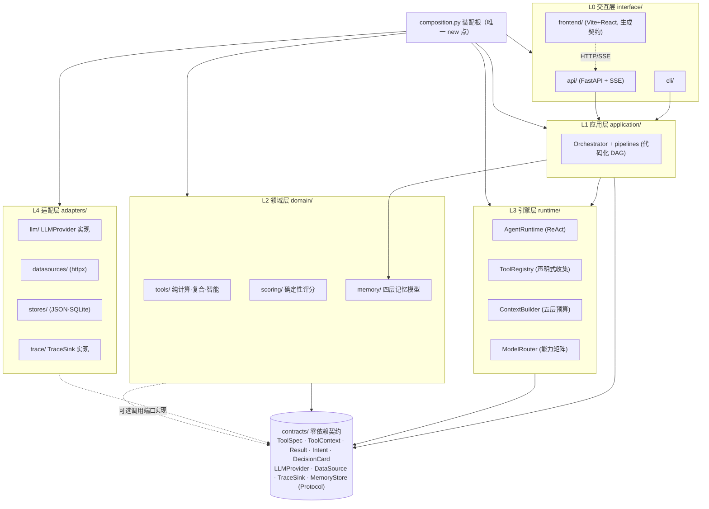
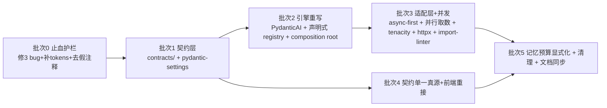

# LightTrail（光迹）· 架构重建方案 v3.1（决策就绪版）

> **作者**：高见远（Gao，软件架构）｜ **日期**：2026-09-09｜ **状态**：待小北拍板
> **版本**：v3.1（在 v3 基础上修订，**保留 v3 全部论证**，被推翻条目原位加删除线并标注 supersede，变更留痕见 §0）
> **输入**：主理人审计清单（8 组）＋ 独立复核（对 `src/lighttrail/`、`tests/`、`frontend/src/` 逐文件核对）＋ 小北 2026-09 拍板三条（骨架重写 / 放开并发 / 1 个月完整版）
> **基线**：HEAD `2129d62`（62 commits，工作区干净，与 origin/main 同步；本方案撰写环境 git 输出不可用，此三项采信主理人核实值，文件级证据一致）
> **约束**：本方案为**决策文档**；未改动任何现有代码或文档；`LICENSE`、`docs/design/delivery/lighttrail-prototype.html` 只读真源未触碰。

---

## 0. v3.1 修订留痕（决策变更记录）

> 小北已拍板三条：① **重构力度 = 包 2「骨架重写」**（见 §5）；② **ECNU 平台继续用，但放开并发**——"受 ECNU 串行约束"这一前提**不成立**；③ **时间预算 = 1 个月做完整版**（质量优先于赶工）。
> 本版**不删除 v3 任何原论证**，被推翻条目原位加删除线并标注「已被 v3.1 supersede，原因见 §X」，保留 ADR 式历史留痕。

| # | 受影响条目 | v3 原结论 | v3.1 修正 | 类型 | 定位 |
|---|---|---|---|---|---|
| R1 | v3 隐含前提 ／ §4.4 ／ 引用架构克制清单「单进程 uvicorn 即最优、水平扩展零收益」 | 默认串行 → 单进程最优 | **作废**：多 worker（`uvicorn --workers N`）可行且推荐；单进程不再是唯一部署形态 | 推翻 | §4.4 |
| R2 | 架构克制清单「并行 LLM 调用」 | 列入克制（默认不并行） | **移出克制清单** | 推翻 | §4.4 |
| R3 | §4.4「~~串行是配置不是假设（ADR-002）~~」 | 串行是平台适配，默认 1 | **降级为纯配置** `LLM_CONCURRENCY=N`（不再有"为某平台特殊设计"的语义）；ADR-002 其余条目（能力矩阵可注入、配置去品牌化、代码不写品牌判断）**不变且价值更大** | 修正 | §4.4 / §4.7 |
| R4 | §4.4 并发默认值 | 默认 `Semaphore(1)` | **默认并发 = 4**（论证见 §4.4）；删除 `LLM_SERIAL_LLM` 双开关歧义 | 修正 | §4.4 |
| R5 | §3 表格第 1 行「Agent 循环（ReAct）」／§2 方案 B 的 runtime | runtime 全自研 | **改为混合：接入 PydanticAI 驱动循环 + 自研 Model 桥**（独立复核见 §3.1） | 推翻 | §3 / §3.1 |
| R6 | §5 迁移路线 | B0–B5 六批线性 | 重排为**三包**结构（包 1/2/3）；**本次承诺 = 包 2** | 细化 | §5 |
| R7 | §4 目标架构 | 无并行取数设计 | **新增 `asyncio.TaskGroup` 并行取数**（管线内四数据源无依赖） | 新增 | §4.4（新增段） |
| R8 | §6 面试叙事第 2 行 | 「为什么不用框架」 | 答案随 R5 改写为「为什么用 PydanticAI、为什么仍不用 LangGraph」；新增 PydanticAI 专条 | 修正 | §6 |
| R9 | §7 决策点 | 6 项 | 增补 4 项（PydanticAI 采纳 / 并发默认值 / 三包范围 / 需求裁剪） | 细化 | §7 |
| R10 | 新增交付物 | — | **§3.2 需求裁剪清单**（供小北决定，不代决）＋**附录 A「ADR-004 草纲」** | 新增 | §3.2 / 附录 A |

---

## 1. 诊断复核结论

### 1.1 逐组复核（确认 / 修正 / 补充）

| 组 | 主理人结论 | 复核判定 | 关键依据（文件:行） | 修正 / 补充 |
|---|---|---|---|---|
| **G1 分层成环** | 工具→编排、工具→核心、基础设施→核心反向依赖 | **确认**，且更严重 | `tools/photo_analysis.py:32`→`orchestrator.schemas`；`tools/{astronomy:23,basic:7,exposure:13,memory_tool:15,photo_analysis:26,site_match:15,weather:24}`→`agent.tools.registry`（共 **7** 个文件，非 6）；`infra/quota.py:19`→`llm.router`；`orchestrator/orchestrator.py:30`→`tools.astronomy._parse_date`（死 import） | 反向依赖文件数是 **7** 个工具（主理人列 6 个，漏 `photo_analysis.py:26`）；环不止一处：`tools→orchestrator`、`tools→agent.core`、`infra→agent.core`、`infra→llm`、`orchestrator→tools`（死 import）——**四个方向的自环** |
| **G2 假热插拔** | 新增工具要改 5~6 处 | **确认**，实为 **5~6 处＋测试 1 处** | `tools/__init__.py:6`（导入清单）；`infra/trace.py:53` `_MAIN_FIELD`；`infra/confidence.py:19/33/35` 三集合；`agent/context.py:44-52`（能力叙述）；`frontend/src/api/events.ts`（如新增事件形态）；**另** `tests/conftest.py:9-17` 也逐工具导入 | `_MAIN_FIELD` **已漂移**：缺 `analyze_photo`/`reverse_engineer_photo`/`search_memory` 三个已注册工具 → 已发生的静默失真，非潜力风险。PRD NF-09「已实现」是**过度声明** |
| **G3 全局单例** | registry/_DEFAULT_CLIENT/_DEFAULT_STORE/null_trace/app | **确认** | `agent/tools.py:158`；`tools/photo_analysis.py:76`；`tools/memory_tool.py:20`；`infra/trace.py:437`；`api/app.py:113` | 补充：`photo_analysis.set_client`/`memory_tool.set_event_store` 用**模块级可写全局 + setter**做测试注入（`:66/:23`），是「服务定位器」而非依赖注入——测试隔离靠改全局态，多测试并发即互相污染 |
| **G4 Trace 显式传参** | 逐层显式传参，无 contextvar | **确认** | 注册表构造注入 `tools.py:38` → loop 每轮 `loop.py:109` → `PipelineEnv.dispatch` lambda `orchestrator.py:161-163` → routes 每请求新建 `routes.py:169/214/293` 且 `_run_setup` 穿透 `:137-159` | 结论成立：换一个入口（如新增 `/api/xxx`）需复制整条链；`_traced_dispatch`（`routes.py:111-125`）是为补记录器而额外包的补丁，正是该设计缺陷的补丁成本 |
| **G5 注释承诺>实现** | 4 处 | **确认** | 缓存：`llm/client.py:7`＋`config.py:11` 声称策略，全仓无 LLM 响应缓存（grep「缓存」仅命中 prompt 段缓存 `context.py:153` 与计费 `quota.py`）；时效：`pipelines.py:256` 注释「距日落还有多少小时」，`:257` 直接 `_build_synthesis_prompt`；tokens：`trace.py:224` 注释「E4-2 接入后补齐」，`loop.py:77`/`core.py:149` 从不传 tokens（恒 None，仅 `test_trace.py:52` 传入）；坐标：`orchestrator.py:34/311` 称「E6-3 落地后精确定位」，E6-3 已提交（`memory/manager.py:190 sediment_favorite_spots`）但代码仍写死 `_DEFAULT_LAT/LON` | 补充：`client.py:7` 与 `config.py:11` 的「缓存」指平台侧 prompt 缓存（命中价 1/5），**本仓零实现**——属「把平台特性写进注释当能力」的同类错误（与 ADR-002 教训同构） |
| **G6 并发正确性** | session 死锁 + 共享可变 + 锁外写 | **确认（真 bug）** | 死锁：`_evict_if_needed`（`:257`）被 `:180/:221/:243` 在持 `_lock` 时调用，其内 `self.save(victim)`（`:265`）→ `save` 再取 `_lock`（`:240`），`threading.Lock` 不可重入 → **同线程永久死锁**（触发：cache>100 且被淘汰会话无磁盘文件）；共享可变：`get()`（`:183-197`）返回缓存对象本体，`routes.py:187-189/231-234/310-313` 直接改它；锁外写：`write_text`（`:237-239`）在锁外，同 id 并发写损坏 JSON | 补充：死锁触发需要 `_evict_if_needed` 走到「victim 无磁盘文件」分支——即**新建会话刚被淘汰**时最易复现；当前 212 用例未覆盖缓存淘汰路径（`tests/test_session.py` 未构 cache>max） |
| **G7 前端伪造数据** | 硬映射置信度、正则猜结论、正则解 JSON | **确认** | `D3Page.tsx:33-42`（78/58/34 硬表）→ `:188-190` 派生「可能性评估」三色条；`HomePage.tsx:21-30` 复制同表；`D3Page.tsx:44-49` `verdictFrom` 中文正则猜 go/wait/risk；`D2Page.tsx:23-26,69-89` 正则解析工具 JSON 字符串 | 补充：`D3Page.tsx:287` 有「数值由置信度区间换算」小字，但源头仍是常量表 → 不诚实；概率条是 `value`/`(100-value)*0.65`/余数**拆分**，与后端无关，却呈现为「可能性评估」 |
| **G8 契约双份手写** | SSE 事件类型前后端手抄 | **确认** | 后端 `api/events.py:29-36` + `map_trace_event:39-83`；前端 `frontend/src/api/events.ts:3-11` 手抄；`token` 非逐 token（`routes.py:190` 整段发） | 补充：`DecisionCard` 亦双写（后端 `orchestrator/schemas.py:93-115` vs 前端 `events.ts:20-29`）；无 codegen → 漂移必然发生（`_MAIN_FIELD` 漂移已在 G2 实证） |

### 1.2 复用与一致性复核（主理人"重复与一致性"清单）

| 项 | 判定 | 依据 |
|---|---|---|
| orchestrator/pipelines **各写一份** `_DEFAULT_LAT/_LON`、`_candidate_sites`、`_default_photo_analyze` | **确认** | `orchestrator.py:35-36,61-71,39-46` vs `pipelines.py:27-28,55-63,297-304`（逐字近似） |
| 时区解析三处 | **修正为两处手写 + 一处复用** | `astronomy._parse_tz_offset:55`、`basic.get_current_time:29-33`（手写）；weather 复用 astronomy（`weather.py:25,83`） |
| HH:MM→分钟两处 | **确认** | `weather._hhmm_to_minutes:401`、`site_match._minute_of_day:176` |
| 重试逻辑多套 | **确认** | `client.chat:180-194`（指数退避）vs `weather._fetch_json:54-74`（无退避立即重试）vs `photo_analysis.py:220-229`、`:345-364`（两套手写「校验失败回传重试」，未用 `validation.parse_with_retry`） |
| `chat`（148-195）与 `acall`（197-249）近乎逐行复制；锁+闸门+重试+记账交织一类 | **确认** | `llm/client.py` 单类聚合 4 类职责（SRP 违背）；`_AsyncGate`（55-111）自研 FIFO 闸门 + `threading.Lock`（137,322-327）+ retry + `_record_usage`（306-320）|
| 依赖声明不一致 | **确认** | `pyproject.toml:12-20` 7 项 vs `requirements.txt:3-8` 4 项（缺 fastapi/uvicorn/python-multipart），且注释「仅依赖 openai SDK」列了 4 条 |
| 死代码 | **确认** | `tools.py:26 ToolError` 全仓无 `raise`；`agent/core.py:22 DEFAULT_SYSTEM_PROMPT` 重复定义（真源 `context.py:61`）；`api/session.py:56/76 snapshot_context/restore_context` 仅 `tests/test_session.py` 用；`SessionRecord.pipeline` 仅测试赋值（`test_session.py:163`）；`frontend/src/styles.css:198 .fake-tag` 零引用 |
| 测试偏弱 | **确认** | `FakeChatClient` 在 8 个文件各自定义，按序 `pop(0)` 不校验请求合理性；`test_pipeline_e2e.py:129` `assert sum(1 for _ in GOLDEN_CASES) == 3` **恒真**；`test_orchestrator.py:161` 弱断言 |
| 文档与代码脱节 | **确认** | `architecture.md:30,419` 写 `web/`（实为 `frontend/`）；基线与测试数已过期；PRD §8.2 称天文用 `ephem（已采用）`，而 `pyproject.toml` 依赖为 `astral`（无 ephem） |

### 1.3 一句话总判断

> **这个项目的问题属于「架构错 + 工程质量」二者兼有，且因果清晰：一个关键架构缺陷（用全局单例 `registry` 做逆向控制 + 契约层缺失导致分层成环）放大并掩护了一大批工程质量问题（注释即承诺、重复实现、死代码、契约手抄、测试偏弱），再叠加 1 个真并发 bug（session 死锁）。** 架构错是"关键少数"（约 3 处根因），工程质量是"量大面广"（可由批次化清理消除）。

### 1.4 文档声称的「六层架构」是否成立？

**不成立——作为可执行的依赖约束不成立，仅作为命名约定成立。**

- `architecture.md:98-107` 声明的边界是自上而下单向依赖：① 交互 → ② 编排 → ③ 核心 → ④ 工具 → ⑤ 记忆 → ⑥ 基础设施，且「换平台只动⑥，加场景只动②④，换交互只动①」。
- 实测依赖图存在 **4 组反向边**（G1）：`④工具→②编排`、`④工具→③核心`、`⑥基础设施→③核心`、`②编排→④工具`。任一条都足以判定「分层闭环」被打破。
- 更本质的问题：`registry` 全局单例（`tools.py:158`）使 ④ 层反向「拉住」③ 层——这不是命名疏忽，而是**控制反转缺失**：工具本应是③层的被调用方，却通过 import 全局注册表反向耦合③层。
- 结论：六层是**纸面架构（aspirational）**，与代码真实结构不符。这也是本方案主张"重建骨架"而非"修补分层"的根本原因（见 §2）。**这个判断本身就是最好的面试素材**（见 §6 第 9 条）。

---

## 2. 重构 vs 重写：量化对照

### 2.1 资产盘点（估算，基于聚合基线 `src` 7482 行/41 文件、`tests` 4269 行/27 文件、`frontend/src` 2889 行）

| 资产 | 估算规模 | 质量判定 | 可否保留 |
|---|---|---|---|
| 确定性领域算法（`tools/` 曝光/天象/天气评分/机位匹配/basic） | 约 1.4k–1.8k 行 | **高**：纯计算、边界清晰、有精确单测（NPF/500 法则/ND 档位）——这是**项目真正的领域 IP** | ✅ 逻辑保留，仅改"注册/依赖"外壳 |
| 记忆层（`memory/` profile/events/semantic/manager） | 约 0.7k–0.9k 行 | **中高**：四层模型 + 规则检索 + double-confirm 设计正确 | ✅ 逻辑保留，接口显式化 |
| LLM 适配（`llm/client.py`） | 约 370 行 | **中**：串行/重试/扩展参数正确，但与 async 复制、SRP 混杂 | ⚠️ 重写（保留 ADR-002/003 语义） |
| 引擎（`agent/` + `registry`） | 约 0.7k 行 | **低**：全局单例 + 反向依赖 + 显式穿透 | ❌ 重写 |
| 编排（`orchestrator/`） | 约 0.9k 行 | **中**：管线思路正确，含重复实现与死 import | ⚠️ 重写骨架，保留管线语义 |
| 基础设施（`infra/`） | 约 0.85k 行 | **中**：trace/quota/confidence/validation 概念对，但 `_MAIN_FIELD` 漂移、重试重复 | ⚠️ 部分重写 + 元数据内聚 |
| Web 服务（`api/`） | 约 0.9k 行 | **中低**：有死锁与共享态 bug | ⚠️ 重写装配 + 修复并发 |
| 前端（`frontend/src`） | 2889 行 | **中高**：**设计令牌/组件是资产**；数据层是伪造 | ✅ 令牌与组件保留，数据层重接 |
| 文档/ADR/PRD（`docs/`） | — | **高**：ADR-002/003 是本项目最成熟的工程产物 | ✅ 全保留（需同步基线） |
| 测试 212 用例 | 4269 行 | 约 **130–150** 属确定性工具/路由/配额/校验/记忆，可保留；约 60–80 属 e2e/装配，随骨架重写 | ✅ 大部分保留 |

### 2.2 三方案对照

| 维度 | **A 渐进重构** | **B 局部重写骨架（推荐）** | **C 推倒重来** |
|---|---|---|---|
| 做法 | 保留全部文件，拆环（把 `schemas` 下移、`registry` 去全局化）、修 3 个 bug、清理重复 | 保留领域工具逻辑 + 记忆逻辑 + 前端令牌/组件 + 全部文档；**重写引擎骨架**（契约层 + runtime + DI/装配 + 并发 + 契约单一真源） | 全部重写，含工具算法与前端 |
| 可保留资产 | ~95% 代码 | 约 **40–45% 代码行**（但含 100% 领域 IP、100% 文档、~65% 测试） | ~15%（仅文档/PRD） |
| 需重写范围 | 拆环涉及 ~15 文件 | 引擎 ~2.5k–3k 行 + 装配/并发/契约 | ~14.6k 行全部 |
| 一次性成本 | 低（~5–8 人日） | **中（净重写 ~13–18 人日；含缓冲总估 ~15–20 人日，分 6 批）** ← v3.1 口径 | 高（~30–40 人日） |
| 持续成本 | **高**：无强制边界 → 必然重新退化成环 | **低**：`import-linter` 硬门禁锁死依赖方向 | 低但前 3–4 周"什么都跑不起来" |
| 主要风险 | **「重构到一半分层还是错的」**：A 方案修的是边，**边界的正确性本身未被重新论证**；且 registry 反向耦合是设计问题不是语法问题，拆完仍会复发 | 重写期约 1–1.5 周系统不完整；需全程用 shim 保测试绿 | 丢掉已跑通的 15 工具与前端资产；**求职叙事退化为"我又重写了一遍"** |
| 对求职叙事 | 弱：讲不出"我重新论证了边界"，像打补丁 | **强**："我诊断了自己的原型、用数据证明六层是纸面架构、用工具强制了正确边界" | 中偏弱：显得不能保留判断，且耗时长无新增信号 |

### 2.3 明确推荐：**方案 B（局部重写骨架）**

**理由（不模棱两可）：**

1. **问题定位决定力度**：根因是"契约层缺失 + 全局单例逆向控制"（§1.4），这是**骨架级**缺陷。A 方案只挪边修不了根因，C 方案连根因之外的优质资产（领域算法、前端令牌、ADR）一起烧掉。B 恰好重写"坏的那一层"（引擎骨架），保留"好的那两层"（领域工具、前端设计）。
2. **对求职最优**：面试官最想听的是**判断力**，而判断力的证据是"你能否指出自己架构的哪一层错了、为什么、并给出可被工具强制的修正"。B 产出的正是一个"有人做过原型 → 找到纸面架构 → 用契约/门禁重建"的完整叙事；C 只剩"重写"，A 只剩"打补丁"。
3. **风险可控**：B 每批结束 `pytest` 全绿 + `ruff` 0 + 系统可用（§5），可随时停；C 有 3–4 周不可演示窗口，与"求职作品要能随时 demo"直接冲突。
4. **承认主理人立场**：小北接受全部推倒重来——B 在"重写力度"上并未妥协（引擎骨架 100% 重写），只是**不销毁已验证的领域正确性**（那些工具算法重写一遍不会新增任何面试信号，只会引入新 bug）。

> 若小北坚持更激进：可把 B 的批次 2/3 合并为"一次性重写 runtime+adapters"，代价是约 5 天不可演示窗口；**不建议**升级到 C。
>
> **v3.1 追加（受 §3.1 影响）**：方案 B 结论**不变**（仍为局部重写骨架）。但接入 PydanticAI 后，B2 的"自研 ReAct 循环"改为"PydanticAI Agent 组装 + 自研 Model 桥"，**一次性成本下调约 2–3 人日**（DI / 结构化输出重试 / TestModel / UsageLimits 由框架承担，见 §3.1），总估由 17–22 人日调整为 **15–20 人日**（与 §5 三包口径一致）。

---

## 3. 混合框架方案（能力 × 自研/用库/用框架）

> 原则：**用框架解决"边界明确、生态成熟、自研无差异化"的问题；自研解决"垂直领域知识与产品判断力所在"的部分。** 每行必答"不用它会怎样"。

| # | 能力点 | 候选 | **选谁** | 一句话理由 | "不用它会怎样" | 面试可讲点 |
|---|---|---|---|---|---|---|
| 1 | Agent 循环（ReAct） | ~~自研~~ / **PydanticAI** / LangGraph / OpenAI Agents SDK | ~~**自研**（`runtime/agent.py`）~~ → **混合：PydanticAI 驱动循环 + 自研 `Model` 桥**（见 §3.1） | ~~核心循环约 40 行，需自定义错误回传自修正~~ **已被 v3.1 supersede（原因见 §3.1）**：通用 agent 机制交框架，差异化（确定性编排 / 领域工具 / 能力路由）自研 | 不用框架 → 错失 DI/校验重试/TestModel/UsageLimits/OTel 与"框架实操"信号；全用框架 → 用最小价值换最大耦合 | "通用机制用框架、差异化自研——这是判断题不是偏好" |
| 2 | 确定性管线编排（代码化 DAG） | 自研函数 / LangGraph 图 / Prefect·Temporal | **自研**（领域流程已知，4 条管线浅 DAG） | 流程在 PRD 里已写死，函数调用即 DAG，零抽象拿到同等可控性 | LangGraph 引入 state schema/checkpointer/节点通信三套概念；Prefect 是重型调度器（分钟级任务用不上，见克制清单） | "为什么代码化 > LLM 自主规划：垂直领域最大的红利是流程已知" |
| 3 | 结构化输出契约 | pydantic 自研自愈 / Instructor / Outlines / JSON mode / function calling | **pydantic + 自研 `parse_with_retry`** | 一份 schema 同时服务 **LLM 校验 + 步骤间数据 + FastAPI 模型** 三处；reason 通道（ecnu-max）**无工具**，function-calling 路线不适用 | Instructor/Outlines 绑定客户端调用路径，且都假设模型支持 JSON mode/工具，与 max 能力边界冲突 | "契约要一份真源三处复用，这是自研的理由" |
| 4 | 可观测性 | 自研 TraceRecorder / OTel GenAI 语义约定 / Langfuse·Phoenix | **混合**：自研 sink **＋ 采用 OTel GenAI 语义约定命名**（`gen_ai.*`） | 保留"trace 即 UI"闭环（回注 prompt + 桥 SSE，Langfuse 做不到），同时对字段采用 OTel 约定便于对接导出 | 纯自研 → 字段无标准、外部工具读不懂；纯 Langfuse/Phoenix → 引入 SaaS/自托管依赖，且丢失 SSE 实时闭环 | "我懂 OTel GenAI 约定，但选择自研 sink 换取本地化与实时上屏" |
| 5 | 记忆 | 四层规则检索 / Mem0 / Letta(MemGPT) / 向量库 | **自研四层规则检索**（保留） | 个人级百条事件，规则检索更可解释；写入靠 double-confirm 防污染 | Mem0/Letta 引入向量链路与新不可解释性，数据量级不需要 | "记忆的价值在注入策略与预算，不在存储引擎；数据量不够就上向量是负优化" |
| 6 | 数据源接入 | 散落 httpx/urllib / 统一 `DataSource` 抽象 / 现成 SDK | **自研 `DataSource` 抽象 + `httpx`**（库） | 天气/地图/天文统一到端口，异步连接池一套；`httpx` 成熟且已是 dev 依赖 | 继续用 `urllib`（`weather.py:52`）→ 无异步、无连接池、重试各写一套 | "所有外部 IO 走同一端口，是并发模型成立的前提" |
| 7 | 重试 / 限流 / 并发 | 自研 / **tenacity** / anyio / asyncio 原语 | **tenacity（库）＋ asyncio 原语 + PydanticAI 输出重试** | HTTP 退避走 tenacity 的专职；LLM 输出校验重试由 PydanticAI `output_retries` 承担；并发边界用单个 `asyncio.Semaphore`（**默认 4**，配置驱动，见 §4.4） | 自研 → 现有 **3 套不一致重试**（客户端/天气/照片），维护黑洞 | "重试是通用横切，没必要自研第三遍；并发边界用原语，因为要靠配置切换" |
| 8 | 配置 / 依赖注入 | 自研 Settings / **pydantic-settings** / dependency-injector | **pydantic-settings（库）＋ 自研 composition root** | 环境变量解析/类型校验/别名（`LLM_`↔`ECNU_`）是 pydantic-settings 强项；装配用显式 composition root（不引重型 DI 框架） | 继续手写 `config.py`（`_get_env`/`_parse_bool`，无校验）→ 静默类型错误 | "配置用标准库，装配用显式 composition root——DI 框架解决的是大规模依赖图，我这里靠显式更可读" |
| 9 | 分层强制 | 约定 / **import-linter** / ruff 自定义规则 / pytest 架构测试 | **import-linter（库）＋ 架构 pytest** | 这是本方案的**核心门禁**：把"六层成环"从"口头约定"变成 CI 硬约束 | 不用 → 分层必然重新退化（本项目已实证） | "我用 import-linter 把架构约束变成可执行契约，退化即 CI 红" |
| 10 | 评估 | 自研 evals / Ragas / promptfoo / DeepEval | **自研三层评估**（保留"工具即裁判"） | 垂直决策卡片的 rubric 含领域判断，且确定性工具可反向校验模型建议（通用框架给不了） | Ragas/DeepEval 的通用指标（faithfulness）在决策卡片场景解释力不足 | "通用评估框架缺'工具即裁判'——我可以拿 500 法则算一遍核对模型快门建议" |
| 11 | API 层 | FastAPI（保留）/ Litestar | **FastAPI（保留）** | 已跑通、OpenAPI 白拿（契约单一真源的生成入口）、SSE 支持好 | 换 Litestar 无收益 | "API 层用框架，因为协议转换是通用能力，无差异化" |
| 12 | 前后端契约 | 手抄 / **OpenAPI 生成 TS** / 单一 schema 真源 | **单一真源（pydantic）→ OpenAPI → `openapi-typescript` 生成** | 消灭手抄双份（G8 已实证漂移） | 继续手抄 → `_MAIN_FIELD` 式漂移必然重演 | "契约只能有一份真源，前端类型是生成物不是手写物" |

**成熟库/框架引入清单（满足"至少 2~3 个"且都有正当理由）**：

| 引入 | 类型 | 替代对象 | 引入理由 | 风险 |
|---|---|---|---|---|
| **`pydantic-ai`** | 运行依赖 | 自研 ReAct 循环 + 自研 DI + 自研输出重试 + 自研测试夹具 | 通用 agent 机制（loop/DI/校验重试/TestModel/UsageLimits/OTel）直接用成熟框架；MIT、v1 稳定（详见 §3.1） | 中：需自定义 `Model` 桥接平台特性；需防止把差异化耦合进框架 |
| `pydantic-settings` | 运行依赖 | 手写 `config.py` | 类型化配置 + 别名解析 + 校验 | 低（pydantic 已在用） |
| `tenacity` | 运行依赖 | 3 套手写重试 | 统一退避/可重试判定 | 低 |
| `httpx` | 运行依赖 | `urllib`（`weather.py`） | 异步 + 连接池，支撑并发模型 | 低（已在 dev 依赖） |
| `import-linter` | 开发依赖 | 口头分层约定 | **把架构变成 CI 门禁** | 低 |
| OTel GenAI 语义约定（命名级，非强制 SDK） | 约定 | 自定义字段名 | 字段标准化；后续可接任意 exporter | 低（仅命名对齐） |
| `openapi-typescript` | 前端 dev 依赖 | 手抄 `events.ts` | 契约单一真源 | 低 |

> **不是"为了用而用"的自证**：以上 7 项每项的"不用它会怎样"列都能对应到**已发生的真实代价**（自研循环的测试夹具维护、手写配置的静默错误、3 套重试、urllib 无异步、分层已退化、字段无标准、契约已漂移）。
>
> **v3.1 提示**：`pydantic-ai` 的采纳是**判断题**——它接管"通用 agent 机制"，但不接管项目的差异化（确定性管线 / 领域工具 / 能力矩阵路由）。边界与论证见 §3.1。

### 3.1 runtime 层选型：自研 vs PydanticAI（独立复核 + 明确推荐）

> 主理人上一轮向小北推荐 PydanticAI。我按其**官方文档与 API 参考（v1.x）独立复核**，不采信二手转述。

#### 3.1.1 对照表复核（主理人 7 条 → 我逐条核验）

| LightTrail 已有/将有 | PydanticAI 对应 | 复核 | 关键依据 |
|---|---|---|---|
| §4.2 `ToolContext` DI | `RunContext[Deps]` 类型化依赖注入（`@agent.tool` 首参） | ✅ 成立 | 官方 DI 示例（bank_support） |
| pydantic 输出 + 自研 `parse_with_retry` | `output_type` + 自动校验重试（`retries` / `output_retries`） | ✅ 成立，**术语更正** | v1.88.0 起 `result_type` **已更名 `output_type`**，结果取 `.output`（`.data` 弃用） |
| async-first | 原生 async（`run`）+ `run_sync` | ✅ 成立 | — |
| ADR-002 平台中立 | model-agnostic；OpenAI 兼容端点走 `OpenAIChatModel`；**可自定义 Model** | ✅ 成立 | 支持 Ollama/DeepSeek/Groq 等兼容端点 |
| `infra/quota.py` QuotaLedger | `UsageLimits`（requests / request_tokens / response_tokens / tool_calls） | ✅ 成立 | 官方 features |
| 212 测试零成本 | 内置 `TestModel`（`Agent('test')` 离线跑） | ✅ 成立 | 官方 Hello World 即演示 |
| OTel GenAI 命名 | Logfire / OTel 原生，`gen_ai.system` 语义约定 | ✅ 成立 | `Model.system` 字段注释直指 OTel semconv |

#### 3.1.2 两处关键更正（决定成败）

1. **术语陈旧风险**：引用 `result_type`/`.data` 会说错（现为 `output_type`/`.output`）。面试与文档需用新名。
2. **平台特性容纳度（本题核心）**：
   - **`extra_body` 是一等字段**：`ModelSettings.extra_body` 官方列为支持 OpenAI 等 → **ADR-003 的 `thinking` / `reasoning_effort` 有正规落点**。
   - **thinking 走 profile**：`OpenAIChatModel` 通过 `OpenAIModelProfile.openai_chat_thinking_field`（如 `reasoning_content`）识别思考字段；统一 `thinking` 会映射到 `reasoning_effort`。→ **非标准端点（ECNU）需自定义 profile**。
   - **无工具模型（ecnu-max）**：不能靠"模型自主 tool calling"，但可用 `output_mode='prompted'` 的**纯结构化输出 Agent（不带 tools）** → `reason` 通道成立。
   - ⚠️ **最大风险**：若**直接**用其 `OpenAIChatModel` + profile，我们会**失去 ADR-003 那段可审计的适配层**（`_NATIVE_REASON_PARAMS` 探测 + extra_body 双路径 `client.py:45-48,280-304`）——平台差异被吸进框架 profile，调试成本转入框架内部。
   - ✅ **缓解**：用**自定义 PydanticAI `Model` 包装我们的 `LLMProvider`**——ADR-002/003 的适配仍在我们侧、可审计；PydanticAI 只驱动循环 / 校验 / DI。

#### 3.1.3 结论：**混合路线（明确推荐）**

**推荐「PydanticAI 负责 LLM 交互 + 自研负责确定性编排与领域资产」**，而非"全盘自研"或"全盘 PydanticAI"：

| 归属 | 组件 | 理由 |
|---|---|---|
| **交 PydanticAI** | ReAct 循环（`/api/chat`）、意图解析（→`Intent`）、reason 综合（→`DecisionCard`）、照片分析结构化输出、DI、输出校验重试、`TestModel`、`UsageLimits`、OTel 导出 | 全是"单次 LLM 交互 / 通用 agent 机制"，框架强项、**自研无差异化**；且兑现"用过生产框架"的求职信号 |
| **自研保留** | **确定性管线 DAG**（D1–D4 代码化编排）、领域工具（`ToolSpec` + 域算法）、**`ModelRouter` 能力矩阵**、领域 `TraceSink` 语义、`contracts` | 项目**差异化与判断力所在**；`Agent`/`Graph` 都不擅长"流程已知的确定性编排"；能力矩阵路由是 ADR-002 核心，框架不管 |
| **桥接** | 自定义 `Model` 包装 `LLMProvider`；`ToolSpec`→PydanticAI Tool 薄适配 | 保 ADR-002/003 可审计；领域工具与框架工具互操作 |

**为什么不选"全盘 PydanticAI"**：它只替换我们**最小、最可解释**的组件（ReAct 循环），却要求把契约/路由/工具注册/trace 全部改造成它的形态——**用框架的最低价值换最大耦合**；且它会吸收平台特性，削弱 ADR-002/003 的审计价值。
**为什么不选"全盘自研"**：会错失真实能力（DI/校验重试/TestModel/UsageLimits/OTel ≈ **3–5 人日**节省，见 §2.3 追加）与"Agent 框架实操"信号；若坚持自研，**必须额外补齐**这四样才不至于在面试中显得"没用过任何 Agent 框架"：类型化 DI、输出校验重试策略、可注入的测试模型、OTel 语义导出。

#### 3.1.4 对 B2 / B3 批次的差异

- **B2**：`runtime/agent.py` 由"自研 ReAct 循环"改为"**PydanticAI Agent 组装 + 自定义 `Model` 桥**"；新增 `ToolSpec → PydanticAI Tool` 适配器；单测用 `TestModel` 替换 8 处自建 `FakeChatClient`；**确定性管线引擎仍是自研**（不经 PydanticAI）。
- **B3**：`UsageLimits` 与 `QuotaLedger` 合并（保留 credits 语义，框架给 token/请求级上限）；trace 走 OTel exporter + 领域 `TraceSink` 叠加；并发用框架 async run + 我们的 `Semaphore`（§4.4）。

---

### 3.2 需求裁剪清单（成本 × 价值，供小北决定）

> 小北明确"原版需求并非不可变更"。下表列**高成本 / 低价值**候选，**我不替你决定，只给判断依据与建议**。

| 需求 | 当前状态 | 边际成本 | 求职叙事价值 | 开源可用性价值 | 建议 |
|---|---|---|---|---|---|
| **D2.2 多机位赶场调度** | 规划中（`architecture.md:419`，依赖地图通勤 API） | **高**：地图 API key + 通勤估算 + 拥堵风险 + 演示依赖真实路网 | 中：能讲"多约束调度"，但演示不稳（外部依赖） | 中：无 key 时需降级 | **缩减**为"MVP：机位间直线距离 + 手工用时估算"；真实通勤延后 |
| **D4 复盘管线** | **已实现**（`orchestrator.py:212-250` review + 前端 D4 页） | 低（沉没成本已付） | 中：多模态 + 处方是亮点，但工程深度低于编排/契约 | 高：上传即用 | **保留**（改动风险低、演示效果好） |
| **低频工具（`get_current_time` 等）** | 已实现（`tools/basic.py:26`，15 工具之一） | 极低 | 低：属标配 | 低 | **保留但降权**：§4.3 能力叙述自动生成后本不需手写，零改动即可 |
| **E9 主动提醒服务族** | **未实现**（PRD §8.4；`TODO.md:79-83` 列 E9-1/2/3） | **高**：时空上下文 + 短临预报扫描 + 触达通道 + 常驻进程 | 中：能讲"主动 Agent"，但偏离决策主线 | 中 | **延后**至开源后迭代（与既有路线图一致）；不占 1 个月预算 |
| **evals 三层评估** | **已实现**（E8-1/E8-2，`docs/codex-longterm-goal.md:97-112`） | 低（已交付）；增强中 | **高**：工程成熟度最强信号 | 中 | **保留**；仅做与新契约/并发的对接（作回归门禁），不新增大投入 |
| **光污染 Bortle / 潮汐 / UGC 机位** | 未实现（PRD §9.1 标 P1/P2） | 中–高 | 低 | 低 | **砍掉**（本期不做，PRD 已列 P2；留作路线图） |

**裁剪预算再分配建议**：把 D2.2 缩减 + E9 延后省下的时间，投入到 **并行取数（§4.4）+ 契约单一真源（§4.6）+ 前端去假数据（B4）**——三者直接提升"决策引擎"核心体验，且零外部依赖风险、零配额成本。

---

## 4. 目标架构（v3）

### 4.1 分层图与依赖方向规则

**核心变化**：新增**零依赖契约层 `contracts/`**，并**反转注册表方向**——工具不再 import 全局 registry，而是**声明自己**、由 composition root 收集。



**依赖方向规则（唯一合法方向）：**

```
L0 interface ─→ L1 application ─→ L3 runtime ─→ contracts
                     │                 │
                     ├─→ L2 domain ────┤
                     └─→ contracts     └─→ contracts
L2 domain ─→ contracts   （domain 不得 import runtime / application / adapters）
L4 adapters ─→ contracts （实现 Protocol；不得被 domain 反向依赖）
contracts ─→ ∅           （零依赖，仅 stdlib + pydantic）
```

**关键禁止边（import-linter 契约）：**
- `domain` ✗→ `application`、`runtime`、`adapters`、`interface`
- `any` ✗→ `interface`（交互层不被任何层依赖）
- `contracts` ✗→ 任何内部包
- `adapters` ✗→ `application`（适配器只实现端口）

**强制手段（不只靠约定）：**
1. **import-linter**：在 `pyproject.toml` 声明 `[tool.importlinter]` 分层契约与禁止契约，CI/提交前跑 `lint-imports`，违规即红。
2. **ruff 自定义规则**：禁止 `from lighttrail.adapters` 出现在 `domain/`（`flake8-tidy-imports` 的 `banned-module-level-imports`）。
3. **pytest 架构测试**：`tests/test_architecture.py` 用 `importlib` 遍历 AST，断言领域层无反向 import（给不装 import-linter 的环境兜底）。

### 4.2 关键抽象接口定义（Python 签名级）

> 位置：`src/lighttrail/contracts/`（零依赖）。所有适配器实现这些 Protocol，装配根注入。

```python
# ---- contracts/tool.py ----
from typing import Protocol, Any
from dataclasses import dataclass, field

class Confidence(StrEnum): HIGH="high"; MEDIUM="medium"; LOW="low"

@dataclass(frozen=True)
class ToolSpec:
    """工具的完整自描述——注册、trace、置信度、能力叙述全部来源于此（消灭 _MAIN_FIELD 漂移）。"""
    name: str
    description: str                     # 面向模型
    parameters: dict[str, Any]           # JSON Schema
    capabilities: frozenset[str] = frozenset()   # {"tools"} 等，供 Router
    main_field: str = ""                 # 替代 trace._MAIN_FIELD
    confidence: Confidence = Confidence.LOW      # 替代 confidence.py 三集合
    source_keys: tuple[str, ...] = ("数据来源", "来源", "data_source")
    def to_openai_schema(self) -> dict[str, Any]: ...

@dataclass
class ToolContext:
    """工具运行上下文（注入式，替代 _DEFAULT_CLIENT/_DEFAULT_STORE/全局 registry）。"""
    llm: "LLMProvider"
    datasource: "DataSource"
    memory: "MemoryStore | None" = None
    sink: "TraceSink | None" = None
    clock: "Clock | None" = None

    def emit(self, kind: str, name: str, **payload) -> None: ...

class Tool(Protocol):
    spec: ToolSpec
    def __call__(self, ctx: ToolContext, **kwargs: Any) -> "ToolResult": ...

# ---- contracts/llm.py ----
class LLMProvider(Protocol):
    async def complete(self, messages, *, model=None, tools=None, temperature=0.2,
                       thinking=None, reasoning_effort=None) -> dict[str, Any]: ...
    def queue_position(self) -> int: ...

# ---- contracts/datasource.py ----
class DataSource(Protocol):
    async def get(self, name: str, params: dict[str, Any]) -> dict[str, Any]: ...

# ---- contracts/observability.py ----
class TraceSink(Protocol):
    def emit(self, event: "TraceEvent") -> None: ...
    def subscribe(self, cb: Callable[["TraceEvent"], None]) -> Callable[[], None]: ...
    def to_prompt_section(self, limit: int = 12) -> str: ...
    def cursor(self) -> int: ...

# ---- contracts/memory.py ----
class MemoryStore(Protocol):
    def build_injections(self, intent: str, *, budget: "TokenBudget") -> list["MemoryBlock"]: ...
    def write_event(self, event: "EventRecord") -> int: ...
    def propose_semantic(self, content: str, keywords: Sequence[str]) -> int: ...

# ---- contracts/result.py ----
@dataclass(frozen=True)
class ToolResult:
    data: dict[str, Any]
    main_field: str = ""
    confidence: Confidence = Confidence.LOW
    def to_json(self) -> str: ...

# ---- runtime/registry.py ----
class ToolRegistry:
    """声明式收集：由 composition root 用 ToolSpec 列表构造，不再有模块级单例。"""
    def __init__(self, specs: Iterable[ToolSpec]) -> None: ...
    def names(self) -> list[str]: ...
    def to_openai_schema(self) -> list[dict[str, Any]]: ...
    async def dispatch(self, name: str, arguments_json: str, ctx: ToolContext) -> str: ...

# ---- runtime/agent.py ----
class AgentRuntime:
    def __init__(self, llm: LLMProvider, registry: ToolRegistry, *,
                 context: ContextBuilder, router: ModelRouter, sink: TraceSink,
                 max_tool_rounds: int = 8) -> None: ...
    async def run(self, messages: list[dict[str, Any]], ctx: ToolContext) -> "RunResult": ...
    async def reason(self, prompt: str, *, system: str = "", **kw) -> str: ...

# ---- runtime/middleware.py ----
class Middleware(Protocol):
    async def on_llm_call(self, req: "LLMRequest") -> "LLMResponse": ...
    async def on_tool_call(self, call: "ToolCall") -> "ToolResult": ...
    # trace / quota / retry 均为 middleware，横切不再散落
```

### 4.3 工具真正的热插拔机制（新增工具只改 1 处）

**现状（改 5~6 处）** → **目标（改 1 处）** 的机制：

1. **工具自带元数据**：`main_field`/`confidence`/`capabilities`/`source_keys` 全部作为 `ToolSpec` 字段写在工具定义旁（§4.2）。→ 消灭 `trace._MAIN_FIELD`、`confidence` 三集合、能力叙述三处硬编码。
2. **单一收集点**：`domain/tools/__init__.py` 暴露 `TOOLS: tuple[Tool, ...]`，工具模块只 import `contracts`，不 import `runtime`/`registry`。新增工具 = **在该 tuple 追加一行**。
3. **能力叙述自动生成**：`ContextBuilder` 的第③层由 `registry.to_openai_schema()` 生成（`context.py:86` 已是此逻辑）→ 不再手改 `DEFAULT_ROLE_PROMPT`（`:44-52`）。
4. **前端事件零改动**：tool 事件结构由 `contracts/events.py` 定义并生成 TS；新工具复用既有 `tool_call`/`tool_result` 事件，无新事件类型即零前端改动。
5. **（可选进阶）entry-points 发现**：`importlib.metadata.entry_points("lighttrail.tools")`，则新增工具**零处编辑**（连 tuple 都不用）。先做显式 tuple（可读、可调试），entry-points 作为 E10 迭代项。

> **验收**：写一个 `tests/test_hotplug.py`——用动态构造的 `ToolSpec` 注入 registry，断言 dispatch/trace/confidence/能力叙述四处**自动生效**且无源码改动。

### 4.4 并发模型（v3.1：并发约束已解除；修 session 死锁；选型明确）

> ~~**原则不变**：**串行是配置不是假设**（ADR-002）。变化在"实现是否正确且统一"。~~
> **已被 v3.1 supersede（原因见 §0 R1/R2/R3）**：小北澄清「ECNU 串行约束」**不成立**——并发是**纯配置**，不再有"为某平台特殊设计"的语义；单进程不再是唯一部署形态，多 worker（`uvicorn --workers N`）合法；"并行 LLM 调用"**移出克制清单**。ADR-002 的其余条目（能力矩阵可注入、配置去品牌化、代码不写品牌判断）不变且价值更大。

**并发默认值建议**：`LLM_CONCURRENCY` 默认 **4**（可配正整数）。依据：① 单机演示/自用的现实并发（一次决策 + 若干闲聊）在 4 以内；② 过高会撞平台侧限流（ECNU 侧策略未知），4 是"明显提速 + 低限流风险"的折中；③ 与"管线内并行取数 4 个数据源"（见下）数量级一致，便于解释。**`LLM_SERIAL_LLM` 去留**：**删除**（已被 `LLM_CONCURRENCY=1` 完全覆盖，保留只制造双开关歧义）；若需兼容旧 `.env`，在 `pydantic-settings` 里设为**只读兼容别名**（`true→1`、`false→默认`），下版本移除。

| 议题 | 现状问题 | v3.1 设计 |
|---|---|---|
| 并发边界 | `threading.Lock`（同步）＋ `_AsyncGate`（自研 FIFO）＋ `call_soon_threadsafe` 桥接三套机制 | **async-first**：单个 `asyncio.Semaphore(N)`，`N` 由 `settings.llm_concurrency` 注入（**默认 4**）。`async with sem` 只包单次 LLM 往返，重试（tenacity / PydanticAI `output_retries`）在信号量外 |
| 同步入口 | CLI 用同步 `chat()` | CLI 用 `asyncio.run(...)` 包异步 runtime；**不再维护第二套同步实现**（消灭 `chat`/`acall` 复制） |
| 阻塞 IO | `asyncio.to_thread` 包裹整条 ReAct（`routes.py:181`） | LLM 路径原生 async；仅**纯 CPU/阻塞工具**（如 Pillow/exifread）用 `anyio.to_thread` 下沉到工具内部 |
| 会话 bug①死锁 | `_evict_if_needed` 持锁调用 `save`（`:265`→`:240`） | **不在锁内调用 `save`**：`save` 先落盘（无锁）→ 再加锁更新缓存；或改用 `threading.RLock`。二者取一，推荐"锁外落盘 + 锁内更新" |
| 会话 bug②共享态 | `get()` 返回可变对象本体 | `get()` 返回**不可变快照**（`SessionRecord.frozen()` 或 `copy`）；路由改动后显式 `save` |
| 会话 bug③锁外写 | `write_text` 在锁外（`:237-239`） | **临时文件 + `os.replace` 原子写**；同 id 写操作串行化 |
| 平台切换 | ~~串行/并发靠代码分支~~ | 全由 `settings` 驱动；~~`concurrency=1` 即复现 ECNU 约束~~ **已被 v3.1 supersede（§0 R3）** → `concurrency=N` 为纯配置，业务代码零改动 |
| 部署形态 | ~~单进程 uvicorn 即最优~~ | **已被 v3.1 supersede（§0 R1）** → 多 worker 合法；**不再需要跨进程串行锁**（包 3 多用户成本因此显著下降，见 §5） |

**并行取数（v3.1 新增，回应 §0 R7）**：管线内四个数据源（天气 / 天文 / 机位匹配 / 光污染）彼此**无依赖**，现为逐个 `registry.dispatch` 串行（`pipelines.py:104-115`，`_collect` 顺序 for 循环）。改为 `asyncio.TaskGroup` 并发：

```python
# application/pipelines.py（改造后形态，示意）
async def collect(env, ctx, steps: list[tuple[str, str]]) -> dict[str, Any]:
    """并发取数；单源失败降级为 {error}，不拖垮整条管线。"""
    results: dict[str, Any] = {}

    async def one(tool: str, args: str) -> None:
        try:
            raw = await env.dispatch_async(tool, args)      # 走各自 DataSource（httpx）
        except Exception as exc:                             # 子源降级（保持现有约定）
            results[tool] = {"error": str(exc)[:120]}
        else:
            results[tool] = json.loads(raw)

    async with asyncio.TaskGroup() as tg:
        for tool, args in steps:
            tg.create_task(one(tool, args))
    return results
```

- **形态**：各 `dispatch_async` 并发；逐任务 `try` 保证单源失败降级（与"多源聚合失败降级返回部分结果"的既有工具约定一致）。
- **预期首屏延迟收益**：串行 = Σ(各源延迟)；取典型值（天气 ≈1.5s、天文 ≈0.3s、机位匹配 ≈0.5s、光污染 ≈1.0s ≈ 3.3s），并发后 ≈ max ≈ 1.5s → **"采集"阶段前缀降低约 50–60%**，对 NF-01「1 次工具调用 ≤15s」与 SSE 首屏体感改善明显。
- **注意**：**取数并发（IO-bound，可全并发）与 LLM 并发（受 `LLM_CONCURRENCY` 管理）是两条独立边界**；并行取数不触 LLM，因此不受信号量约束。

**选型结论**：`asyncio` 原语（Semaphore/TaskGroup）+ `tenacity`（HTTP 重试）+ `httpx`（异步数据源）+ PydanticAI（LLM 交互）——**不引入 anyio 作为主框架**（asyncio 原语已足够，anyio 仅在"需兼容 trio/消除 `to_thread` 样板"时作为 E10 候选）。

### 4.5 记忆与上下文（保留四层思路，显式化注入策略与预算）

- **四层不变**（短期 / 档案 / 事件 / 语义），`MemoryStore` Protocol 化。
- **注入策略与预算显式化**：定义 `TokenBudget` 对象，每层独立预算（对应 `context.py:64-70` 现有常量，但作为**可注入配置**而非模块常量），超预算截断并标注。
- **写入克制**：语义记忆保持 double-confirm（`manager.py:161-188`）；事件写入走单一 `write_event` 端口。
- **消除坐标写死**：`_candidate_sites` 从 `favorite_spots`（`sediment_favorite_spots` 已备）取精确坐标，删除 `orchestrator.py`/`pipelines.py` 双份 `_DEFAULT_LAT/LON`。

### 4.6 前后端契约单一真源

```
pydantic 契约 (contracts/models.py: Intent / DecisionCard / Source / events.py: SSEEvent)
        │  FastAPI 自动产出 OpenAPI (+ 导出 SSE 事件 JSON Schema)
        ▼
   openapi.json / sse.schema.json   ← 唯一真源
        │  openapi-typescript（npm run gen:api）
        ▼
   frontend/src/api/generated.ts    ← 生成物（禁止手改）
```

- 前端 `SSEEventType`/`DecisionCard` 改为 import 生成物（删除 `events.ts:3-11,20-29` 手抄）。
- CI 加 `npm run gen:api && git diff --exit-code` → 契约漂移即失败。

### 4.7 与 ADR-002 / ADR-003 的一致性声明

| ADR | 要求 | v3 如何满足 | 是否破坏 |
|---|---|---|---|
| ADR-002 D1 ~~并发可配置（默认串行）~~ | ~~串行进配置、架构中立~~ | ~~`settings.llm_concurrency`（默认 1）~~ **已被 v3.1 supersede（见 §0 R3/R4 / 附录 A）** → 并发为纯配置 `LLM_CONCURRENCY`（默认 4），无平台语义；单个 `Semaphore`；业务零感知 | 修正：D1 由 ADR-004 取代，D2/D3 不变 |
| ADR-002 D2 能力矩阵可注入 | 路由只认能力声明 | `ModelRouter` 保留，`ToolSpec.capabilities` 供给能力声明 | 否 |
| ADR-002 D3 配置去品牌化 | `LLM_` 前缀 + `ECNU_` 别名 | `pydantic-settings` 原生 `AliasChoices("LLM_API_KEY","ECNU_API_KEY")` | 否，**更规范** |
| ADR-003 扩展参数收敛适配层 | thinking/reasoning_effort 只在适配层 | 保留 `_NATIVE_REASON_PARAMS` 探测 + `extra_body` 双路径（`client.py:45-48,280-304`）；**在 PydanticAI 下经自定义 `Model` 桥沿用**，不被框架 profile 吸收（见 §3.1.2） | 否（须守） |

> **平台中立不可破**：任何 LLM 品牌判断只允许出现在 `adapters/llm` 与 `settings` 默认值；`domain`/`application`/`runtime` 零品牌。import-linter 增加一条：`domain|application|runtime` 不得出现字面量 `"ecnu"`（用 ruff 自定义规则兜底）。

---

## 5. 迁移路线（v3.1：三包结构）

> 通则：**每批结束 `pytest` 全绿 + `ruff` 0 + 系统可用（CLI 与 Web 均可跑）**；用 re-export shim 保证批间向后兼容；每批独立可回退（git 分支/标签）。

### 5.1 三包分期（小北已定：本次承诺 = 包 2）

| 包 | 含批次 | 范围 | 估时 | 前提 |
|---|---|---|---|---|
| **包 1** | B0 + B1 | 止血护栏 + 契约层（风险最低、可独立交付） | ~4–5 人日 | 无 |
| **包 2 ★本次承诺** | **B0–B5 全部** | **完整骨架重写**（引擎 + 适配 + 并发 + 契约单一真源 + 前端去假数据 + 清理） | **~15–20 人日** | 小北确认 §7 |
| **包 3**（可选增量，挂后） | 包 2 + 增量 | + 认证 / per-user 配额 / 数据库会话 / **多 worker** / 支付 | 增量 ~8–12 人日 | 包 2 完成且有付费场景 |

> **v3.1 成本下调（§0 R1 的连带效应）**：因串行约束解除、多 worker 合法，**包 3 不再需要跨进程串行锁**（原方案隐含该设计），多用户/付费的工程量与复杂度显著下降——这是"放开并发"对商业化的直接红利。

### 5.2 批次地图



| 批次 | 目标 | 涉及模块 | 验收门禁 | 可回退点 | 工作量 | 独立交付 | 依赖 |
|---|---|---|---|---|---|---|---|
| **B0 止血护栏** | 修 3 个真 bug；`record_llm` 补 tokens；把"假注释"变真实现或删注释；补缓存/淘汰路径测试 | `api/session.py`、`infra/trace.py`、`agent/loop.py`、`agent/core.py`、`orchestrator/{orchestrator,pipelines}.py`、`llm/client.py`、`config.py`、`tests/test_session.py` | pytest 全绿（新增会话淘汰/并发写用例）；`ruff` 0；CLI 可用 | 单 commit，`git revert` | ~2 人日 | ✅ 独立 | 无 |
| **B1 契约层** | 引入零依赖 `contracts/`；迁移 `Intent/DecisionCard/TraceEvent/PhotoReport`；`config.py` 换 `pydantic-settings`（保留别名） | `contracts/`（新）、`config.py`、`orchestrator/schemas.py`（转 re-export shim） | pytest 全绿；`import-linter` 仅"契约零依赖"一条通过；配置单测覆盖 `LLM_/ECNU_` 别名 | 保留旧 import 路径 shim | ~2–3 人日 | ✅ 独立 | — |
| **B2 引擎重写** | 反转注册表（声明式 `ToolSpec` + `ToolRegistry(specs)` + composition root）；**去全局单例**；工具改依赖 `contracts`；**接入 PydanticAI（Agent 组装 + 自定义 `Model` 桥）**（§3.1.4） | `runtime/`（新）、`domain/tools/*`、`composition.py`（新）、`agent/`（替换为 runtime 门面）、`adapters/llm`（自定义 Model 桥）、`tools/__init__.py`→`domain/tools/__init__.py` | pytest 全绿；`tests/test_hotplug.py` 通过；`import-linter` 禁止边（domain✗→runtime/application）通过；15 工具名不变；`TestModel` 替换 `FakeChatClient` | 保留 `agent.Agent` 门面 shim | ~4–5 人日 | ⚠️ 依赖 B1 | B1 |
| **B3 适配层 + 并发** | async-first `LLMProvider`（单 Semaphore，**默认 4**）＋ **管线并行取数（`asyncio.TaskGroup`）**＋ tenacity（HTTP）＋ httpx 数据源＋ `TraceSink`/OTel 叠加＋ `UsageLimits`↔`QuotaLedger` 合并；**开启全量 import-linter** | `adapters/llm`、`adapters/datasources`、`adapters/stores`、`adapters/trace`、`application/pipelines.py`（并行取数）、`api/*` 装配 | pytest 全绿（含异步/并发用例）；`lint-imports` 全契约通过；`LLM_CONCURRENCY` 切换测试；死锁回归测试；**采集阶段延迟下降 ≥40%（对照基线）** | 保留同步 shim 供 CLI | ~4–5 人日 | ⚠️ 依赖 B2 | B2 |
| **B4 契约单一真源 + 前端重接** | pydantic→OpenAPI→`openapi-typescript`；删除前端手抄类型与伪造置信度表/正则解析，改接真实字段 | `contracts/models.py`、`api/`（OpenAPI 导出）、`frontend/src/api/generated.ts`（新）、`D3Page/HomePage/D2Page`、`events.ts` | `npm run build` 通过；`npm run gen:api && git diff --exit-code` 通过；前端不再有硬编码置信度表 | 生成物可回滚 | ~3–4 人日 | ⚠️ 依赖 B1 | B1 |
| **B5 记忆预算 + 清理 + 文档** | 记忆预算显式化；坐标改用 `favorite_spots`；删死代码；文档同步（`architecture.md` 基线/`web`→`frontend`/`ephem`）；`requirements.txt` 与 `pyproject` 一致；**落盘 ADR-004** | `memory/`、`application/`、`infra/quota.py`（去 `infra→llm` 环）、死代码文件、`docs/architecture.md`、`docs/adr/ADR-004-*`、`requirements.txt` | pytest 全绿；`lint-imports` 通过；文档基线=实际 HEAD | 分文件回退 | ~2–3 人日 | ⚠️ 依赖 B2/B3 | B2,B3 |

**可并行**：B4 与 B2/B3 相互独立（B4 只依赖 B1），可由不同人/时段并行。
**总估工作量**：包 2 约 **15–20 人日**（含缓冲，已按 §3.1.4 下调；对照 v3 的 17–22）；核心路径 B0→B1→B2→B3 约 11–14 人日。**1 个月预算足够覆盖包 2 完整版**（含前端去假数据与并行取数）。

---

## 6. 面试叙事映射

| # | 架构决策 | 面试官会怎么问 | 答题骨架（3~5 句） |
|---|---|---|---|
| 1 | **分层依据** | "你为什么这么分层？边界依据是什么？" | 边界按**变化频率与变化原因**切：交互形态会换（L0）、领域流程固定（L2）、通用推理稳定（L3）、外部依赖最易变（L4）。判据是"哪个需求变化会牵动哪些文件"。我用 **import-linter 把边界变成 CI 门禁**，不是口头约定。原型阶段我的六层是纸面的（工具反向依赖核心），这正是我发现并修正的。 |
| 2 | **为什么用 PydanticAI、为什么仍不用 LangGraph** | "你用框架了吗？为什么这么选？" | ~~我的 ReAct 循环约 40 行，需自定义错误回传自修正与串行边界；框架不解决我的真问题~~ **已被 v3.1 supersede（原因见 §3.1）**。新答：我做了框架评测——**PydanticAI**（MIT、v1 稳定、Pydantic 团队）与我的契约几乎同构（`RunContext` DI、`output_type` 校验重试、`TestModel`、`UsageLimits`、OTel），所以**接它做 LLM 交互层**；**仍不用 LangGraph**，因为它解决"LLM 自主流程"，而我的流程是**已知的确定性管线**（代码化 DAG 更可控），且它不解决能力矩阵路由。**通用 agent 机制交框架，差异化（确定性编排 + 领域工具 + 路由）自研**——这是判断题。 |
| 3 | **用了哪些框架** | "你只用自研吗？" | 不是，我按"边界明确、生态成熟、自研无差异化"引入框架：**`pydantic-ai`（agent 循环 / DI / 结构化输出 / 测试夹具）**、`pydantic-settings`（配置）、`tenacity`（重试）、`httpx`（异步数据源）、`import-linter`（架构门禁）、OTel GenAI 语义约定（字段标准）。每引入一个我都答得出"不用它会怎样"——比如不自研循环，是因为 DI/校验重试/TestModel 已由框架成熟提供；但仍自研**确定性管线与领域工具**，因为那是差异化。 |
| 4 | **并发模型** | "你的并发模型为什么是对的？" | 三句话：① 并发是**纯配置** `LLM_CONCURRENCY`（默认 4）驱动单个 `asyncio.Semaphore`，业务代码零改动；② 信号量只包单次 LLM 往返，重试在信号量外，**工具/HTTP 取数可全并发**（管线内四数据源用 `asyncio.TaskGroup` 并发，采集阶段延迟降约 50–60%）；③ async-first 一套实现，不再维护同步/异步两份；多 worker 合法、无需跨进程锁。 |
| 5 | **前后端契约** | "契约为什么不会漂移？" | 单一真源：pydantic 模型 → OpenAPI/JSON Schema → `openapi-typescript` 生成前端类型；CI 跑 `gen:api && git diff --exit-code`，漂移即失败。原型阶段我手抄过一份事件类型，结果是字段静默失真——所以我用生成物替代手写物。 |
| 6 | **平台中立** | "换掉现在的 LLM 平台要改多少？" | 零业务改动：改 `.env` 的 base_url/model + 并发度 + 能力矩阵即可（ADR-002/003）。我专门写过 ADR，因为原型曾把"平台建议串行"错当架构前提，那是一次真实的架构教训。品牌字面量只允许出现在适配层，用静态检查兜底。 |
| 7 | **记忆设计** | "记忆为什么不用向量库/MemGPT？" | 记忆的价值在**注入策略与 token 预算**，不在存储引擎。个人级百条事件用规则检索更可解释；四层各自预算（档案常驻、事件按需、语义择优、短期全量）。数据量不够就上向量是负优化——所以我给它设了明确的重新评估触发条件（事件上千级再上）。 |
| 8 | **评估** | "你怎么证明 Agent 变好了？" | 三层评估：L1 工具精确断言、L2 黄金用例 cassette 回放（零 LLM 成本）、L3 LLM-as-judge。我的差异化是**"工具即裁判"**——确定性工具能反向校验模型建议（拿 500 法则算一遍核对模型给的快门），这是通用评估框架给不了的红利，所以评估我自研。 |
| 9 | **最大的技术判断** | "这个项目你最有价值的判断是什么？" | 我判断出**自己的六层架构是纸面架构**：依赖图存在四组反向边（工具→编排/核心、基础设施→核心），根因是用全局单例注册表做了逆向控制。我没有粉饰，而是引入零依赖契约层 + 声明式注册 + import-linter 门禁，把边界变成可执行约束。会自我证伪，比会写代码更难。 |
| 10 | **可解释性 / trace** | "可解释性怎么落地的？" | TraceSink 是被动记录器，三种消费：运行时回注 prompt、实时桥接 SSE（"trace 即 UI"）、事后 TraceReport（依据+来源+置信度）。置信度是**规则推导**不是模型自评。字段采用 OTel GenAI 语义约定命名，便于对接任意 exporter，同时保留自研 sink 换本地化与实时上屏。 |
| 11 | **框架边界判断** | "把平台接进框架，你怎么保证不丢平台中立？" | 我用**自定义 PydanticAI `Model` 包装自己的 `LLMProvider`**：框架只驱动循环/校验/DI，平台差异（thinking 字段、extra_body、无工具模型）仍留在我的适配层、可审计（ADR-002/003）。不用框架自带的 provider profile 直接吞掉平台差异——那样调试与中立性都会转入黑盒。**框架边界由我划定，不由框架给定。** |

---

## 7. 待小北拍板的决策点

| # | 决策点 | 选项 | **我的推荐** | 理由 |
|---|---|---|---|---|
| 1 | **重构力度** | ~~A 渐进重构 / **B 局部重写骨架** / C 推倒重来~~ **小北已定：包 2「骨架重写」**（= 方案 B 的 B0–B5 全量） | **包 2（本次承诺）** | §2 + §5：重写根因所在的引擎骨架，保留领域算法/前端/文档；1 个月预算覆盖 |
| 2 | **是否接受 async-first** | 保留双份（同步+异步）/ **async-first（同步仅 CLI 薄封装）** | **async-first** | 消除 `chat`/`acall` 复制与三套并发机制；是修死锁与统一并发边界的前提 |
| 3 | **契约真源与生成** | 继续手抄 / **pydantic→OpenAPI→openapi-typescript** | **生成（唯一真源）** | G8 漂移已实证；生成 + CI diff 门禁是唯一可靠解 |
| 4 | **是否引入 import-linter 硬门禁** | 仅约定 / **CI 硬门禁（+pytest 架构测试兜底）** | **硬门禁** | 本项目已实证"无强制即退化"；这是把架构变成可执行契约的关键 |
| 5 | **前端伪数据如何处理** | 保留"示例数据"标注 / **改接真实字段（B4 与契约同步）** | **改接真实**（缺后端字段的板块保留显式"示例数据"标注） | 置信度/概率条/结论三态应有真实来源；诚实原则不排斥补齐 |
| 6 | **工具发现机制** | **显式 `TOOLS` tuple（先）** / entry-points 自动发现（后） | **显式 tuple 起步，entry-points 列为 E10** | 显式可读可调试，符合"新增工具改一处"目标；自动发现留作迭代 |
| 7 ★v3.1 | **runtime 选型：是否采纳 PydanticAI** | 全自研 / **PydanticAI 混合（PydanticAI 管 LLM 交互 + 自研管确定性编排/领域资产）** / 全 PydanticAI | **混合**（§3.1：含自定义 `Model` 桥以保存 ADR-002/003 可审计性） | 通用 agent 机制交框架（省 3–5 人日 + 框架实操信号），差异化自研；全盘用/全盘自研都更差 |
| 8 ★v3.1 | **并发默认值** | `LLM_CONCURRENCY` 默认 **4**（推荐） / 保留 `LLM_SERIAL_LLM` 双开关 | **默认 4；删除 `LLM_SERIAL_LLM`（旧 `.env` 作只读别名过渡）** | §4.4：4 覆盖单机现实并发且低限流风险；双开关制造歧义 |
| 9 ★v3.1 | **包 3（多用户/付费）是否排期** | 包 2 后立即做 / **挂后作可选增量** | **挂后**（本次只承诺包 2） | 1 个月预算与"质量优先"：先做透包 2，商业增量按需再启 |
| 10 ★v3.1 | **需求裁剪取舍** | 见 §3.2（D2.2 缩减 / E9 延后 / P2 项砍掉 / D4·evals 保留） | **按 §3.2 建议裁剪** | 小北明确"需求可变更"；把预算从高成本低价值项转向并行取数 + 契约真源 + 前端去假数据 |

---

*本方案为决策文档，未改动任何既有代码或文档。§7 决策点 1/7/8/9/10 确认后即可进入实施（建议从包 1 的批次 0 止血护栏起步，独立可交付）。*

---

## 附录 A：ADR-004「并发约束解除」草纲

> **状态**：Proposed（**待小北确认后落盘到 `docs/adr/ADR-004-concurrency-lifted.md`**；本附录仅为草纲，不是最终 ADR 文本）。
> **Supersedes**：ADR-002 **D1「并发策略可配置（默认串行）」**——仅此一条；ADR-002 的 D2（能力矩阵可注入）、D3（配置去品牌化）**维持不变且价值更大**。

### A.1 背景（Context）

- ADR-001 曾把「ECNU 建议避免并行请求」当**架构前提**；ADR-002 已把它降级为「默认配置」。
- 2026-09 小北澄清：**「受 ECNU 串行约束」这一前提不成立**——平台继续用，但可并发。
- 于是 ADR-002 D1 的「默认串行 = 适配某平台」叙事**失去前提**；「单进程即最优、水平扩展零收益」的推论一并失效。

### A.2 被 supersede 的 ADR-002 条目

| 原条目 | 原文要点 | 处置 |
|---|---|---|
| ADR-002 D1 | 新增 `Settings.serial_llm`（默认 true，语义「适配 ECNU」）；串行锁实例级、只包单次往返 | **被本 ADR 取代** |
| ADR-002「变难的」 | 「默认配置下少了『ECNU 串行→单进程部署』的强论证（但仍成立）」 | 该论证**不再成立**：多进程/多 worker 合法 |

### A.3 新决策（Decision）

- **D1' 并发为纯配置**：`LLM_CONCURRENCY`（正整数，**默认 4**），语义仅为「同时在途的 LLM 请求上限」，**不含任何平台含义**。
- **D2' 移除串行开关**：删除 `LLM_SERIAL_LLM`；如需兼容旧 `.env`，在 `pydantic-settings` 中作**只读兼容别名**（`true→1` / `false→默认`），下版本移除，避免双开关歧义。
- **D3' 部署形态去约束**：单进程**不再**是唯一最优；多 worker（`uvicorn --workers N`）合法，**不再需要跨进程串行锁**。默认（单机自用）仍单进程，但这是**默认选择**而非架构约束。
- **D4' 平台中立红线照旧**：任何 LLM 品牌判断只允许出现在适配层与 `settings` 默认值；`domain`/`application`/`runtime` 零品牌。ADR-002 D2/D3 **原样保留**。

### A.4 影响面（Consequences）

- **变容易的**：部署弹性↑（worker 数可调）；**包 3 多用户/付费成本显著下降**（无需跨进程锁 + 无单进程瓶颈）；管线并行取数 + 在途 LLM 并发 → 延迟↓。
- **变难 / 风险**：① 并发下 `QuotaLedger` 记账需线程安全（`_records` 追加需加锁）；② 会话跨 worker 需**共享存储**（当前 JSON 落盘在单机可行，多 worker 需 DB——列入包 3，见 §5.1）；③ LLM 侧限流策略由平台决定，需给 `LLM_CONCURRENCY` 可调与失败可观测（trace 已有）。
- **不再成立**：原「单进程即最优」的部署论证。

### A.5 触发条件：**什么时候才需要重新引入 LangGraph 的 checkpointer / human-in-the-loop**

> 诚实结论——当前**不构成触发**，但把条件写死，避免将来重犯「把平台特性当前提」的错误。

**当且仅当出现「多用户 + 长流程 + 需中断恢复/人工介入」时**，LangGraph（或等价耐久执行框架）的以下能力会从「过度设计」转为「真需求」：

1. **checkpointer / 断点续跑**：单次会话跨越小时/天且必须可恢复（如**多日拍摄计划持续跟踪**、等待天气窗口后再继续、长任务中途进程重启不丢状态）；
2. **human-in-the-loop**：流程中需要人工审批/介入（如"发布前确认"式的关键动作——目前属外部动作闸门，尚未进 Agent 运行时）；
3. **跨进程/跨机器的状态一致性**：多 worker 下会话状态需持久化恢复（**注意**：此条已在包 3 中出现苗头——但包 3 用**数据库会话**即可满足，**仍不足以**触发引入 LangGraph；真正触发点是(1)+(2)）。

**当前判断**：产品为单用户、单次执行分钟级、无断点续跑需求 → **不用 LangGraph**。一旦(1)(2)成真，**重新评估**（届时 PydanticAI 的 durable execution 集成——Temporal/DBOS/Prefect——可作为 LangGraph 的替代候选，见 §3.1）。

---

*附录 A 与 §4.4 / §4.7 一致；落盘 ADR 时以上内容需转正式 ADR 文风（Status/Context/Decision/Consequences/相关链接）。*
