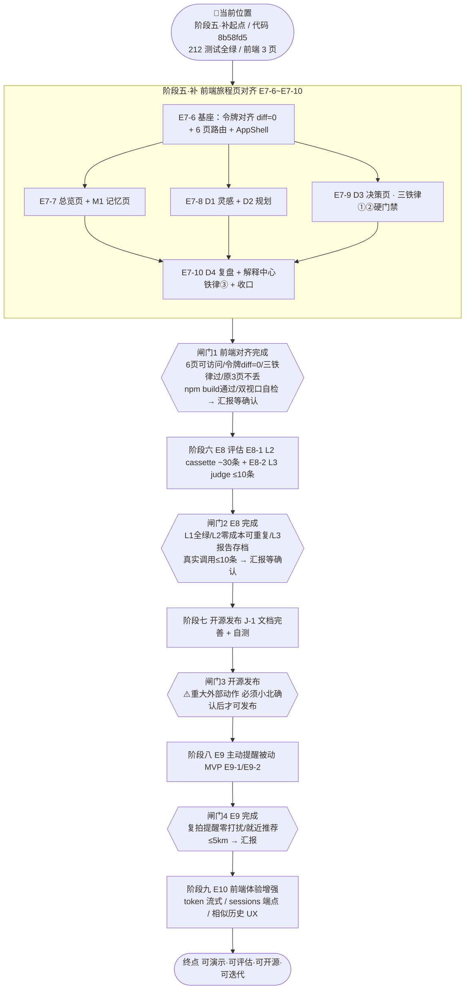

# LightTrail（光迹）· Codex 长期开发目标 v6（前端对齐 + 评估 + 开源 + 迭代）

> v6 更新（2026-09-09）：重排长期路线——**阶段五·补（前端旅程页对齐 E7-6~E7-10）→ 阶段六 E8 评估 → 阶段七开源发布 → 阶段八 E9 主动提醒 → 阶段九 E10 体验增强 → 维护迭代**。
> 新增：**路线地图（mermaid）+ 阶段闸门 + 「路线感」状态块 + 完成顺序速查表**；明确 **push 划线**与**开源发布人工闸门**；修正 E8-0（并入 E8-1 开场）、.env.example（复核非重写）。
> 本文档定位：**路线地图 + 阶段闸门 + 硬约束**（现在在哪 / 下一步干什么 / 什么时候必须停下等确认）。任务细节看 roadmap v2.5，前端设计看 FRONTEND-SPEC + 真源 html，代码规范看 AGENTS.md，平台决策看 ADR-002/003——不在本文档重复。

---

## 📍 当前位置（开工第一眼先看这里）

```
📍 当前位置：阶段五·补起点（E7-6 之前，前端 3 页待对齐 6 页）
  代码基线：E7 交付点 8b58fd5（HEAD 文档 ffaef73）｜ pytest 212 全绿 ｜ ruff 0 ｜ smoke 21 ｜ 15 工具
🎯 当前目标：E7-6 基座升级（令牌对齐 diff=0 + 路由 3→6 页 + AppShell）→ E7-7~E7-9 三页 → E7-10 收口
🏁 终点：可演示 · 可评估 · 可开源 · 可自我迭代的成熟产品
```

**每次完成一个任务，更新此块**（或指引用 devlog 记录），保证「打开文档 3 秒内定位自己」。
> E7-6 ~ E7-9 已提交（d3 决策页含三铁律①②勾验 + /api/decide 真实跑通，devlog 2026-09-09），下一步 E7-10 D4 复盘 + 解释中心 + 收口。

---

## 路线地图（全景图）



**阶段顺序与依赖逻辑**：
- **前端对齐排最前**：求职演示本体、纯前端零 LLM 成本；后端五端点 + SSE 8 事件已覆盖设计稿 90% 数据需求，边际成本最低。
- **E8 在开源前**：开源是一锤子买卖，外部观感靠质量；没有评估门禁就发布，质量回退无从发现。
- **开源在 E9 前**：延续 roadmap v2.5 既定顺序；E9 演示价值低于前端与评估，延后不阻塞主线。
- **E10 放最后（拆两批）**：低成本体验项（sessions 端点）开源前清完；高风险项（token 流式动后端底层）放开源后——避免拖累发布窗口，兼作开源后第一迭代维持活跃度。

---

## 主线任务（按路线顺序执行，做完一个提交一个）

### 阶段五·补｜任务范围 E7-6~E7-10｜出口：前端对齐完成 ★ 当前

**一句话目标**：把 3 个窄功能页补齐为设计稿 6 页决策旅程，样式层整体对齐真源令牌。

**⚠️ 动手前强制顺序（防止「先动代码」）**：
1. 先读 `docs/design/FRONTEND-SPEC.md` 全篇（6 页信息架构 / 令牌全集 / 组件规格 / 映射表 / 三铁律 / 移动端 / Fake 标注）；
2. 再打开真源 `docs/design/delivery/lighttrail-prototype.html` 核对 :root 与组件形态（断网可开，只读）；
3. **之后**才动 `frontend/` 代码。任何「spec 没写、真源没有」的样式/结构，先记入阻塞清单问主理人，**不许自创**。

**硬约束三连（每次动前端前默念）**：
- 真源唯一：令牌只从 html :root 提取，**不新造色值/间距/字体**；现存漂移逐一修正（`--bg #12121c`→`#0A0D14`、`--good #7fe0a3`→`--semantic-go #3FCF8E` 等）；
- 后端不动：E7-3 五端点 + SSE 8 事件已够用，缺板块用结构正确的 Fake 渲染并**显眼标注「示例数据」**；确需新增端点先征得主理人同意；
- 可解释性三铁律是验收硬门禁（FRONTEND-SPEC §6），不是可选项。

| 任务 | 一句话目标 | 核心验收 |
|---|---|---|
| E7-6 基座 | 令牌对齐 + 路由 3→6 页 + 顶栏/汉堡/AppShell | `npm run build` 过；6 页 hash 可切换；:root 令牌与真源逐项 **diff=0（写 5 行脚本核对，不靠肉眼）**；双视口 390×844/360×780 汉堡开合正常；原 3 页功能可访问不回归 |
| E7-7 总览 + M1 | 环图今日卡 + 四阶段入口 + 器材档案 GET/PUT `/api/profile` | 四阶段入口跳转正确；环图标注数据来源；档案可读可改；双视口不溢出 |
| E7-8 D1 + D2 | 一句话→SSE→方案卡 A/B/C；参考图反推；sky-band 天象时间线 | D1 流式渲染闭环；反推走 `/api/photos/review`；D2 时间线移动端横滚 |
| E7-9 D3 决策页（核心） | 三态大卡 + 置信度三层 + 倒计时 + 现场模式 + 曝光三角 + 四步推理 | **铁律① 置信度三层（主值+区间条+依据）逐条勾验；铁律② 语义色+图标+文字三要素齐备**；倒计时基于 time_window；`/api/decide` 真实/Fake 跑通 |
| E7-10 D4 + 解释中心 + 收口 | 批量上传 4 维分析处方 + 页脚解释中心 + 全站示例数据标注 | **铁律③ 解释中心模态列 data_source**；双视口逐页截图自检；原 3 页经新架构可访问；devlog/roadmap 勾选 |

**依赖拓扑**：E7-6 →（E7-7/E7-8/E7-9 三页并行、模块解耦）→ E7-10。单线程可串行执行；标注「并行三页」说明互不依赖，卡住任一页可先跳。

**阶段出口检查单（过完才许进 E8）**：
- [ ] 6 页路由全部可访问、可切换
- [ ] 设计令牌与真源 :root 逐项 diff=0（脚本核对）
- [ ] 三铁律①/②/③ 逐条勾验通过
- [ ] 原 3 页功能不丢（对话→D1+全局、会话列表→总览、决策卡→D3 底座）
- [ ] `npm run build` 通过；双视口自检通过；pytest 保持 212 全绿（纯前端改动，误伤后端必须修复）
- [ ] devlog 记录：令牌 diff 结果 / 三铁律勾验 / 截图自检 / 遗留

**降级策略**：组件实现卡住（如地图）→ devlog 记阻塞 + 用标注「示例数据」的静态占位先交付 → 跳下一不依赖任务 → 全部卡住停下等主理人。**禁止**：为绕过阻塞自创令牌、改后端、删原功能。

---

### 阶段六｜任务范围 E8-1/E8-2｜出口：评估体系完成

**一句话目标**：把「改 prompt 是提升还是回退」从手感变成数据（架构 v2.0 §2.11）。

- **E8-1（L2）**：`evals/` runner 框架 + cassette 录制/回放 + 集中补齐 ~30 条黄金用例（三题材×四主线 + 边界：极昼/缺天气 Key/空档案）。**E8-0 精神并入开场**：真实 Key 最小样本验证 runner 链路（与 E6-0/E7-0「真实链路开场」原则一致）。验收：`python -m evals.runner --level L2` 分钟级跑完、**零 LLM 成本**；断言 DecisionCard schema 合法 + 结论方向/机位数/置信度区间/evidence 非空。
- **E8-2（L3）**：`ecnu-max` 按 rubric（决策合理性/依据完整性/个性化/不确定性坦白）1–5 打分 + 「工具即裁判」交叉校验（如 `star_shutter_rule` 算一遍核对模型快门建议）。验收：报告可读；交叉校验能抓出「模型建议违反 500 法则」的假阳性。

**配额克制（红线）**：E8 全阶段真实 LLM 调用**只跑最小黄金子集 ≤10 条**，走 QuotaLedger 预算门禁；L2 必须零成本（cassette 回放）；L3 单次受 ~500 credits 预算约束；默认不用真实 Key 联调。

**阶段出口检查单**：
- [ ] L1（pytest 212）全绿；L2 分钟级零成本可重复
- [ ] L3 报告存档 `evals/results/`，形成质量曲线
- [ ] 真实调用 ≤10 条、配额可控（devlog 记录实际消耗）
- [ ] devlog 总结 + roadmap 勾选 + 平台中立性审计

**降级策略**：LLM-as-judge 打分不稳定（judge 自己飘）→ 先以「工具即裁判」确定性校验为主、LLM 打分为辅并记录偏差 → 仍不可行记阻塞，**不删 L2**（L2 是保底价值）。

---

### 阶段七｜任务范围 J-1｜出口：开源发布包就绪 ⚠️ 重大外部动作

**一句话目标**：让陌生人 15 分钟跑起 Web 形态，贡献路径写清楚。

- **J-1 要点**：README 重写（Web 双入口 `uvicorn lighttrail.api.app:app` + `npm run dev`、CLI、架构图、工具清单 15、评估入口）；`CONTRIBUTING.md`（含**新增工具三步走**：注册 → import 触发 → 黄金用例）；`.env.example` **复核**（LLM_SERIAL_LLM / LLM_REASON_THINKING / LIGHTTRAIL_QUOTA_WARN_THRESHOLD 已存在，只查遗漏、不重写）；CHANGELOG（从 commits 梳理 E1–E8）；附 roadmap/评估/架构文档链接。
- **出口标准**：**新用户按 README 15 分钟内本地跑起 Web UI**（模拟一次全新 clone + 跑通，用时写进 devlog）。

**⚠️ 开源发布是重大外部动作，AGENTS.md「对外提交先确认」直接适用**：**push/tag/release/对外宣传前，必须先让小北（主理人）过目**——包括 README 成稿、.env.example、LICENSE 声明、CHANGELOG 措辞、演示截图。Codex 可准备「发布包 + 自检清单」提交审核，但**不自行发布**。这是全路线最硬的一个人工闸门。

**降级策略**：文档写不完整或自测跑不通 → 记阻塞 + 请求主理人帮助，不跳过出口标准硬发。

---

### 阶段八｜任务范围 E9-1/E9-2｜出口：被动提醒 MVP 完成

**一句话目标**：查询时被动注入提醒（非定时推送），复用 E3-2 已备好的事件坐标+天气快照字段，边际成本低。

- **E9-1 复拍提醒（D2.3-07）**：检索近期事件，坐标+天气快照与当前预报匹配（上次阴天、今晨晴+同色温金色时刻）→ 响应附加提醒卡片附依据。验收：构造命中→提醒出现且附依据；不命中→**零打扰**。
- **E9-2 就近推荐（D3.1-04）**：haversine 5km 过滤 favorite_spots + 轻量排序 →「20 分钟内可达机位」。验收：给定坐标返回 ≤5km 列表按可达性排。
- **E9-3 定时推送**：可选，APScheduler 骨架，视开源后社区反馈，**不默认排期**。

**刻意裁剪**：被动 MVP 不引入常驻进程/调度器（主动推送约半个阶段工程量且演示价值低，这是设计决策不是偷懒）。

**降级策略**：天气快照字段不齐 → 先做「仅坐标+题材」匹配的弱化版并标注口径；仍不可行记阻塞。

---

### 阶段九｜任务范围 E10（拆两批）｜出口：体验增强完成

**拟议内容（来自 devlog 遗留）**：① token 逐字流式（当前整段文本）；② `GET /api/sessions` 列表端点（前端本地兜底）；③ 相似历史命中 UX；④ D3 倒计时实时刷新；⑤ 解释中心数据源聚合。

| 项 | 归属 | 理由 |
|---|---|---|
| ② sessions 列表端点 | **开源前**（E8 后、J-1 前穿插） | 低成本小端点，消灭「本地兜底」，新用户第一眼体验 |
| ⑤ 解释中心 / ④ 倒计时 | 大概率已被 E7-10/E7-9 覆盖 | 验收已含，E10 只确认+增强 |
| ① token 逐字流式 | **开源后** | 动 `ChatClient` 底层 + streaming SDK，回归风险与改造成本最高，发布前赶工最易引入事故 |
| ③ 相似历史 UX | 开源后 | 依赖真实会话数据积累，开源前无米下锅 |

**核心理由**：开源是「外界定型的第一印象」，**体验完整度在开源前最重要**（低成本项清完再发）；但**高风险项放开源后**，既避免拖累发布窗口，又作开源后第一个体验迭代维持社区活跃度（呼应 roadmap 精神：风险高的事不赶发布）。

**降级策略**：streaming 通道联调不可行（平台不支持）→ token 事件退化为「分块发送」并在文档标注，不阻塞其他体验项。

---

## 完成顺序速查表

| 阶段 | 任务范围 | 出口检查 | 估时* |
|---|---|---|---|
| 阶段五·补 | E7-6 → E7-7/9 → E7-10 | 6 页可访问 / 令牌 diff=0 / 三铁律过 | ~4-6 日 |
| 阶段六 | E8-1 / E8-2 | L2 零成本 / L3 报告存档 / 配额 ≤10 条 | ~2-3 日 |
| 阶段七 | J-1 | 15 分钟跑通（**发布须小北确认**） | ~1 日 |
| 阶段八 | E9-1 / E9-2 | 零打扰 / ≤5km | ~1-2 日 |
| 阶段九 | E10 两批 | 各验收项过 / 回归门禁 | ~2-3 日 |

> 估时仅供参考，**不以估时赶工**；质量门禁优先。

---

## 阶段闸门与无人值守平衡

- **阶段内自治**：E7-6→E7-10 连续做完再汇报（每任务只 devlog 一行 + commit，不打断主理人）。
- **阶段间闸门**：只在 4 个节点强制停下汇报等确认：
  - **闸门1** 前端对齐完成 → 等确认进 E8
  - **闸门2** E8 评估完成 → 等确认进开源
  - **闸门3** 开源发布前（**必等小北**，绝不自行发布）
  - **闸门4** E9 完成 → 等确认进 E10
- 理由：无人值守减少低价值打断，但方向性/外部性决策必须人控；闸门间主理人不在，Codex 也不许越过开源发布闸门自行发布。

## 硬约束与红线（每次动手必过）

1. **平台中立（ADR-002/003，最高优先级）**：LLM 调用一律过 ChatClient/ModelRouter/适配层；代码不写平台品牌判断、不加 `ECNU_*` 新变量；thinking 等扩展字段收敛适配层。**违反即失败。**（自查清单沿用 ADR，此处不重复展开）
2. **前端对齐三约束**：真源唯一（令牌只取 html :root）/ 后端不动（确需新增端点先问）/ Fake 必标「示例数据」+ 三铁律硬门禁。
3. **测试/build 门禁**：后端改动 `pytest tests/` 全绿 + ruff 0；前端改动 `npm run build` 通过；每次提交前自查。
4. **LLM 配额克制**：默认 Fake/mock，不烧真实 Key；E8 真实调用 ≤10 条走 QuotaLedger。
5. **不动文件**：LICENSE、`lighttrail-prototype.html`（只读真源）永不改；AGENTS.md / 设计稿归档如需变动先征得小北同意。
6. **push 划线**：日常任务 commit+push 沿项目主线节奏（写入本文档即视为一次性授权）；**阶段出口/开源发布前的 push、tag、release、对外宣传必须确认**。
7. **禁忌**：LightTrail 是独立开源项目，与学位论文/学术研究**无关**，文档/代码/提交信息严禁此类关联。
8. **架构决策**：不确定先查 `docs/architecture.md` + `docs/adr/` + roadmap；新决策记入阻塞清单，不擅自大改架构。

## 项目基线（先读这些，不要凭猜测动手）

1. 按顺序阅读关键文档：
   - `AGENTS.md`（协作约定 + 代码规范，必须遵守）
   - `docs/DEVELOPMENT-ROADMAP.md`（**v2.5**，任务细节以它为准）
   - **`docs/design/FRONTEND-SPEC.md`（前端唯一 spec，先读透再动前端）**
   - `docs/design/delivery/lighttrail-prototype.html`（唯一视觉真源，只读不改）
   - `docs/architecture.md`（v2.0.3）
   - `docs/adr/ADR-002/003`（平台中立权威记录）
   - `docs/PRD-v0.3.md`（产品需求）
   - `TODO.md` / `docs/devlog.md`（待办 + 进度）
2. 当前代码状态：src+tests ~1.1w 行；15 工具；212 用例全绿；ruff 0；smoke 21；前端 3 页（devlog 有 E1–E7 记录）。
3. Python 环境：`.venv\Scripts\python.exe`；Node：`frontend/` 独立工程（npm run dev / build）。新增依赖一律装进 .venv。
4. git：分支 main，代码基线 `8b58fd5`（文档 HEAD `ffaef73`），已与 origin/main 同步。每完成任务 commit + push（日常 push 已授权；阶段出口 push 需确认，见红线 6）。

## 每完成任务单元（统一节奏）

1. 后端改动跑 `pytest tests/` 全绿 + ruff 0；前端改动跑 `npm run build` 通过
2. 中文 commit（如「feat(E7-6): 前端令牌对齐 + 6 页路由…」）+ push（日常授权）
3. `docs/devlog.md` 追加一行（任务编号 / 时间 / commit hash / 测试数量）
4. 更新文首 📍 状态块

## 收尾

阶段完成或决定停止时：
1. 最后一次 `pytest tests/` 全绿 + `ruff check src tests` 无新告警 + `npm run build` 通过
2. `git add -A && git commit && git push`（阶段出口 push 按红线 6 确认）
3. `docs/devlog.md` 写总结：已完成 / 剩余 / 遗留 / 建议（含平台中立性审计）；并在文首 📍 状态块更新路线位置

> **文档自我定位**：本文档只回答「现在在哪 / 下一步干什么 / 什么时候必须停下等确认」。与 roadmap/spec 冲突时，roadmap/spec 优先并提示主理人同步；仅在「阶段顺序、闸门、红线」级别变更时才升版本号。