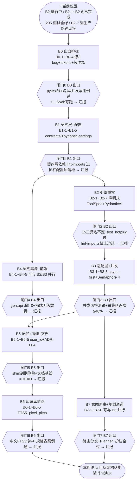

# LightTrail（光迹）· Codex 长期开发目标 v7（架构重建期）

> v7 更新（2026-09-12）：项目进入**架构重建期**。依据已拍板定稿的 `docs/architecture-v4-proposal.md`（D1–D14），本期重心 = **架构重构（B0–B7 批次）**，功能迭代全部让路。旧 E 系列路线（E1–E10）随 v2.5 路线图归档至 `docs/archive/DEVELOPMENT-ROADMAP-v2.5.md`，不再执行。
> 本文档定位：**路线地图 + 批次闸门 + 硬约束**（现在在哪 / 下一步干什么 / 什么时候必须停下等确认）。任务细节看 **`docs/REFACTOR-ROADMAP.md`**（唯一任务清单），方案论证看 `docs/architecture-v4-proposal.md`，代码规范看 AGENTS.md，平台决策看 ADR-002/003——不在本文档重复。

---

## 📍 当前位置（开工第一眼先看这里）

```
📍 当前位置：B2 批次进行中（B2-1 ~ B2-6 已完成；B2-7 部分：热插拔 + 架构禁止边已过）
  代码基线：main 分支 HEAD <B2-7 部分> ｜ pytest 295 全绿 ｜ ruff 0 ｜ lint-imports 2 kept / 0 broken
  实跑基线：CLI + Web 真实查询通过 ｜ 冒烟 21 项 ｜ 15 工具全部声明式 ｜ PydanticAI Model 桥 + AgentRuntime 已落地（尚未接管生产路径）
🎯 当前目标：B2-7 剩余——① 生产路径切 AgentRuntime（api 会话历史 dict→ModelMessage、orchestrator/cli 换装）② TestModel 替换 8 处 FakeChatClient ③ shim 清理 → 然后 B2 收口（闸门 2 汇报）
🏁 本期终点：B0–B7 全部批次通过出口检查，目标架构（契约层+声明式注册+async-first+知识库+意图路由）落地，随时可演示
```

**每次完成一个任务，更新此块**，保证「打开文档 3 秒内定位自己」。

---

## 路线地图（全景图）



**批次顺序与依赖逻辑**：
- **B0 最先**：三颗真 bug（会话死锁等）不除，重构基线不干净；
- **B1 是一切的地基**：契约层不落地，后续批次无的放矢；
- **B4 可提前并行**（只依赖 B1）：前端去假数据与引擎重写互不阻塞；
- **B6 与 B7 相互独立**，可在 B5/B3 之后并行推进；
- 功能需求（E9 被动提醒、E10 体验项等）**全部排在 B0–B7 之后**，本期不做。

---

## 主线任务（按批次执行，做完一个任务 commit 一个）

### B0 止血护栏 ✅ 已完成（2026-09-13，停闸门 0）

| 任务 | 一句话目标 | 核心验收 |
|---|---|---|
| B0-1 | 修 SessionManager 死锁/共享态/锁外写 | 淘汰路径不死锁 + 并发写用例过 |
| B0-2 | record_llm 接通 tokens 记账 | TraceReport tokens 非 None 且正确 |
| B0-3 | 四处假注释清理（实现或删注释） | grep 复查无空头承诺 |
| B0-4 | B0 收口，建立重构前基线 | pytest 绿 + CLI/Web 实跑一次 |

### B1 契约层 + 配置 ✅ 已完成（2026-09-13，停闸门 1）

| 任务 | 一句话目标 | 核心验收 |
|---|---|---|
| B1-1 | 零依赖 contracts/ 骨架（ToolSpec / ToolContext / RequestContext） | 契约层仅 stdlib+pydantic，schema 转换与 frozen 用例过 |
| B1-2 | 契约模型下沉（Intent / DecisionCard / TraceEvent / Plan） | 旧路径 shim 可用、tools 不再反向 import orchestrator |
| B1-3 | 用户体系预留接口（LLMConfig / UserConfigProvider / KeyVault） | repr 掩码不泄 Key、优先级链用例过 |
| B1-4 | 剩余 Protocol（MemoryStore / KnowledgeProvider / DataSource / TraceSink） | 知识库签名不含 user_id、记录器满足 TraceSink |
| B1-5 | pydantic-settings + 统一护栏 + import-linter 门禁 | 护栏项默认值落地、lint-imports「契约零依赖」通过 |

### B2 引擎重写 🔄 进行中（2026-09-13：B2-1 ~ B2-4 已完成）

| 任务 | 状态 | 一句话目标 |
|---|---|---|
| B2-1 | ✅ 72ebe68 | basic + exposure 声明式（ToolSpec + TOOLS、去 agent.tools import） |
| B2-2 | ✅ e7f774b | astronomy + weather 声明式 + 动态置信度规则（confidence_rule） |
| B2-3 | ✅ a6c6212 | site_match / memory_tool / photo_analysis 声明式 + 去模块级全局（构造注入） |
| B2-4 | ✅ 6000683 | runtime/registry.py + composition.py + agent/tools 转 shim + 适配器契约开启 |
| B2-5 | ✅ 230dbbc | PydanticAI 自定义 Model 桥（adapters/llm/pydantic_bridge.py + pin pydantic-ai-slim） |
| B2-6 | ✅ f0c5060 | AgentRuntime（runtime/agent.py）+ ContextBuilder 迁 runtime（能力叙述自动生成） |
| B2-7 | 🔄 5756583（部分） | ✅ 热插拔 test_hotplug + 架构禁止边；⏳ 生产路径切 AgentRuntime + TestModel 替换 + shim 清理 + 收口 |

### B3 ~ B7

任务细节（目标/前置/输入上下文/交付物/验收标准/涉及文件）**全部见 `docs/REFACTOR-ROADMAP.md` 对应章节**，此处不重复。每批出口检查单见路线图 §1.3/§1.4 与各批次末任务。

---

## 批次闸门与无人值守平衡

- **批次内自治**：单批次内任务连续做完再汇报（每任务只 devlog 一行 + commit，不打断主理人）。
- **批次间闸门**：每个批次出口（闸门0–7）强制停下汇报等确认——架构重建每一步都是方向性决策，必须人控。
- **绝对红线**：任何对外动作（开源发布 / 对外宣传 / release）仍必须先经小北确认，与重构进度无关。

## 硬约束与红线（每次动手必过）

1. **v4 方案为唯一权威**：任务与 `docs/architecture-v4-proposal.md` 冲突时以 v4 为准，冲突点记 devlog 提示主理人。
2. **平台中立（ADR-002/003，最高优先级）**：品牌字面量只允许在 `adapters/llm` 与 settings 默认值；LLM 调用一律过 LLMProvider/ModelRouter/适配层。**违反即失败。**
3. **并发语义已变（ADR-004 前身）**：「ECNU 串行约束」不成立，并发为纯配置 `LLM_CONCURRENCY`（默认 4）；`LLM_SERIAL_LLM` 只作只读兼容别名过渡一版（B1 落地，B3 删除）。**不要再写「默认串行适配 ECNU」的旧逻辑。**
4. **批次纪律**：每批结束 pytest 全绿 + ruff 0 + 系统可用（CLI/Web 可跑）；批间 re-export shim 保兼容，shim 豁免带 TODO + 删除批次，到期不删 = 批次不通过。
5. **测试/build 门禁**：后端 `pytest tests/` 全绿 + ruff 0；前端 `npm run build` 通过；B1 起 `lint-imports` 逐步全开；B4 起 `gen:api && git diff --exit-code`。
6. **LLM 配额克制**：默认 Fake/TestModel/cassette 回放，不烧真实 Key；真实调用走 QuotaLedger 预算门禁。
7. **热插拔口径**：B2 起新增工具只改 `domain/tools/__init__.py` 一行；B6 起领域判据/规格一律进知识库，不写死在工具描述或代码常量。
8. **不动文件**：LICENSE、`lighttrail-prototype.html`（只读真源）永不改。
9. **禁忌**：LightTrail 是独立开源项目，与学位论文/学术研究**无关**，文档/代码/提交信息严禁此类关联。

## 项目基线（先读这些，不要凭猜测动手）

1. 按顺序阅读关键文档：
   - `AGENTS.md`（协作约定 + 代码规范，必须遵守）
   - **`docs/architecture-v4-proposal.md`（唯一权威方案，D1–D14 定稿）**
   - **`docs/REFACTOR-ROADMAP.md`（唯一任务清单，B0-1 ~ B7-6）**
   - `docs/adr/ADR-002/003`（平台中立权威记录）
   - `docs/PRD-v0.3.md`（产品需求 + v0.4 范围修订附录）
   - `docs/architecture.md`（**重构前现状描述**，B5-5 重写为目标架构）
   - `TODO.md` / `docs/devlog.md`（待办 + 进度）
2. 当前代码状态：src 7482 行/41 文件，tests 4269 行/27 文件，frontend/src 2889 行；15 工具；223 用例全绿；ruff 0；**已知问题清单见 v4 §1（八组诊断全部成立，就是本期的修复对象）**。
3. Python 环境：`.venv\Scripts\python.exe`；Node：`frontend/` 独立工程（npm run dev / build）。新增依赖一律装进 .venv。
4. git：分支 main，HEAD `2129d62`，与 origin/main 同步。每完成任务 commit + push（日常 push 已授权）；对外发布仍须确认。

## 每完成任务单元（统一节奏）

1. 后端改动跑 `pytest tests/` 全绿 + ruff 0；前端改动跑 `npm run build` 通过
2. 中文 commit（如「fix(B0-1): 修复 SessionManager 淘汰路径死锁…」）+ push（日常授权）
3. `docs/devlog.md` 追加一行（任务编号 / 时间 / commit hash / 测试数量）
4. 更新文首 📍 状态块

## 收尾

批次完成或决定停止时：
1. 最后一次 `pytest tests/` 全绿 + `ruff check src tests` 无新告警 + `npm run build` 通过（+ 对应批次额外的 lint-imports / gen:api 门禁）
2. `git add -A && git commit && git push`
3. `docs/devlog.md` 写批次总结：已完成 / 剩余 / 遗留 / 建议（含平台中立性审计）；并在文首 📍 状态块更新位置
4. **停在批次闸门，等主理人确认后再进下一批**

> **文档自我定位**：本文档只回答「现在在哪 / 下一步干什么 / 什么时候必须停下等确认」。与 REFACTOR-ROADMAP / v4 方案冲突时，以 v4 方案为准并提示主理人同步。
